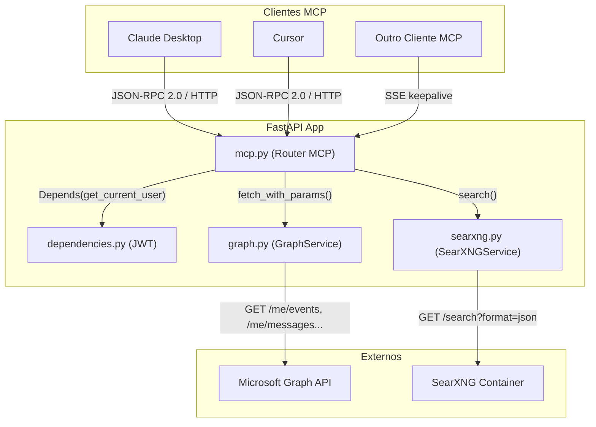
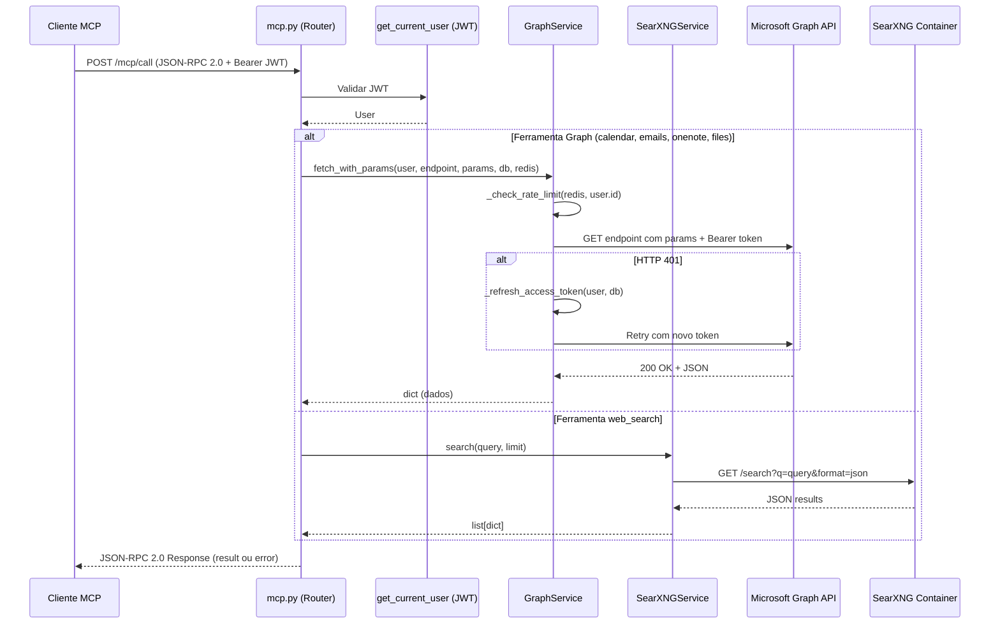
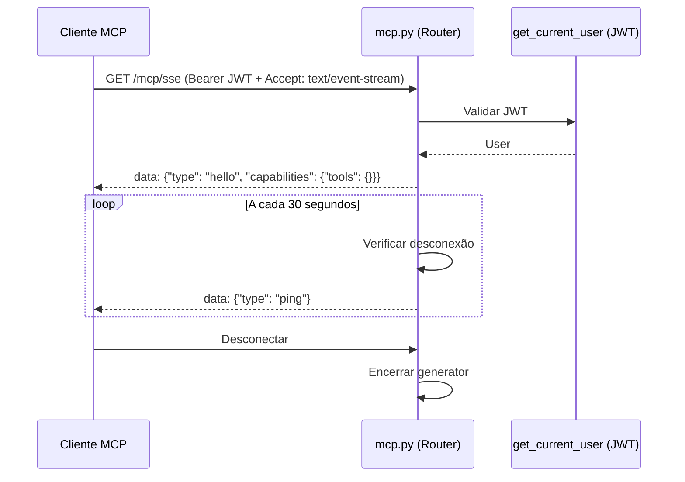

# Documento de Design — Lanez Fase 2: MCP Server

## Visão Geral

Este documento descreve a arquitetura e o design técnico da Fase 2 do Lanez. O objetivo é expor os dados do Microsoft 365 como ferramentas MCP (Model Context Protocol) consumíveis por AI assistants (Claude Desktop, Cursor). A implementação segue o protocolo JSON-RPC 2.0 sobre HTTP/SSE, reutilizando toda a infraestrutura da Fase 1 (autenticação JWT, GraphService, cache Redis, PostgreSQL).

A Fase 2 adiciona dois novos arquivos (`app/services/searxng.py` e `app/routers/mcp.py`) e modifica cinco existentes (`app/services/graph.py`, `app/config.py`, `app/main.py`, `.env.example`, `docker-compose.yml`). Nenhum modelo de dados novo é necessário — a fase reutiliza `User` e `GraphCache` da Fase 1.

## Arquitetura

```
┌──────────────────────────────────────────────────────────────┐
│                       FastAPI App                             │
│                                                               │
│  ┌────────────┐  ┌────────────────┐  ┌─────────────────────┐ │
│  │  Routers   │  │   Services     │  │    Models (Fase 1)  │ │
│  │  auth.py   │→│  graph.py      │→│  user.py            │ │
│  │  webhooks  │→│  cache.py      │→│  cache.py           │ │
│  │  graph.py  │→│  webhook.py    │→│  webhook.py         │ │
│  │  mcp.py ★  │→│  searxng.py ★  │  └─────────────────────┘ │
│  └────────────┘  └────────────────┘                          │
│        │                │                     │               │
│        ▼                ▼                     ▼               │
│  ┌──────────┐  ┌──────────────┐  ┌───────────────┐          │
│  │  Schemas  │  │    Redis     │  │  PostgreSQL   │          │
│  └──────────┘  └──────────────┘  └───────────────┘          │
└──────────────────────────────────────────────────────────────┘
         │                    │
         ▼                    ▼
┌─────────────────┐  ┌──────────────────┐  ┌──────────────┐
│  Microsoft       │  │  Microsoft Graph │  │  SearXNG ★   │
│  Entra ID        │  │  API v1.0        │  │  (busca web) │
│  (OAuth 2.0)     │  │                  │  │              │
└─────────────────┘  └──────────────────┘  └──────────────┘

★ = Novo na Fase 2
```



## Fluxo Principal — Chamada de Ferramenta MCP



## Fluxo SSE — Keepalive



## Componentes e Interfaces

### 1. Router MCP (`app/routers/mcp.py`) — NOVO

**Responsabilidade:** Implementar o protocolo MCP via JSON-RPC 2.0 sobre HTTP/SSE. Expor 5 ferramentas que consultam dados do Microsoft 365 e busca web.

**Interface:**

```python
router = APIRouter(prefix="/mcp", tags=["mcp"])

# Schemas de request/response JSON-RPC
class MCPToolParam(BaseModel):
    name: str
    type: str
    description: str
    required: bool = True

class MCPTool(BaseModel):
    name: str
    description: str
    inputSchema: dict

class MCPCallRequest(BaseModel):
    jsonrpc: str = "2.0"
    id: str | int | None = None
    method: str  # "tools/call"
    params: dict  # {"name": str, "arguments": dict}

# Endpoints
@router.get("")
async def list_tools(user: User = Depends(get_current_user)) -> dict:
    """Lista todas as ferramentas MCP disponíveis."""

@router.post("/call")
async def call_tool(
    request: MCPCallRequest,
    user: User = Depends(get_current_user),
    db: AsyncSession = Depends(get_db),
    redis: aioredis.Redis = Depends(get_redis),
    graph: GraphService = Depends(get_graph_service),
    searxng: SearXNGService = Depends(get_searxng_service),
) -> dict:
    """Executa uma ferramenta MCP via JSON-RPC 2.0."""

@router.get("/sse")
async def mcp_sse(
    request: Request,
    _user: User = Depends(get_current_user),
) -> StreamingResponse:
    """Conexão SSE keepalive para clientes MCP."""
```

**Responsabilidades:**
- Autenticar todas as requisições via JWT (`get_current_user`)
- Rotear chamadas de ferramentas para o serviço correto (GraphService ou SearXNGService)
- Formatar respostas no padrão JSON-RPC 2.0
- Separar erros de protocolo (campo `error`) de erros de domínio (`isError: true` no `result`)
- Manter conexão SSE com pings a cada 30 segundos

### 2. Serviço SearXNG (`app/services/searxng.py`) — NOVO

**Responsabilidade:** Cliente HTTP para o SearXNG (busca web self-hosted).

**Interface:**

```python
class SearXNGService:
    def __init__(self, client: httpx.AsyncClient | None = None) -> None: ...
    async def close(self) -> None: ...
    async def search(self, query: str, limit: int = 10) -> list[dict]: ...
```

**Responsabilidades:**
- Consultar SearXNG via GET `/search?format=json`
- Retornar lista de `{title, url, content}` limitada a `limit` resultados
- Tratar erros HTTP graciosamente (retornar lista vazia, logar erro)
- Usar timeout de 10 segundos

### 3. GraphService — Modificação (`app/services/graph.py`)

**Responsabilidade adicional:** Suportar consultas parametrizadas à Graph API sem cache.

**Novas interfaces:**

```python
class GraphService:
    # Método existente modificado — adicionar parâmetro params
    async def _request_graph(
        self,
        url: str,
        access_token: str,
        params: dict[str, str] | None = None,  # NOVO
    ) -> httpx.Response: ...

    # Método novo
    async def fetch_with_params(
        self,
        user: User,
        endpoint: str,
        params: dict[str, str],
        db: AsyncSession,
        redis: aioredis.Redis,
    ) -> dict: ...
```

**Decisões de design:**
- `fetch_with_params` NÃO usa cache — queries parametrizadas (datas, textos livres) não compartilham chave de cache com `fetch_data`
- Mantém rate limit e token refresh (mesma lógica do `fetch_data`)
- `_request_graph` recebe `params` opcional para passar query parameters ao `httpx.AsyncClient.get()`

## Modelos de Dados

A Fase 2 não adiciona tabelas. Reutiliza `User` e `GraphCache` da Fase 1.

## Definição das 5 Ferramentas MCP

### Ferramenta 1: `get_calendar_events`

```python
TOOL_GET_CALENDAR_EVENTS = MCPTool(
    name="get_calendar_events",
    description="Busca eventos do calendário do Outlook em um intervalo de datas.",
    inputSchema={
        "type": "object",
        "properties": {
            "start": {"type": "string", "description": "Data inicial (YYYY-MM-DD)"},
            "end": {"type": "string", "description": "Data final (YYYY-MM-DD)"},
        },
        "required": ["start", "end"],
    },
)
```

**Precondições:**
- `start` e `end` são strings no formato YYYY-MM-DD
- `start <= end`
- Usuário autenticado com token válido

**Pós-condições:**
- Retorna eventos do calendário no intervalo `[start, end]`
- Campos selecionados: subject, start, end, location, organizer, attendees
- Ordenados por start/dateTime ascendente
- Máximo 50 eventos

**Parâmetros Graph API:**
```python
params = {
    "$filter": f"start/dateTime ge '{start}T00:00:00Z' and end/dateTime le '{end}T23:59:59Z'",
    "$orderby": "start/dateTime",
    "$select": "subject,start,end,location,organizer,attendees",
    "$top": "50",
}
endpoint = "/me/events"
```

### Ferramenta 2: `search_emails`

```python
TOOL_SEARCH_EMAILS = MCPTool(
    name="search_emails",
    description="Busca emails no Outlook por texto livre.",
    inputSchema={
        "type": "object",
        "properties": {
            "query": {"type": "string", "description": "Texto de busca"},
            "limit": {"type": "integer", "description": "Número máximo de resultados (padrão: 10, máximo: 50)"},
        },
        "required": ["query"],
    },
)
```

**Precondições:**
- `query` é string não vazia
- `limit` é inteiro positivo (padrão 10, máximo 50)

**Pós-condições:**
- Retorna emails correspondentes à busca
- Campos selecionados: subject, from, receivedDateTime, bodyPreview, isRead
- Limitado a `min(limit, 50)` resultados

**Parâmetros Graph API:**
```python
params = {
    "$search": f'"{query}"',
    "$top": str(min(limit, 50)),
    "$select": "subject,from,receivedDateTime,bodyPreview,isRead",
}
endpoint = "/me/messages"
```

### Ferramenta 3: `get_onenote_pages`

```python
TOOL_GET_ONENOTE_PAGES = MCPTool(
    name="get_onenote_pages",
    description="Lista páginas do OneNote, opcionalmente filtrando por título.",
    inputSchema={
        "type": "object",
        "properties": {
            "notebook": {"type": "string", "description": "Nome do notebook (opcional)"},
            "query": {"type": "string", "description": "Filtro por título da página (opcional)"},
        },
        "required": [],
    },
)
```

**Precondições:**
- `notebook` e `query` são opcionais
- Se `query` fornecido, é string não vazia

**Pós-condições:**
- Retorna páginas do OneNote
- Campos selecionados: title, createdDateTime, lastModifiedDateTime, parentNotebook
- Se `query` fornecido, filtra por `contains(title, query)`
- Máximo 50 páginas

**Parâmetros Graph API:**
```python
params = {
    "$top": "50",
    "$select": "title,createdDateTime,lastModifiedDateTime,parentNotebook",
}
if query:
    params["$filter"] = f"contains(title, '{query}')"
endpoint = "/me/onenote/pages"
```

### Ferramenta 4: `search_files`

```python
TOOL_SEARCH_FILES = MCPTool(
    name="search_files",
    description="Busca arquivos no OneDrive por nome ou conteúdo.",
    inputSchema={
        "type": "object",
        "properties": {
            "query": {"type": "string", "description": "Texto de busca"},
        },
        "required": ["query"],
    },
)
```

**Precondições:**
- `query` é string não vazia

**Pós-condições:**
- Retorna arquivos correspondentes à busca
- Campos selecionados: name, size, lastModifiedDateTime, webUrl, file, folder
- Máximo 25 resultados

**Parâmetros Graph API:**
```python
params = {
    "$top": "25",
    "$select": "name,size,lastModifiedDateTime,webUrl,file,folder",
}
endpoint = f"/me/drive/root/search(q='{query}')"
```

### Ferramenta 5: `web_search`

```python
TOOL_WEB_SEARCH = MCPTool(
    name="web_search",
    description="Busca na web usando SearXNG (motor de busca self-hosted).",
    inputSchema={
        "type": "object",
        "properties": {
            "query": {"type": "string", "description": "Texto de busca"},
        },
        "required": ["query"],
    },
)
```

**Precondições:**
- `query` é string não vazia
- SearXNG acessível em `SEARXNG_URL`

**Pós-condições:**
- Retorna lista de `{title, url, content}` (máximo 10 resultados)
- Em caso de erro do SearXNG, retorna lista vazia (erro logado)

## Pseudocódigo Algorítmico

### Algoritmo: Despacho de Chamada de Ferramenta MCP

```python
async def call_tool(request: MCPCallRequest, user, db, redis, graph, searxng) -> dict:
    """
    Precondições:
    - request.jsonrpc == "2.0"
    - request.id é str | int | None (conforme JSON-RPC 2.0)
    - request.method == "tools/call"
    - request.params contém "name" (str) e "arguments" (dict)
    - user é User autenticado via JWT

    Pós-condições:
    - Retorna JSON-RPC 2.0 response com result ou error
    - Erros de protocolo → campo "error" com código JSON-RPC
    - Parâmetros obrigatórios ausentes → campo "error" com código -32602
    - Erros de domínio → campo "result" com isError=true
    - Sucesso → campo "result" com isError=false e dados serializados
    """
    tool_name = request.params.get("name")
    arguments = request.params.get("arguments", {})

    # Validação de protocolo
    if request.method != "tools/call":
        return jsonrpc_error(request.id, -32601, f"Método '{request.method}' não suportado")

    if tool_name not in TOOLS_REGISTRY:
        return jsonrpc_error(request.id, -32601, f"Ferramenta '{tool_name}' não encontrada")

    # Validação de parâmetros obrigatórios via inputSchema
    tool_def = TOOLS_MAP[tool_name]  # MCPTool com inputSchema
    required_params = tool_def.inputSchema.get("required", [])
    for param in required_params:
        if param not in arguments:
            return jsonrpc_error(
                request.id, -32602,
                f"Parâmetro obrigatório ausente: '{param}' na ferramenta '{tool_name}'"
            )

    # Despacho para handler da ferramenta
    try:
        handler = TOOLS_REGISTRY[tool_name]
        data = await handler(arguments, user, db, redis, graph, searxng)
        return jsonrpc_success(request.id, data)
    except HTTPException as exc:
        return jsonrpc_domain_error(request.id, str(exc.detail))
    except Exception as exc:
        logger.exception("Erro interno na ferramenta %s", tool_name)
        return jsonrpc_domain_error(request.id, f"Erro interno: {exc}")
```

### Algoritmo: fetch_with_params (GraphService)

```python
async def fetch_with_params(self, user, endpoint, params, db, redis) -> dict:
    """
    Precondições:
    - user é User com microsoft_access_token válido
    - endpoint é string começando com "/"
    - params é dict não vazio
    - db é AsyncSession ativa
    - redis é conexão Redis ativa

    Pós-condições:
    - Retorna dict com dados da Graph API
    - Rate limit verificado antes da requisição
    - Se 401: tenta refresh do token uma vez
    - Se 401 após refresh: levanta HTTPException(401)
    - Se outro erro: levanta HTTPException com status code original
    - NÃO armazena em cache (queries parametrizadas)

    Invariante de loop: N/A (sem loops)
    """
    # 1. Verificar rate limit
    await self._check_rate_limit(redis, user.id)

    # 2. Montar URL e obter token
    url = f"{self.BASE_URL}{endpoint}"
    access_token = user.microsoft_access_token

    # 3. Requisição com backoff para 429
    resp = await self._request_graph(url, access_token, params=params)

    # 4. Tratar 401 — refresh + retry 1x
    if resp.status_code == 401:
        new_token = await self._refresh_access_token(user, db)
        resp = await self._request_graph(url, new_token, params=params)
        if resp.status_code == 401:
            raise HTTPException(status_code=401, detail="Token inválido. Re-autentique.")

    # 5. Propagar outros erros
    if resp.status_code != 200:
        raise HTTPException(status_code=resp.status_code, detail=f"Erro Graph API: {resp.status_code}")

    return resp.json()
```

### Algoritmo: Busca SearXNG

```python
async def search(self, query: str, limit: int = 10) -> list[dict]:
    """
    Precondições:
    - query é string não vazia
    - limit é inteiro positivo
    - SearXNG acessível em settings.SEARXNG_URL

    Pós-condições:
    - Retorna lista de {title, url, content} com len <= limit
    - Em caso de erro HTTP: retorna lista vazia, erro logado
    - Timeout de 10 segundos

    Invariante de loop: N/A
    """
    params = {"q": query, "format": "json"}
    try:
        resp = await self._client.get(f"{settings.SEARXNG_URL}/search", params=params)
        resp.raise_for_status()
        results = resp.json().get("results", [])[:limit]
        return [
            {"title": r.get("title", ""), "url": r.get("url", ""), "content": r.get("content", "")}
            for r in results
        ]
    except httpx.HTTPError as exc:
        logger.error("Erro SearXNG: %s", exc)
        return []
```

### Algoritmo: Formatação de Respostas JSON-RPC 2.0

```python
def jsonrpc_success(request_id: str | int | None, data: Any) -> dict:
    """
    Precondições:
    - request_id é str | int | None (conforme JSON-RPC 2.0)
    - data é serializável para JSON

    Pós-condições:
    - Retorna dict com jsonrpc="2.0", id=request_id, result com isError=false
    """
    return {
        "jsonrpc": "2.0",
        "id": request_id,
        "result": {
            "content": [{"type": "text", "text": json.dumps(data, default=str, ensure_ascii=False)}],
            "isError": False,
        },
    }

def jsonrpc_error(request_id: str | int | None, code: int, message: str) -> dict:
    """
    Precondições:
    - request_id é str | int | None (conforme JSON-RPC 2.0)
    - code é código de erro JSON-RPC válido (-32700, -32600, -32601, -32602, -32603)

    Pós-condições:
    - Retorna dict com jsonrpc="2.0", id=request_id, error com code e message
    """
    return {
        "jsonrpc": "2.0",
        "id": request_id,
        "error": {"code": code, "message": message},
    }

def jsonrpc_domain_error(request_id: str | int | None, message: str) -> dict:
    """
    Precondições:
    - request_id é str | int | None (conforme JSON-RPC 2.0)

    Pós-condições:
    - Retorna dict com jsonrpc="2.0", id=request_id, result com isError=true
    """
    return {
        "jsonrpc": "2.0",
        "id": request_id,
        "result": {
            "content": [{"type": "text", "text": f"Erro: {message}"}],
            "isError": True,
        },
    }
```

## Exemplo de Uso

```python
# 1. Listar ferramentas
# GET /mcp com Authorization: Bearer <JWT>
# Resposta:
{
    "jsonrpc": "2.0",
    "result": {
        "tools": [
            {
                "name": "get_calendar_events",
                "description": "Busca eventos do calendário do Outlook em um intervalo de datas.",
                "inputSchema": {
                    "type": "object",
                    "properties": {
                        "start": {"type": "string", "description": "Data inicial (YYYY-MM-DD)"},
                        "end": {"type": "string", "description": "Data final (YYYY-MM-DD)"}
                    },
                    "required": ["start", "end"]
                }
            },
            # ... mais 4 ferramentas
        ]
    }
}

# 2. Chamar ferramenta
# POST /mcp/call com Authorization: Bearer <JWT>
# Body:
{
    "jsonrpc": "2.0",
    "id": "req-1",
    "method": "tools/call",
    "params": {
        "name": "get_calendar_events",
        "arguments": {"start": "2026-04-24", "end": "2026-04-30"}
    }
}
# Resposta sucesso:
{
    "jsonrpc": "2.0",
    "id": "req-1",
    "result": {
        "content": [{"type": "text", "text": "[{\"subject\": \"Reunião\", ...}]"}],
        "isError": False
    }
}

# 3. Ferramenta inexistente — erro de protocolo
# POST /mcp/call
{
    "jsonrpc": "2.0",
    "id": "req-2",
    "method": "tools/call",
    "params": {"name": "nao_existe", "arguments": {}}
}
# Resposta:
{
    "jsonrpc": "2.0",
    "id": "req-2",
    "error": {"code": -32601, "message": "Ferramenta 'nao_existe' não encontrada"}
}

# 4. Erro de domínio (Graph API falhou)
{
    "jsonrpc": "2.0",
    "id": "req-3",
    "result": {
        "content": [{"type": "text", "text": "Erro: Rate limit excedido."}],
        "isError": True
    }
}
```

## Tratamento de Erros

### Erro 1: Ferramenta Não Encontrada

**Condição:** `tool_name` não existe no `TOOLS_REGISTRY`
**Resposta:** JSON-RPC error com código `-32601` (Method Not Found)
**Recuperação:** Cliente deve verificar lista de ferramentas via `GET /mcp`

### Erro 2: JSON Inválido no Body

**Condição:** Body do POST não é JSON válido ou não segue schema MCPCallRequest
**Resposta:** JSON-RPC error com código `-32700` (Parse Error) ou `-32600` (Invalid Request)
**Recuperação:** Cliente deve corrigir o formato da requisição

### Erro 3: Parâmetros Inválidos

**Condição:** Argumentos da ferramenta não correspondem ao inputSchema
**Resposta:** JSON-RPC error com código `-32602` (Invalid Params)
**Recuperação:** Cliente deve verificar inputSchema da ferramenta

### Erro 4: Token Expirado / Inválido

**Condição:** Graph API retorna 401 mesmo após refresh
**Resposta:** JSON-RPC domain error com `isError: true` e mensagem de re-autenticação
**Recuperação:** Usuário deve re-autenticar via `/auth/microsoft`

### Erro 5: Rate Limit Excedido

**Condição:** Usuário excedeu 200 requisições em 15 minutos
**Resposta:** JSON-RPC domain error com `isError: true`
**Recuperação:** Aguardar reset da janela de rate limit

### Erro 6: SearXNG Indisponível

**Condição:** Container SearXNG não responde ou retorna erro HTTP
**Resposta:** JSON-RPC domain error com `isError: true` e lista vazia
**Recuperação:** Verificar se container SearXNG está rodando

### Erro 7: JWT Ausente ou Inválido

**Condição:** Header Authorization ausente ou JWT inválido/expirado
**Resposta:** HTTP 401 (antes do processamento JSON-RPC)
**Recuperação:** Obter novo JWT via `/auth/microsoft` ou `/auth/refresh`

## Estratégia de Testes

### Testes Unitários

- Testar cada handler de ferramenta isoladamente com mocks do GraphService e SearXNGService
- Testar formatação de respostas JSON-RPC (sucesso, erro de protocolo, erro de domínio)
- Testar `fetch_with_params` com mocks do httpx
- Testar `SearXNGService.search` com mocks do httpx

### Testes de Propriedade (Property-Based Testing)

**Biblioteca:** hypothesis

- Respostas JSON-RPC sempre contêm `jsonrpc: "2.0"` e `id` correspondente
- Erros de protocolo nunca contêm campo `result`; erros de domínio nunca contêm campo `error`
- Descriptions de ferramentas são strings fixas (não mudam entre chamadas)
- `fetch_with_params` sempre verifica rate limit antes de fazer requisição

### Testes de Integração

- Testar fluxo completo: autenticar → listar ferramentas → chamar ferramenta → verificar resposta
- Testar SSE: conectar → receber hello → receber ping → desconectar

## Considerações de Segurança

- **JWT obrigatório** em todos os endpoints MCP — reuso do `get_current_user` da Fase 1
- **Descriptions fixas** — strings hardcoded no código, nunca geradas a partir de dados externos (proteção contra tool poisoning)
- **Endpoints fixos** — ferramentas não aceitam `endpoint` ou `url` como parâmetro livre (prevenção de exfiltração de dados)
- **Tokens nunca logados** — usar `[token=REDACTED]` em todas as mensagens de log
- **SearXNG self-hosted** — busca web sem enviar dados para terceiros

## Considerações de Performance

- `fetch_with_params` sem cache — queries parametrizadas são únicas demais para cache eficiente
- Rate limit compartilhado entre `fetch_data` e `fetch_with_params` (mesmo contador Redis por user)
- SearXNG com timeout de 10 segundos — evita bloqueio em caso de lentidão
- SSE com ping a cada 30 segundos — mantém conexão viva sem overhead significativo

## Dependências

### Novas
- **SearXNG** (container Docker) — motor de busca web self-hosted

### Existentes (Fase 1, sem alteração)
- FastAPI, httpx, SQLAlchemy, asyncpg, redis, python-jose, cryptography
- PostgreSQL (pgvector/pgvector:pg16), Redis (redis:7-alpine)

## Modificações em Arquivos Existentes

### `app/config.py` — Adicionar variável

```python
# Adicionar ao Settings:
SEARXNG_URL: str = "http://localhost:8080"
```

### `app/main.py` — Registrar router MCP

```python
from app.routers import auth, graph, mcp, webhooks

# Na seção de routers:
app.include_router(mcp.router)
```

### `.env.example` — Adicionar seção SearXNG

```env
# --- SearXNG (busca web self-hosted) ---
SEARXNG_URL=http://localhost:8080
```

### `docker-compose.yml` — Adicionar serviço SearXNG

```yaml
searxng:
  image: searxng/searxng:latest
  ports:
    - "8080:8080"
  environment:
    - SEARXNG_SECRET=lanez-searxng-secret
  restart: unless-stopped
```

## Propriedades de Corretude

### Propriedade 1: Respostas JSON-RPC Sempre Válidas
- **Tipo:** Invariante
- **Descrição:** Toda resposta do endpoint POST /mcp/call deve conter `jsonrpc: "2.0"` e o `id` correspondente à requisição. Deve conter exatamente um dos campos `result` ou `error`, nunca ambos.
- **Propriedade:** `response.jsonrpc == "2.0" AND response.id == request.id AND (("result" in response) XOR ("error" in response))`. O campo `id` pode ser str, int ou None conforme JSON-RPC 2.0.
- **Abordagem de teste:** Property-based test gerando nomes de ferramentas, IDs aleatórios (str, int, None) e argumentos aleatórios, verificando que a resposta sempre segue o formato JSON-RPC 2.0.

### Propriedade 2: Descriptions de Ferramentas São Imutáveis
- **Tipo:** Invariante
- **Descrição:** As descriptions das ferramentas MCP devem ser strings fixas definidas no código. Chamadas consecutivas a GET /mcp devem retornar exatamente as mesmas descriptions.
- **Propriedade:** `list_tools()[i].description == EXPECTED_DESCRIPTIONS[i]` para todo i
- **Abordagem de teste:** Property-based test chamando list_tools múltiplas vezes e verificando que descriptions nunca mudam (proteção contra tool poisoning).

### Propriedade 3: Separação de Erros de Protocolo vs Domínio
- **Tipo:** Invariante
- **Descrição:** Erros de protocolo (ferramenta inexistente, JSON inválido) devem usar o campo `error` da resposta JSON-RPC. Erros de domínio (Graph API falhou, rate limit) devem usar `isError: true` no campo `result`.
- **Propriedade:** `is_protocol_error(e) → "error" in response AND "result" not in response` e `is_domain_error(e) → "result" in response AND response.result.isError == true`. Parâmetros obrigatórios ausentes são erros de protocolo (-32602), não erros de domínio.
- **Abordagem de teste:** Property-based test gerando cenários de erro (nomes inválidos → -32601, parâmetros ausentes → -32602, exceções simuladas → isError true no result) e verificando que nunca há ambos os campos simultaneamente.

### Propriedade 4: fetch_with_params Nunca Usa Cache
- **Tipo:** Invariante
- **Descrição:** O método `fetch_with_params` nunca deve ler ou escrever no cache Redis. Cada chamada deve ir diretamente à Graph API.
- **Propriedade:** Para qualquer chamada a `fetch_with_params`, `cache.get()` e `cache.set()` nunca são invocados.
- **Abordagem de teste:** Property-based test com mock do CacheService, verificando que nenhum método de cache é chamado durante `fetch_with_params`.

### Propriedade 5: Rate Limit Compartilhado Entre fetch_data e fetch_with_params
- **Tipo:** Invariante
- **Descrição:** Ambos os métodos `fetch_data` e `fetch_with_params` devem usar o mesmo contador de rate limit por usuário no Redis.
- **Propriedade:** `rate_limit_key(fetch_data) == rate_limit_key(fetch_with_params) == "lanez:ratelimit:{user_id}"`
- **Abordagem de teste:** Property-based test verificando que a chave de rate limit usada é idêntica em ambos os métodos.

## Casos de Borda

### Caso de Borda 1: Ferramenta Inexistente
- **Descrição:** POST /mcp/call com nome de ferramenta que não existe no TOOLS_REGISTRY.
- **Teste:** Enviar chamada com `name: "nao_existe"`, verificar resposta JSON-RPC error com código -32601.

### Caso de Borda 2: Argumentos Ausentes em Ferramenta Obrigatória
- **Descrição:** Chamar `get_calendar_events` sem os parâmetros `start` e `end`.
- **Teste:** Enviar chamada sem argumentos obrigatórios, verificar resposta JSON-RPC error com código -32602.

### Caso de Borda 3: SearXNG Indisponível
- **Descrição:** Container SearXNG não está rodando ou não responde.
- **Teste:** Mock do httpx retornando timeout/erro, verificar que `web_search` retorna domain error com `isError: true`.

### Caso de Borda 4: Token Expirado Durante Chamada MCP
- **Descrição:** Access token expira entre a autenticação JWT e a chamada à Graph API.
- **Teste:** Mock da Graph API retornando 401, verificar que `fetch_with_params` tenta refresh e retry.

### Caso de Borda 5: Rate Limit Excedido via MCP
- **Descrição:** Usuário excede 200 requisições em 15 minutos via chamadas MCP.
- **Teste:** Simular rate limit excedido, verificar que resposta é domain error com `isError: true`.

### Caso de Borda 6: SSE Desconexão do Cliente
- **Descrição:** Cliente MCP desconecta durante conexão SSE.
- **Teste:** Simular desconexão, verificar que o generator encerra graciosamente.

### Caso de Borda 7: JSON-RPC com method Diferente de tools/call
- **Descrição:** POST /mcp/call com method diferente de "tools/call".
- **Teste:** Enviar com `method: "tools/list"`, verificar resposta JSON-RPC error com código -32601.

### Caso de Borda 8: JWT Ausente nos Endpoints MCP
- **Descrição:** Requisição a qualquer endpoint MCP sem header Authorization.
- **Teste:** Enviar GET /mcp, POST /mcp/call e GET /mcp/sse sem JWT, verificar HTTP 401 em todos.
