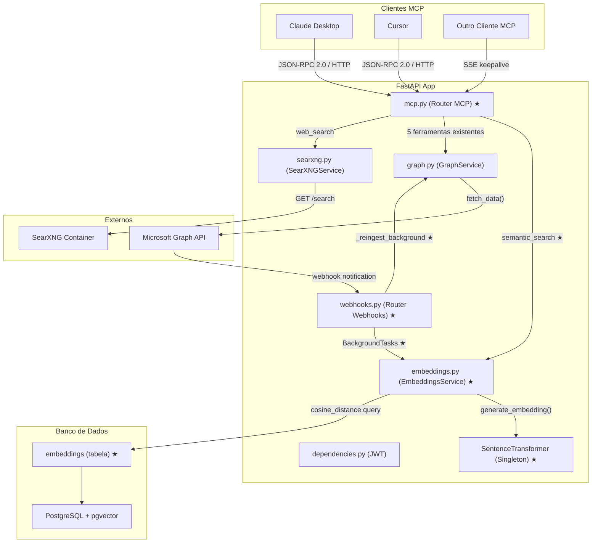
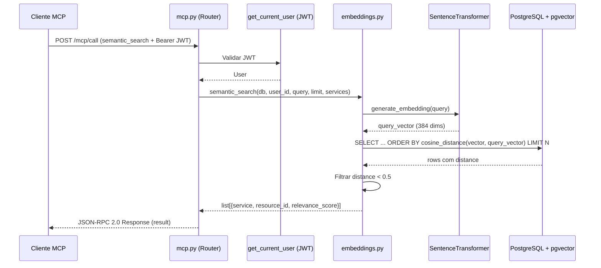

# Documento de Design — Lanez Fase 3: Busca Semântica

## Visão Geral

Este documento descreve a arquitetura e o design técnico da Fase 3 do Lanez. O objetivo é implementar busca semântica (por significado, não por palavra-chave) em todos os serviços do Microsoft 365 simultaneamente — calendário, emails, OneNote e OneDrive. A ferramenta `semantic_search` retorna os resultados mais relevantes de todos os serviços de uma só vez.

A Fase 3 adiciona dois novos arquivos (`app/models/embedding.py` e `app/services/embeddings.py`), uma nova migração Alembic (`alembic/versions/002_add_embeddings.py`), e modifica seis arquivos existentes (`app/models/__init__.py`, `app/services/webhook.py`, `app/routers/webhooks.py`, `app/routers/mcp.py`, `app/main.py`, `requirements.txt`). A implementação usa pgvector (já no stack) com o modelo local `all-MiniLM-L6-v2` (384 dimensões) via `sentence-transformers`, eliminando dependência de APIs externas de embeddings.

Decisões técnicas chave: singleton do modelo no startup (~2s, ~300MB), índice HNSW com cosine distance (invariante ao comprimento do texto), deduplicação por content_hash SHA-256, chunking por parágrafo a 1200 chars, threshold de distância 0.5, e re-embedding assíncrono via BackgroundTasks (webhook deve retornar 202 em <10s).

## Arquitetura

```
┌──────────────────────────────────────────────────────────────────┐
│                          FastAPI App                              │
│                                                                   │
│  ┌────────────┐  ┌──────────────────┐  ┌───────────────────────┐ │
│  │  Routers   │  │    Services      │  │    Models             │ │
│  │  auth.py   │→│  graph.py        │→│  user.py              │ │
│  │  webhooks  │→│  cache.py        │→│  cache.py             │ │
│  │  graph.py  │→│  webhook.py  ★   │→│  webhook.py           │ │
│  │  mcp.py  ★ │→│  searxng.py      │  │  embedding.py  ★     │ │
│  └────────────┘  │  embeddings.py ★ │  └───────────────────────┘ │
│        │         └──────────────────┘           │                 │
│        ▼                │                       ▼                 │
│  ┌──────────┐  ┌──────────────┐  ┌──────────────────────────┐   │
│  │  Schemas  │  │    Redis     │  │  PostgreSQL + pgvector   │   │
│  └──────────┘  └──────────────┘  └──────────────────────────┘   │
└──────────────────────────────────────────────────────────────────┘
         │                    │
         ▼                    ▼
┌─────────────────┐  ┌──────────────────┐  ┌──────────────┐
│  Microsoft       │  │  Microsoft Graph │  │  SearXNG      │
│  Entra ID        │  │  API v1.0        │  │  (busca web)  │
│  (OAuth 2.0)     │  │                  │  │               │
└─────────────────┘  └──────────────────┘  └──────────────┘

★ = Novo ou modificado na Fase 3
```



## Fluxo Principal — Busca Semântica via MCP



## Fluxo de Re-embedding via Webhook

```mermaid
sequenceDiagram
    participant MS as Microsoft Graph
    participant WH as webhooks.py (Router)
    participant WS as webhook.py (Service)
    participant CS as CacheService
    participant BG as BackgroundTask
    participant GS as GraphService
    participant E as embeddings.py
    participant M as SentenceTransformer
    participant DB as PostgreSQL + pgvector

    MS->>WH: POST /webhooks/graph (notificação)
    WH->>WS: process_notification(notification, cache, db)
    WS->>WS: Validar clientState
    WS->>CS: invalidate(user_id, service)
    WS-->>WH: (user_id, service_type)
    WH-->>MS: HTTP 202 (imediato)

    WH->>BG: add_task(_reingest_background, user_id, service_type)

    Note over BG,DB: Execução assíncrona após resposta 202

    BG->>GS: fetch_data(user_id, service_type, db, redis)
    GS-->>BG: GraphDataResponse (items)

    loop Para cada item
        BG->>E: ingest_graph_data(db, user_id, service, resource_id, data)
        E->>E: extract_text(service, data)
        E->>E: chunk_text(text, 1200)
        loop Para cada chunk
            E->>E: content_hash = SHA-256(chunk)
            alt Hash diferente do existente
                E->>M: generate_embedding(chunk)
                M-->>E: vector (384 dims)
                E->>DB: UPSERT embedding
            else Hash igual
                E->>E: Skip (conteúdo não mudou)
            end
        end
    end
```



## Componentes e Interfaces

### 1. Modelo Embedding (`app/models/embedding.py`) — NOVO

**Responsabilidade:** Modelo SQLAlchemy para armazenar vetores de embedding com pgvector.

**Interface:**

```python
class Embedding(Base):
    __tablename__ = "embeddings"

    id = Column(UUID(as_uuid=True), primary_key=True, default=uuid.uuid4)
    user_id = Column(UUID(as_uuid=True), ForeignKey("users.id", ondelete="CASCADE"), nullable=False)
    service = Column(String(20), nullable=False)        # "calendar" | "mail" | "onenote" | "onedrive"
    resource_id = Column(String(255), nullable=False)   # Graph API item ID ou "id__chunk_i"
    content_hash = Column(String(64), nullable=False)   # SHA-256 do texto
    vector = Column(Vector(384), nullable=False)        # embedding all-MiniLM-L6-v2
    updated_at = Column(DateTime(timezone=True), nullable=True)

    __table_args__ = (
        UniqueConstraint("user_id", "service", "resource_id", name="uq_embedding_user_service_resource"),
        Index(
            "ix_embeddings_vector_hnsw",
            vector,
            postgresql_using="hnsw",
            postgresql_with={"m": 16, "ef_construction": 64},
            postgresql_ops={"vector": "vector_cosine_ops"},
        ),
    )
```

**Decisões de design:**
- `Vector(384)` — dimensão do modelo all-MiniLM-L6-v2
- HNSW em vez de IVFFlat — melhor qualidade, não requer dados pré-existentes
- `vector_cosine_ops` — invariante ao comprimento do texto
- `content_hash` SHA-256 — deduplicação sem re-embedding desnecessário
- `ondelete="CASCADE"` — embeddings removidos quando usuário é deletado
- `resource_id` aceita formato `"id__chunk_i"` para textos longos divididos em chunks

### 2. Serviço de Embeddings (`app/services/embeddings.py`) — NOVO

**Responsabilidade:** Singleton do modelo, extração de texto, chunking, ingestão e busca semântica.

**Interface:**

```python
# Singleton do modelo
_model: SentenceTransformer | None = None

def get_model() -> SentenceTransformer:
    """Carrega o modelo uma vez (lazy singleton). ~2s, ~300MB."""

def generate_embedding(text: str) -> list[float]:
    """Gera vetor de 384 dimensões para o texto."""

def extract_text(service: str, data: dict) -> str:
    """Extrai texto relevante de um item Graph API por tipo de serviço."""

def chunk_text(text: str, max_chars: int = 1200) -> list[str]:
    """Divide texto por parágrafo, respeitando limite de ~400 tokens."""

async def ingest_item(
    db: AsyncSession, user_id: UUID, service: str, resource_id: str, text: str
) -> bool:
    """Gera e upserta embedding. Retorna True se houve mudança."""

async def ingest_graph_data(
    db: AsyncSession, user_id: UUID, service: str, resource_id: str, data: dict
) -> None:
    """Extrai texto, faz chunking, ingere embeddings."""

async def semantic_search(
    db: AsyncSession, user_id: UUID, query: str, limit: int = 10, services: list[str] | None = None
) -> list[dict]:
    """Busca por significado. Threshold de distância coseno: 0.5."""
```

**Responsabilidades:**
- Carregar modelo `all-MiniLM-L6-v2` como singleton (uma vez no startup)
- Extrair texto relevante de itens Graph API por tipo de serviço (calendar, mail, onenote, onedrive)
- Dividir textos longos em chunks de ~1200 chars por parágrafo
- Upsert de embeddings com deduplicação por content_hash SHA-256
- Busca vetorial por cosine distance com threshold 0.5

### 3. Migração Alembic (`alembic/versions/002_add_embeddings.py`) — NOVO

**Responsabilidade:** Criar extensão pgvector, tabela embeddings e índice HNSW.

**Operações:**
1. `CREATE EXTENSION IF NOT EXISTS vector`
2. `CREATE TABLE embeddings` com todas as colunas
3. Índice HNSW via `op.execute()` (tipo vector não tem representação nativa no Alembic)

### 4. WebhookService — Modificação (`app/services/webhook.py`)

**Responsabilidade adicional:** Retornar informações necessárias para re-embedding.

**Mudança de interface:**

```python
# Antes (Fase 2):
async def process_notification(...) -> bool:
    # return True (sucesso) ou return False (falha)

# Depois (Fase 3):
async def process_notification(...) -> tuple[uuid.UUID, ServiceType] | None:
    # return (user_id, service_type) no sucesso
    # return None na falha (subscrição não encontrada, resource desconhecido)
    # HTTPException(403) para clientState inválido (sem mudança)
```

**Decisão de design:** Retornar tuple em vez de bool permite que o router saiba exatamente qual user_id e service_type agendar para re-embedding, sem precisar inspecionar a notificação novamente.

### 5. Router Webhooks — Modificação (`app/routers/webhooks.py`)

**Responsabilidade adicional:** Agendar re-embedding em background após notificação.

**Novas interfaces:**

```python
async def _reingest_background(user_id: uuid.UUID, service_type: ServiceType) -> None:
    """Background task: busca dados frescos via GraphService e regenera embeddings."""

@router.post("/graph")
async def receive_graph_notification(
    request: Request,
    background_tasks: BackgroundTasks,  # NOVO
    ...
) -> Response:
    # Após process_notification retornar (user_id, service_type):
    # background_tasks.add_task(_reingest_background, user_id, service_type)
```

**Decisões de design:**
- `BackgroundTasks` do FastAPI — webhook retorna 202 imediatamente, re-embedding roda em background
- `_reingest_background` cria nova `AsyncSessionLocal` — não compartilha sessão do request
- Usa `get_redis()` diretamente — é função síncrona que retorna o client Redis global
- Erros no re-embedding são logados mas nunca propagados (não afetam resposta do webhook)

### 6. Router MCP — Modificação (`app/routers/mcp.py`)

**Responsabilidade adicional:** Expor 6ª ferramenta `semantic_search`.

**Nova ferramenta:**

```python
TOOL_SEMANTIC_SEARCH = MCPTool(
    name="semantic_search",
    description=(
        "Busca por significado em todos os serviços do Microsoft 365 simultaneamente. "
        "Use quando o usuário quiser encontrar algo sem saber em qual serviço está, "
        "ou quando uma busca por palavra-chave não for suficiente. "
        "Exemplos: 'encontre informações sobre o projeto Alpha', "
        "'o que discutimos com João sobre contratos?'"
    ),
    inputSchema={
        "type": "object",
        "properties": {
            "query": {"type": "string", "description": "Descrição do que você está buscando"},
            "services": {
                "type": "array",
                "items": {"type": "string", "enum": ["calendar", "mail", "onenote", "onedrive"]},
                "description": "Filtrar por serviços específicos (opcional — padrão: todos)",
            },
            "limit": {
                "type": "integer",
                "description": "Número máximo de resultados (padrão: 10, máximo: 20)",
            },
        },
        "required": ["query"],
    },
)
```

**Novo handler:**

```python
async def handle_semantic_search(arguments, user, db, redis, graph, searxng) -> list[dict]:
    from app.services.embeddings import semantic_search as _semantic_search
    query = arguments["query"]
    services = arguments.get("services")
    limit = min(int(arguments.get("limit", 10)), 20)
    return await _semantic_search(db, user.id, query, limit, services)
```

**Adições:** `TOOL_SEMANTIC_SEARCH` ao `ALL_TOOLS`, `handle_semantic_search` ao `TOOLS_REGISTRY`, `TOOL_SEMANTIC_SEARCH` ao `TOOLS_MAP`.

## Modelos de Dados

### Modelo Novo: Embedding

| Coluna | Tipo | Constraints |
|--------|------|-------------|
| id | UUID | PK, default uuid4 |
| user_id | UUID | FK users.id ON DELETE CASCADE, not null |
| service | String(20) | not null ("calendar", "mail", "onenote", "onedrive") |
| resource_id | String(255) | not null (Graph API item ID ou "id__chunk_i") |
| content_hash | String(64) | not null (SHA-256 do texto) |
| vector | Vector(384) | not null (pgvector, all-MiniLM-L6-v2) |
| updated_at | DateTime(tz) | nullable |

**Constraints:**
- UniqueConstraint em `(user_id, service, resource_id)` — nome: `uq_embedding_user_service_resource`
- Índice HNSW em `vector` com `vector_cosine_ops` (m=16, ef_construction=64)

**Regras de validação:**
- `service` deve ser um dos 4 valores: "calendar", "mail", "onenote", "onedrive"
- `content_hash` deve ter exatamente 64 caracteres (SHA-256 hex)
- `vector` deve ter exatamente 384 dimensões
- `resource_id` pode conter sufixo `__chunk_N` para textos divididos em chunks

## Pseudocódigo Algorítmico

### Algoritmo: Extração de Texto por Serviço

```python
def extract_text(service: str, data: dict) -> str:
    """
    Precondições:
    - service é um dos 4 valores: "calendar", "mail", "onenote", "onedrive"
    - data é dict com campos do item Graph API

    Pós-condições:
    - Retorna string com texto relevante concatenado por " | "
    - Retorna string vazia se nenhum campo relevante encontrado
    - Nunca levanta exceção (campos ausentes retornam "")

    Invariante de loop: N/A
    """
    if service == "calendar":
        parts = [data.get("subject", "")]
        if body := data.get("body", {}).get("content"):
            parts.append(body[:500])
        if attendees := data.get("attendees", []):
            names = [a.get("emailAddress", {}).get("name", "") for a in attendees]
            parts.append("Participantes: " + ", ".join(filter(None, names)))
        return " | ".join(filter(None, parts))

    elif service == "mail":
        return " | ".join(filter(None, [
            data.get("subject", ""),
            data.get("from", {}).get("emailAddress", {}).get("name", ""),
            data.get("bodyPreview", ""),
        ]))

    elif service == "onenote":
        return " | ".join(filter(None, [
            data.get("title", ""),
            data.get("contentUrl", ""),
        ]))

    elif service == "onedrive":
        return " | ".join(filter(None, [
            data.get("name", ""),
            data.get("description", ""),
        ]))

    return ""
```

### Algoritmo: Chunking por Parágrafo

```python
def chunk_text(text: str, max_chars: int = 1200) -> list[str]:
    """
    Precondições:
    - text é string não vazia
    - max_chars é inteiro positivo

    Pós-condições:
    - Retorna lista de chunks com len(chunk) <= max_chars (exceto parágrafos individuais maiores)
    - Preserva parágrafos inteiros (não corta frases)
    - Se texto não tem parágrafos, retorna [text[:max_chars]]
    - Retorna pelo menos 1 chunk

    Invariante de loop:
    - current_len == sum(len(p) for p in current_chunk)
    - Todos os chunks finalizados têm len <= max_chars
    """
    paragraphs = [p.strip() for p in text.split("\n\n") if p.strip()]
    chunks, current_chunk, current_len = [], [], 0

    for paragraph in paragraphs:
        plen = len(paragraph)
        if current_len + plen > max_chars and current_chunk:
            chunks.append("\n\n".join(current_chunk))
            current_chunk, current_len = [paragraph], plen
        else:
            current_chunk.append(paragraph)
            current_len += plen

    if current_chunk:
        chunks.append("\n\n".join(current_chunk))

    return chunks or [text[:max_chars]]
```

### Algoritmo: Ingestão com Deduplicação

```python
async def ingest_item(db, user_id, service, resource_id, text) -> bool:
    """
    Precondições:
    - db é AsyncSession ativa
    - user_id é UUID válido existente na tabela users
    - service é um dos 4 valores válidos
    - resource_id é string não vazia
    - text é string (pode ser vazia)

    Pós-condições:
    - Se text vazio: retorna False, nenhuma operação no banco
    - Se embedding existe com mesmo content_hash: retorna False (skip)
    - Se embedding existe com hash diferente: atualiza vector, content_hash, updated_at
    - Se embedding não existe: insere novo registro
    - Retorna True se houve INSERT ou UPDATE
    - Commit executado após cada operação

    Invariante de loop: N/A
    """
    if not text.strip():
        return False

    content_hash = hashlib.sha256(text.encode()).hexdigest()

    existing = await db.execute(
        select(Embedding).where(
            Embedding.user_id == user_id,
            Embedding.service == service,
            Embedding.resource_id == resource_id,
        )
    )
    existing = existing.scalar_one_or_none()

    if existing and existing.content_hash == content_hash:
        return False  # conteúdo não mudou

    vector = generate_embedding(text)
    now = datetime.now(timezone.utc)

    if existing:
        existing.vector = vector
        existing.content_hash = content_hash
        existing.updated_at = now
    else:
        db.add(Embedding(
            user_id=user_id, service=service, resource_id=resource_id,
            content_hash=content_hash, vector=vector, updated_at=now,
        ))

    await db.commit()
    return True
```

### Algoritmo: Ingestão de Dados Graph com Chunking

```python
async def ingest_graph_data(db, user_id, service, resource_id, data) -> None:
    """
    Precondições:
    - db é AsyncSession ativa
    - data é dict com campos do item Graph API

    Pós-condições:
    - Se extract_text retorna vazio: nenhuma operação
    - Se texto cabe em 1 chunk: ingest_item com resource_id original
    - Se texto dividido em N chunks: ingest_item para cada com resource_id "{id}__chunk_{i}"
    - Cada chunk é ingerido independentemente

    Invariante de loop:
    - Todos os chunks anteriores foram ingeridos com sucesso
    """
    text = extract_text(service, data)
    if not text:
        return

    chunks = chunk_text(text)
    if len(chunks) == 1:
        await ingest_item(db, user_id, service, resource_id, chunks[0])
    else:
        for i, chunk in enumerate(chunks):
            await ingest_item(db, user_id, service, f"{resource_id}__chunk_{i}", chunk)
```

### Algoritmo: Busca Semântica

```python
async def semantic_search(db, user_id, query, limit=10, services=None) -> list[dict]:
    """
    Precondições:
    - db é AsyncSession ativa
    - user_id é UUID válido
    - query é string não vazia
    - limit é inteiro positivo
    - services é None (todos) ou lista de strings válidas

    Pós-condições:
    - Retorna lista de {service, resource_id, relevance_score}
    - Ordenada por relevance_score decrescente (distance crescente)
    - Todos os resultados têm distance < 0.5 (relevance_score > 0.5)
    - len(resultado) <= limit
    - Se services fornecido, filtra apenas por esses serviços

    Invariante de loop: N/A (query SQL única)
    """
    query_vector = generate_embedding(query)

    stmt = (
        select(
            Embedding,
            Embedding.vector.cosine_distance(query_vector).label("distance"),
        )
        .where(Embedding.user_id == user_id)
    )

    if services:
        stmt = stmt.where(Embedding.service.in_(services))

    stmt = stmt.order_by("distance").limit(limit)
    results = await db.execute(stmt)

    return [
        {
            "service": row.Embedding.service,
            "resource_id": row.Embedding.resource_id,
            "relevance_score": round(1 - row.distance, 4),
        }
        for row in results.all()
        if row.distance < 0.5
    ]
```

### Algoritmo: Re-embedding em Background

```python
async def _reingest_background(user_id, service_type) -> None:
    """
    Precondições:
    - user_id é UUID válido existente na tabela users
    - service_type é ServiceType válido
    - Redis inicializado (get_redis() disponível)

    Pós-condições:
    - Dados frescos buscados via GraphService.fetch_data
    - Embeddings atualizados para todos os itens retornados
    - Erros logados mas nunca propagados
    - Sessão do banco e GraphService fechados no finally

    Invariante de loop:
    - Todos os itens anteriores foram processados (com sucesso ou erro logado)
    """
    async with AsyncSessionLocal() as db:
        graph_svc = GraphService()
        try:
            redis = get_redis()
            response = await graph_svc.fetch_data(user_id, service_type, db, redis)
            data = response.data
            items = data.get("value", []) if isinstance(data, dict) else []

            for item in items:
                resource_id = item.get("id", "")
                if resource_id:
                    await ingest_graph_data(db, user_id, service_type.value, resource_id, item)
        except Exception:
            logger.exception(
                "Erro no re-embedding user_id=%s service=%s [token=REDACTED]",
                user_id, service_type.value,
            )
        finally:
            await graph_svc.close()
```

## Funções-Chave com Especificações Formais

### Função 1: generate_embedding()

```python
def generate_embedding(text: str) -> list[float]
```

**Precondições:**
- `text` é string não vazia
- Modelo `all-MiniLM-L6-v2` carregado via `get_model()`

**Pós-condições:**
- Retorna lista de exatamente 384 floats
- Valores normalizados (norma L2 ≈ 1.0)
- Determinístico: mesma entrada → mesma saída

**Invariante de loop:** N/A

### Função 2: get_model()

```python
def get_model() -> SentenceTransformer
```

**Precondições:**
- Nenhuma (lazy initialization)

**Pós-condições:**
- Retorna instância de `SentenceTransformer("all-MiniLM-L6-v2")`
- Singleton: chamadas subsequentes retornam a mesma instância
- Primeira chamada leva ~2s e aloca ~300MB

**Invariante de loop:** N/A

### Função 3: ingest_item()

```python
async def ingest_item(db, user_id, service, resource_id, text) -> bool
```

**Precondições:**
- `db` é `AsyncSession` ativa
- `user_id` existe na tabela `users`
- `service` ∈ {"calendar", "mail", "onenote", "onedrive"}
- `resource_id` é string não vazia

**Pós-condições:**
- Se `text` vazio → retorna `False`, sem operação no banco
- Se embedding existe com mesmo `content_hash` → retorna `False` (skip)
- Se embedding existe com hash diferente → UPDATE vector, content_hash, updated_at → retorna `True`
- Se embedding não existe → INSERT novo registro → retorna `True`
- `content_hash == hashlib.sha256(text.encode()).hexdigest()`

**Invariante de loop:** N/A

### Função 4: semantic_search()

```python
async def semantic_search(db, user_id, query, limit=10, services=None) -> list[dict]
```

**Precondições:**
- `db` é `AsyncSession` ativa
- `query` é string não vazia
- `limit` é inteiro positivo (máximo 20)
- `services` é `None` ou lista de strings válidas

**Pós-condições:**
- Retorna lista de `{service, resource_id, relevance_score}`
- `relevance_score = round(1 - cosine_distance, 4)`
- Todos os resultados têm `cosine_distance < 0.5` (relevance_score > 0.5)
- Ordenados por `relevance_score` decrescente
- `len(resultado) <= limit`

**Invariante de loop:** N/A

## Exemplo de Uso

```python
# 1. Busca semântica via MCP — encontrar informações sobre um projeto
# POST /mcp/call com Authorization: Bearer <JWT>
{
    "jsonrpc": "2.0",
    "id": "sem-1",
    "method": "tools/call",
    "params": {
        "name": "semantic_search",
        "arguments": {
            "query": "reunião de planejamento do projeto Alpha",
            "limit": 5
        }
    }
}
# Resposta sucesso:
{
    "jsonrpc": "2.0",
    "id": "sem-1",
    "result": {
        "content": [{
            "type": "text",
            "text": "[{\"service\": \"calendar\", \"resource_id\": \"AAMk...\", \"relevance_score\": 0.8234}, {\"service\": \"mail\", \"resource_id\": \"AAMk...\", \"relevance_score\": 0.7156}]"
        }],
        "isError": false
    }
}

# 2. Busca semântica filtrada por serviço
{
    "jsonrpc": "2.0",
    "id": "sem-2",
    "method": "tools/call",
    "params": {
        "name": "semantic_search",
        "arguments": {
            "query": "contrato de prestação de serviços",
            "services": ["mail", "onedrive"],
            "limit": 10
        }
    }
}

# 3. Listar ferramentas — agora retorna 6 ferramentas
# GET /mcp com Authorization: Bearer <JWT>
# Resposta inclui semantic_search na lista de tools

# 4. Webhook dispara re-embedding em background
# POST /webhooks/graph (notificação da Microsoft)
# → process_notification retorna (user_id, service_type)
# → BackgroundTasks agenda _reingest_background
# → Resposta 202 imediata
# → Background: fetch_data → extract_text → chunk_text → ingest_item para cada item
```

## Tratamento de Erros

### Erro 1: Modelo Não Carregado

**Condição:** `get_model()` falha ao carregar `all-MiniLM-L6-v2` (disco cheio, dependência ausente)
**Resposta:** Exceção propagada no startup — aplicação não inicia
**Recuperação:** Verificar instalação de `sentence-transformers` e espaço em disco

### Erro 2: Texto Vazio para Embedding

**Condição:** `extract_text()` retorna string vazia para um item Graph API
**Resposta:** `ingest_item()` retorna `False` sem operação no banco
**Recuperação:** Nenhuma ação necessária — item sem texto relevante é ignorado

### Erro 3: Embedding Duplicado (Race Condition)

**Condição:** Dois webhooks simultâneos tentam inserir embedding para o mesmo `(user_id, service, resource_id)`
**Resposta:** UniqueConstraint viola — IntegrityError
**Recuperação:** Segundo insert falha, primeiro prevalece — comportamento correto

### Erro 4: Falha no Re-embedding Background

**Condição:** GraphService.fetch_data falha durante `_reingest_background` (token expirado, rate limit)
**Resposta:** Exceção logada, background task encerra silenciosamente
**Recuperação:** Próximo webhook dispara novo re-embedding

### Erro 5: Query Sem Resultados Relevantes

**Condição:** Busca semântica não encontra embeddings com distance < 0.5
**Resposta:** Retorna lista vazia (isError: false)
**Recuperação:** Usuário pode reformular a query ou usar busca por palavra-chave

### Erro 6: Parâmetro query Ausente em semantic_search

**Condição:** Chamada MCP sem parâmetro obrigatório `query`
**Resposta:** JSON-RPC error com código -32602 (Invalid Params)
**Recuperação:** Cliente deve incluir parâmetro `query`

### Erro 7: Serviço Inválido no Filtro

**Condição:** `services` contém valor que não é "calendar", "mail", "onenote" ou "onedrive"
**Resposta:** Query SQL retorna resultados vazios para serviço inexistente
**Recuperação:** Nenhuma ação necessária — filtro simplesmente não encontra resultados

## Estratégia de Testes

### Testes Unitários

- Testar `extract_text` para cada tipo de serviço com dados reais e dados vazios
- Testar `chunk_text` com textos curtos (1 chunk), longos (múltiplos chunks) e sem parágrafos
- Testar `ingest_item` com mock do banco: insert, update e skip por hash igual
- Testar `semantic_search` com mock do banco: resultados filtrados por threshold e serviço
- Testar `_reingest_background` com mocks de GraphService e embeddings

### Testes de Propriedade (Property-Based Testing)

**Biblioteca:** hypothesis

- Dimensão do vetor é sempre 384 para qualquer texto de entrada
- content_hash SHA-256 tem sempre 64 caracteres hexadecimais
- chunk_text sempre retorna pelo menos 1 chunk para qualquer texto não vazio
- Deduplicação: ingest_item com mesmo texto retorna False na segunda chamada
- Busca semântica: resultados sempre têm relevance_score > 0.5
- process_notification retorna tuple ou None (nunca bool)

### Testes de Integração

- Fluxo completo: ingest_graph_data → semantic_search → verificar resultados
- Webhook → process_notification → _reingest_background → verificar embeddings no banco

## Considerações de Performance

- **Modelo singleton**: carregado uma vez no startup (~2s, ~300MB) — por request seria inaceitável
- **HNSW index**: busca aproximada O(log N) em vez de scan linear O(N) — essencial para >1000 embeddings
- **content_hash deduplicação**: evita re-embedding quando webhook notifica mudança de metadados sem alteração de conteúdo
- **BackgroundTasks**: re-embedding não bloqueia resposta do webhook (exigência Graph API: 202 em <10s)
- **Chunking a 1200 chars**: ~400 tokens — dentro do limite eficiente do all-MiniLM-L6-v2 (max 256 tokens, mas trunca graciosamente)
- **Threshold 0.5**: descarta resultados com similaridade < 50% — reduz ruído sem perder relevância

## Considerações de Segurança

- **Tokens nunca logados** — usar `[token=REDACTED]` em todas as mensagens de log do re-embedding
- **Isolamento por user_id** — busca semântica sempre filtra por `user_id`, impedindo acesso cruzado
- **CASCADE delete** — embeddings removidos automaticamente quando usuário é deletado
- **Modelo local** — `all-MiniLM-L6-v2` roda localmente, sem enviar dados para APIs externas
- **Description fixa** — string da ferramenta `semantic_search` é hardcoded (proteção contra tool poisoning)

## Dependências

### Novas
- **sentence-transformers==3.3.1** — framework para modelos de embedding (inclui PyTorch)
- **all-MiniLM-L6-v2** — modelo de embedding (384 dimensões, ~80MB download, ~300MB em memória)

### Existentes (sem alteração)
- **pgvector==0.3.0** — já presente no requirements.txt
- FastAPI, httpx, SQLAlchemy, asyncpg, redis, python-jose, cryptography
- PostgreSQL (pgvector/pgvector:pg16), Redis (redis:7-alpine)

## Modificações em Arquivos Existentes

### `app/models/__init__.py` — Importar Embedding

```python
from app.models.embedding import Embedding  # adicionar

__all__ = [
    "Base", "GraphCache", "User", "WebhookSubscription", "Embedding",
]
```

### `app/main.py` — Precarregar modelo no lifespan

```python
from app.services.embeddings import get_model  # adicionar import

# No lifespan, após init_redis() e create_all:
get_model()  # força carregamento do modelo no startup (~2s, ~300MB)
logger.info("Modelo de embeddings carregado")
```

### `app/services/webhook.py` — Retorno tuple | None

```python
# Assinatura muda de:
async def process_notification(...) -> bool:
# Para:
async def process_notification(...) -> tuple[uuid.UUID, ServiceType] | None:
    # return False → return None
    # return True → return user_id, service_type
```

### `app/routers/webhooks.py` — BackgroundTasks + _reingest_background

```python
from fastapi import BackgroundTasks  # adicionar import

# Nova função:
async def _reingest_background(user_id, service_type): ...

# Endpoint modificado:
@router.post("/graph")
async def receive_graph_notification(
    request: Request,
    background_tasks: BackgroundTasks,  # NOVO
    ...
):
    # Após process_notification retornar (user_id, service_type):
    # background_tasks.add_task(_reingest_background, user_id, service_type)
```

### `app/routers/mcp.py` — 6ª ferramenta semantic_search

```python
# Adicionar TOOL_SEMANTIC_SEARCH, handle_semantic_search
# Adicionar ao TOOLS_REGISTRY, TOOLS_MAP, ALL_TOOLS
```

### `requirements.txt` — Adicionar sentence-transformers

```
sentence-transformers==3.3.1
```

## Propriedades de Corretude

### Propriedade 1: Dimensão do Vetor é Sempre 384
- **Tipo:** Invariante
- **Descrição:** Para qualquer texto de entrada não vazio, `generate_embedding(text)` deve retornar uma lista de exatamente 384 floats.
- **Propriedade:** `len(generate_embedding(text)) == 384` para todo texto não vazio
- **Abordagem de teste:** Property-based test gerando strings aleatórias não vazias, verificando que o vetor retornado tem exatamente 384 dimensões.

### Propriedade 2: content_hash SHA-256 Tem 64 Caracteres Hex
- **Tipo:** Invariante
- **Descrição:** O content_hash gerado para qualquer texto deve ser uma string hexadecimal de exatamente 64 caracteres (SHA-256).
- **Propriedade:** `len(hashlib.sha256(text.encode()).hexdigest()) == 64 AND all(c in "0123456789abcdef" for c in hash)` para todo texto
- **Abordagem de teste:** Property-based test gerando strings aleatórias, verificando formato e comprimento do hash.

### Propriedade 3: chunk_text Sempre Retorna Pelo Menos 1 Chunk
- **Tipo:** Invariante
- **Descrição:** Para qualquer texto não vazio e qualquer max_chars positivo, `chunk_text` deve retornar uma lista com pelo menos 1 elemento.
- **Propriedade:** `len(chunk_text(text, max_chars)) >= 1` para todo texto não vazio e max_chars > 0
- **Abordagem de teste:** Property-based test gerando textos aleatórios (com e sem parágrafos) e valores de max_chars, verificando que a lista nunca é vazia.

### Propriedade 4: Deduplicação por content_hash
- **Tipo:** Idempotência
- **Descrição:** Chamar `ingest_item` duas vezes com o mesmo texto para o mesmo (user_id, service, resource_id) deve retornar True na primeira e False na segunda chamada.
- **Propriedade:** `ingest_item(text) == True AND ingest_item(text) == False` para mesmo (user_id, service, resource_id, text)
- **Abordagem de teste:** Property-based test gerando textos aleatórios, ingerindo duas vezes, verificando que a segunda chamada retorna False.

### Propriedade 5: Resultados da Busca Semântica Respeitam Threshold
- **Tipo:** Invariante
- **Descrição:** Todos os resultados retornados por `semantic_search` devem ter `cosine_distance < 0.5` (relevance_score > 0.5).
- **Propriedade:** `all(r["relevance_score"] > 0.5 for r in semantic_search(query))` para qualquer query
- **Abordagem de teste:** Property-based test ingerindo textos aleatórios, buscando com queries aleatórias, verificando que todos os resultados respeitam o threshold.

### Propriedade 6: process_notification Retorna Tuple ou None
- **Tipo:** Invariante
- **Descrição:** `process_notification` deve retornar `(uuid.UUID, ServiceType)` no sucesso ou `None` na falha. Nunca retorna `bool`.
- **Propriedade:** `result is None OR (isinstance(result[0], uuid.UUID) AND isinstance(result[1], ServiceType))` para qualquer notificação válida
- **Abordagem de teste:** Property-based test gerando notificações com clientState válido/inválido, subscription_id existente/inexistente, verificando tipo do retorno.

### Propriedade 7: Ferramentas MCP Agora São 6
- **Tipo:** Invariante
- **Descrição:** A lista de ferramentas MCP deve conter exatamente 6 ferramentas após a Fase 3, incluindo `semantic_search`.
- **Propriedade:** `len(ALL_TOOLS) == 6 AND "semantic_search" in [t.name for t in ALL_TOOLS]`
- **Abordagem de teste:** Teste unitário verificando que ALL_TOOLS contém 6 ferramentas e que semantic_search está presente.

### Propriedade 8: extract_text Nunca Levanta Exceção
- **Tipo:** Invariante
- **Descrição:** `extract_text` deve retornar string (possivelmente vazia) para qualquer combinação de service e data, sem levantar exceção.
- **Propriedade:** `isinstance(extract_text(service, data), str)` para qualquer service e data
- **Abordagem de teste:** Property-based test gerando dicts aleatórios como data e strings aleatórias como service, verificando que sempre retorna string.

## Casos de Borda

### Caso de Borda 1: Texto Vazio para Embedding
- **Descrição:** Item Graph API sem campos de texto relevantes (subject vazio, body vazio).
- **Teste:** Chamar `ingest_item` com texto vazio, verificar que retorna False sem operação no banco.

### Caso de Borda 2: Texto Muito Longo (Múltiplos Chunks)
- **Descrição:** Email com body muito longo que excede 1200 chars.
- **Teste:** Chamar `chunk_text` com texto de 5000 chars com parágrafos, verificar que retorna múltiplos chunks todos <= 1200 chars.

### Caso de Borda 3: Texto Sem Parágrafos
- **Descrição:** Texto contínuo sem `\n\n` (uma única linha longa).
- **Teste:** Chamar `chunk_text` com texto sem parágrafos, verificar que retorna `[text[:max_chars]]`.

### Caso de Borda 4: Busca Semântica Sem Embeddings
- **Descrição:** Usuário sem nenhum embedding no banco faz busca semântica.
- **Teste:** Chamar `semantic_search` com user_id sem embeddings, verificar que retorna lista vazia.

### Caso de Borda 5: Busca Semântica com Filtro de Serviço Inexistente
- **Descrição:** Filtro `services=["inexistente"]` na busca semântica.
- **Teste:** Chamar `semantic_search` com serviço inválido, verificar que retorna lista vazia.

### Caso de Borda 6: Re-embedding com Token Expirado
- **Descrição:** Token expira durante `_reingest_background`.
- **Teste:** Mock de GraphService.fetch_data levantando HTTPException(401), verificar que erro é logado e background task encerra sem propagar.

### Caso de Borda 7: Webhook Duplo para Mesmo Recurso
- **Descrição:** Dois webhooks simultâneos para o mesmo item — race condition no upsert.
- **Teste:** Simular dois ingest_item concorrentes para mesmo (user_id, service, resource_id), verificar que UniqueConstraint é respeitado.

### Caso de Borda 8: content_hash Igual (Metadados Mudaram, Conteúdo Não)
- **Descrição:** Webhook notifica mudança mas texto extraído é idêntico ao anterior.
- **Teste:** Ingerir item, chamar ingest_item novamente com mesmo texto, verificar que retorna False (skip).

### Caso de Borda 9: Parâmetro query Ausente em semantic_search via MCP
- **Descrição:** Chamada MCP `semantic_search` sem parâmetro obrigatório `query`.
- **Teste:** POST /mcp/call sem query, verificar resposta JSON-RPC error com código -32602.

### Caso de Borda 10: Limit Excede Máximo (20) em semantic_search
- **Descrição:** Chamada com `limit: 100` — deve ser capped a 20.
- **Teste:** Chamar handler com limit=100, verificar que query SQL usa limit=20.
