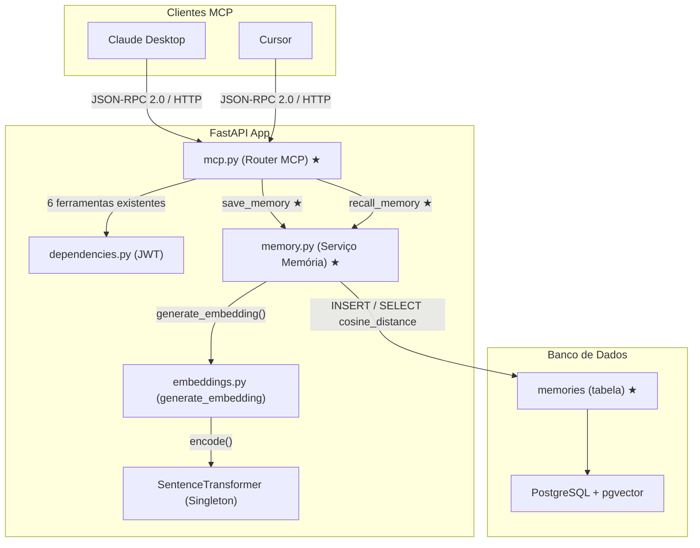
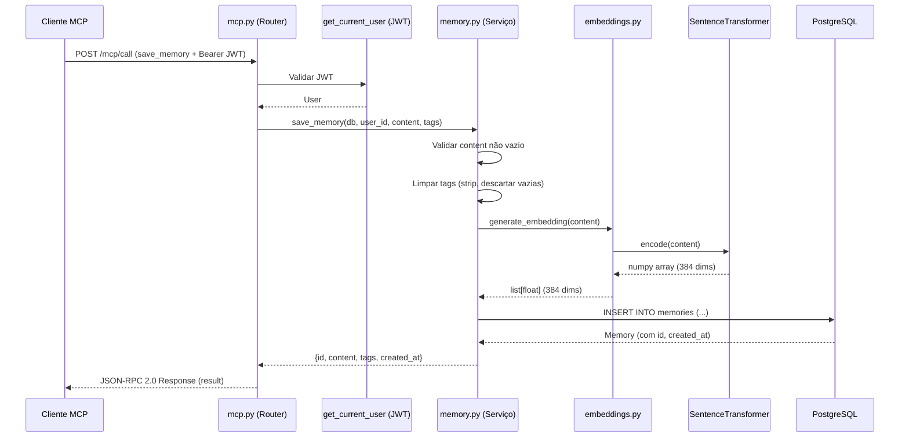
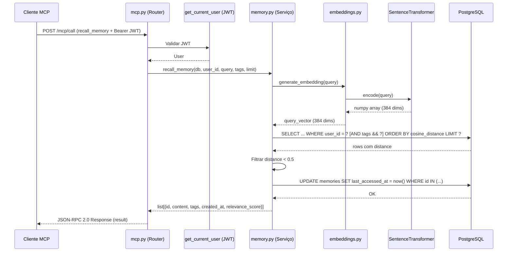

# Documento de Design — Lanez Fase 4: Memória Persistente

## Visão Geral

Este documento descreve a arquitetura e o design técnico da Fase 4 do Lanez. O objetivo é implementar memória persistente para o AI assistant — o usuário ou o próprio AI salva decisões, preferências, projetos em andamento e fatos importantes via MCP, e em sessões futuras recupera memórias relevantes por busca semântica.

A Fase 4 adiciona dois novos arquivos (`app/models/memory.py` e `app/services/memory.py`), uma nova migração Alembic (`alembic/versions/003_add_memories.py`), e modifica dois arquivos existentes (`app/models/__init__.py` e `app/routers/mcp.py`). A implementação reutiliza `generate_embedding()` do `app.services.embeddings` (mesmo singleton all-MiniLM-L6-v2 da Fase 3), armazena texto completo + tags + vetor na tabela `memories`, e expõe `save_memory` e `recall_memory` como ferramentas MCP (total: 8 ferramentas).

Decisões técnicas chave: `ARRAY(String)` nativo PostgreSQL para tags (GIN indexável, `overlap()` para filtro OR), sempre INSERT sem deduplicação (memórias são input intencional), threshold de cosine_distance 0.5, limit padrão 5 / máximo 20, `last_accessed_at` atualizado em batch no recall, e `ValueError` para content vazio convertido em `HTTPException(400)` no handler MCP.

## Arquitetura

```
┌──────────────────────────────────────────────────────────────────┐
│                          FastAPI App                              │
│                                                                   │
│  ┌────────────┐  ┌──────────────────┐  ┌───────────────────────┐ │
│  │  Routers   │  │    Services      │  │    Models             │ │
│  │  auth.py   │→│  graph.py        │→│  user.py              │ │
│  │  webhooks  │→│  cache.py        │→│  cache.py             │ │
│  │  graph.py  │→│  webhook.py      │→│  webhook.py           │ │
│  │  mcp.py  ★ │→│  searxng.py      │  │  embedding.py         │ │
│  └────────────┘  │  embeddings.py   │  │  memory.py  ★         │ │
│        │         │  memory.py  ★    │  └───────────────────────┘ │
│        ▼         └──────────────────┘           │                 │
│  ┌──────────┐           │                       ▼                 │
│  │  Schemas  │  ┌──────────────┐  ┌──────────────────────────┐   │
│  └──────────┘  │    Redis     │  │  PostgreSQL + pgvector   │   │
│                └──────────────┘  └──────────────────────────┘   │
└──────────────────────────────────────────────────────────────────┘

★ = Novo ou modificado na Fase 4
```



## Fluxo Principal — save_memory via MCP



## Fluxo Principal — recall_memory via MCP



## Componentes e Interfaces

### 1. Modelo Memory (`app/models/memory.py`) — NOVO

**Responsabilidade:** Modelo SQLAlchemy para armazenar memórias persistentes com texto, tags e vetor.

**Interface:**

```python
class Memory(Base):
    __tablename__ = "memories"

    id: Mapped[uuid.UUID]           # PK, default uuid4
    user_id: Mapped[uuid.UUID]      # FK users.id ON DELETE CASCADE
    content: Mapped[str]            # Text, não nulo
    tags: Mapped[list[str]]         # ARRAY(String), não nulo, default list
    vector                          # Vector(384), não nulo
    created_at: Mapped[datetime]    # DateTime(tz), não nulo
    last_accessed_at: Mapped[datetime | None]  # DateTime(tz), nullable

    __table_args__ = (
        Index("ix_memories_vector_hnsw", "vector",
              postgresql_using="hnsw",
              postgresql_with={"m": 16, "ef_construction": 64},
              postgresql_ops={"vector": "vector_cosine_ops"}),
        Index("ix_memories_user_created", "user_id", "created_at"),
        Index("ix_memories_tags_gin", "tags", postgresql_using="gin"),
    )
```

**Decisões de design:**
- `Vector(384)` — mesma dimensão do modelo all-MiniLM-L6-v2 usado na Fase 3
- `ARRAY(String)` nativo PostgreSQL — GIN indexável, `overlap()` e `contains()` nativos, mais rápido que JSONB para filtros de tags
- `default=list` (não `[]`) — evita mutable default no SQLAlchemy
- `last_accessed_at` nullable — None até a primeira vez que a memória é retornada por recall
- Sem `content_hash` — memórias são input intencional, sem deduplicação
- Sem `service` ou `resource_id` — memórias não derivam do Microsoft 365

### 2. Serviço de Memória (`app/services/memory.py`) — NOVO

**Responsabilidade:** Salvar e recuperar memórias persistentes com busca semântica.

**Interface:**

```python
_RECALL_DISTANCE_THRESHOLD = 0.5
_RECALL_LIMIT_DEFAULT = 5
_RECALL_LIMIT_MAX = 20

async def save_memory(
    db: AsyncSession, user_id: UUID, content: str, tags: list[str] | None = None
) -> dict:
    """Persiste memória nova. Sempre INSERT. Raises ValueError se content vazio."""

async def recall_memory(
    db: AsyncSession, user_id: UUID, query: str,
    tags: list[str] | None = None, limit: int = 5
) -> list[dict]:
    """Recupera memórias por busca semântica + filtro de tags (OR)."""
```

**Responsabilidades:**
- Importar `generate_embedding` de `app.services.embeddings` — NÃO criar outro singleton
- Validar content não vazio (levantar `ValueError`)
- Limpar tags com `.strip()` e descartar strings vazias
- Sempre INSERT (sem deduplicação por content_hash)
- Busca vetorial por cosine distance com threshold 0.5
- Filtro de tags via `overlap()` (OR — pelo menos uma tag em comum)
- Atualizar `last_accessed_at` em batch via `update().where().values()`
- Limitar resultados: padrão 5, máximo 20

### 3. Migração Alembic (`alembic/versions/003_add_memories.py`) — NOVO

**Responsabilidade:** Criar tabela memories com 3 índices (HNSW, GIN, B-tree composto).

**Operações:**
1. `CREATE TABLE memories` com todas as colunas e FK
2. `CREATE INDEX ix_memories_user_created` (B-tree composto)
3. `CREATE INDEX ix_memories_tags_gin ON memories USING gin(tags)` (raw SQL)
4. `CREATE INDEX ix_memories_vector_hnsw ON memories USING hnsw (vector vector_cosine_ops) WITH (m = 16, ef_construction = 64)` (raw SQL)

**Nota:** A extensão `vector` já foi criada na migration 002 — NÃO recriar.

### 4. Router MCP — Modificação (`app/routers/mcp.py`)

**Responsabilidade adicional:** Expor 7ª e 8ª ferramentas: `save_memory` e `recall_memory`.

**Novas ferramentas:**

```python
TOOL_SAVE_MEMORY = MCPTool(
    name="save_memory",
    description="Salve uma memória persistente que deve ser lembrada em sessões futuras...",
    inputSchema={
        "type": "object",
        "properties": {
            "content": {"type": "string", "description": "..."},
            "tags": {"type": "array", "items": {"type": "string"}, "description": "..."},
        },
        "required": ["content"],
    },
)

TOOL_RECALL_MEMORY = MCPTool(
    name="recall_memory",
    description="Recupere memórias relevantes para a conversa atual via busca semântica...",
    inputSchema={
        "type": "object",
        "properties": {
            "query": {"type": "string", "description": "..."},
            "tags": {"type": "array", "items": {"type": "string"}, "description": "..."},
            "limit": {"type": "integer", "description": "..."},
        },
        "required": ["query"],
    },
)
```

**Novos handlers:**

```python
async def handle_save_memory(arguments, user, db, redis, graph, searxng) -> dict:
    # Converte ValueError em HTTPException(400)

async def handle_recall_memory(arguments, user, db, redis, graph, searxng) -> list[dict]:
    # Limita limit a 20
```

**Adições:** Ambas ferramentas ao `TOOLS_REGISTRY`, `TOOLS_MAP` e `ALL_TOOLS`. Total: 8 ferramentas.

### 5. Models Init — Modificação (`app/models/__init__.py`)

**Mudança:** Importar `Memory` de `app.models.memory` e adicionar ao `__all__`.

## Modelos de Dados

### Modelo Novo: Memory

| Coluna | Tipo | Constraints |
|--------|------|-------------|
| id | UUID | PK, default uuid4 |
| user_id | UUID | FK users.id ON DELETE CASCADE, not null |
| content | Text | not null |
| tags | ARRAY(String) | not null, default `ARRAY[]::varchar[]` |
| vector | Vector(384) | not null (pgvector, all-MiniLM-L6-v2) |
| created_at | DateTime(tz) | not null |
| last_accessed_at | DateTime(tz) | nullable |

**Índices:**
- `ix_memories_vector_hnsw` — HNSW em vector com `vector_cosine_ops` (m=16, ef_construction=64)
- `ix_memories_tags_gin` — GIN em tags (filtros por sobreposição)
- `ix_memories_user_created` — B-tree composto em (user_id, created_at)

**Diferenças vs Embedding (Fase 3):**
- Sem `content_hash` — sem deduplicação
- Sem `service` / `resource_id` — não derivado do Graph API
- Com `content` (texto completo) — embeddings da Fase 3 não armazenam texto
- Com `tags` (ARRAY) — embeddings não têm tags
- Com `last_accessed_at` — atualizado no recall

## Pseudocódigo Algorítmico

### Algoritmo: save_memory

```python
async def save_memory(db, user_id, content, tags=None) -> dict:
    """
    Precondições:
    - db é AsyncSession ativa
    - user_id é UUID válido existente na tabela users
    - content é string (pode ser vazia — será validada)

    Pós-condições:
    - Se content vazio/whitespace: levanta ValueError, nenhuma operação no banco
    - Caso contrário: INSERT novo registro em memories
    - Tags limpas: strip() aplicado, strings vazias descartadas
    - Vetor gerado via generate_embedding(content) — 384 dims
    - Retorna dict com {id, content, tags, created_at}

    Invariante: Cada chamada cria exatamente 0 ou 1 registro (nunca update)
    """
    if not content.strip():
        raise ValueError("content não pode ser vazio")

    clean_tags = [t.strip() for t in (tags or []) if t.strip()]
    vector = generate_embedding(content)
    now = datetime.now(timezone.utc)

    memory = Memory(
        user_id=user_id, content=content, tags=clean_tags,
        vector=vector, created_at=now,
    )
    db.add(memory)
    await db.commit()
    await db.refresh(memory)

    return {
        "id": str(memory.id),
        "content": memory.content,
        "tags": memory.tags,
        "created_at": memory.created_at.isoformat(),
    }
```

### Algoritmo: recall_memory

```python
async def recall_memory(db, user_id, query, tags=None, limit=5) -> list[dict]:
    """
    Precondições:
    - db é AsyncSession ativa
    - user_id é UUID válido
    - query é string (pode ser vazia — retorna [])
    - limit é inteiro (será clamped entre 1 e 20)

    Pós-condições:
    - Se query vazia/whitespace: retorna [] sem hit no banco
    - Todos os resultados têm cosine_distance < 0.5 (relevance_score > 0.5)
    - Se tags fornecidas: filtra por overlap (OR — pelo menos 1 tag em comum)
    - last_accessed_at atualizado em batch para IDs retornados
    - Retorna lista de {id, content, tags, created_at, relevance_score}
    - Ordenada por relevance_score decrescente

    Invariante: len(resultado) <= min(limit, 20)
    """
    if not query.strip():
        return []

    limit = min(max(limit, 1), _RECALL_LIMIT_MAX)
    query_vector = generate_embedding(query)
    distance_col = Memory.vector.cosine_distance(query_vector).label("distance")

    stmt = select(Memory, distance_col).where(Memory.user_id == user_id)

    if tags:
        clean_tags = [t.strip() for t in tags if t.strip()]
        if clean_tags:
            stmt = stmt.where(Memory.tags.overlap(clean_tags))

    stmt = stmt.order_by("distance").limit(limit)
    result = await db.execute(stmt)
    rows = result.all()

    filtered = [
        (row.Memory, row.distance)
        for row in rows
        if row.distance < _RECALL_DISTANCE_THRESHOLD
    ]

    if filtered:
        ids = [m.id for m, _ in filtered]
        now = datetime.now(timezone.utc)
        await db.execute(
            update(Memory).where(Memory.id.in_(ids)).values(last_accessed_at=now)
        )
        await db.commit()

    return [
        {
            "id": str(memory.id),
            "content": memory.content,
            "tags": memory.tags,
            "created_at": memory.created_at.isoformat(),
            "relevance_score": round(1 - distance, 4),
        }
        for memory, distance in filtered
    ]
```

## Funções-Chave com Especificações Formais

### Função 1: save_memory()

```python
async def save_memory(db, user_id, content, tags=None) -> dict
```

**Precondições:**
- `db` é `AsyncSession` ativa
- `user_id` existe na tabela `users`
- `content` é string

**Pós-condições:**
- Se `content.strip()` vazio → `ValueError`, sem operação no banco
- Caso contrário → INSERT novo registro em `memories`
- `tags` limpos: `[t.strip() for t in (tags or []) if t.strip()]`
- `vector` = `generate_embedding(content)` — 384 floats
- Retorna `{id, content, tags, created_at}`

### Função 2: recall_memory()

```python
async def recall_memory(db, user_id, query, tags=None, limit=5) -> list[dict]
```

**Precondições:**
- `db` é `AsyncSession` ativa
- `user_id` é UUID válido
- `query` é string
- `limit` é inteiro

**Pós-condições:**
- Se `query.strip()` vazio → retorna `[]`
- `limit` clamped: `min(max(limit, 1), 20)`
- Todos os resultados têm `cosine_distance < 0.5`
- Se `tags` fornecidas e não vazias → filtro `overlap()` (OR)
- `last_accessed_at` atualizado em batch para IDs retornados
- Retorna lista ordenada por `relevance_score` decrescente

## Tratamento de Erros

### Erro 1: Content Vazio em save_memory

**Condição:** `content` é string vazia ou só whitespace
**Resposta:** `save_memory` levanta `ValueError("content não pode ser vazio")`
**No MCP:** Handler converte para `HTTPException(400)` → dispatcher converte em `jsonrpc_domain_error`

### Erro 2: Query Vazia em recall_memory

**Condição:** `query` é string vazia ou só whitespace
**Resposta:** Retorna lista vazia `[]` sem executar busca no banco
**No MCP:** Retorna resultado vazio (isError: false)

### Erro 3: Parâmetro Obrigatório Ausente no MCP

**Condição:** `content` ausente em save_memory ou `query` ausente em recall_memory
**Resposta:** Dispatcher valida via `inputSchema.required` → JSON-RPC error -32602
**Recuperação:** Cliente deve incluir parâmetro obrigatório

### Erro 4: Nenhuma Memória Relevante

**Condição:** Busca semântica não encontra memórias com distance < 0.5
**Resposta:** Retorna lista vazia (isError: false), `last_accessed_at` não é atualizado
**Recuperação:** Usuário pode reformular a query ou salvar memórias mais relevantes

### Erro 5: Limit Excedendo Máximo

**Condição:** `limit` > 20 fornecido via MCP
**Resposta:** Clamped silenciosamente a 20 (`min(max(limit, 1), 20)`)
**Recuperação:** Nenhuma ação necessária — comportamento esperado

## Propriedades de Corretude

### Propriedade 1: Dimensão do Vetor de Memória (test_property_memory_vector_dim)

**Tipo:** Invariante
**Requisito:** 3.3
**Descrição:** Para qualquer string não vazia, o embedding gerado por `generate_embedding` (reutilizado em `save_memory`) sempre tem exatamente 384 dimensões.
**Propriedade formal:** `∀ text ∈ String, text.strip() ≠ "" → len(generate_embedding(text)) == 384`
**Estratégia:** Gerar strings aleatórias não vazias via Hypothesis, chamar `generate_embedding`, verificar `len(result) == 384`.

### Propriedade 2: Tags Limpas em save_memory (test_property_memory_tags_cleaned)

**Tipo:** Invariante
**Requisito:** 3.4
**Descrição:** Para qualquer lista de tags com strings arbitrárias (incluindo vazias e com espaços), o resultado de `save_memory` nunca contém strings vazias nas tags.
**Propriedade formal:** `∀ tags ∈ list[str] → ∀ t ∈ clean(tags): t.strip() ≠ ""`
**Estratégia:** Gerar listas de strings arbitrárias via Hypothesis, aplicar a lógica de limpeza de tags, verificar que nenhuma tag no resultado é vazia.

### Propriedade 3: Threshold de Recall (test_property_recall_threshold)

**Tipo:** Invariante
**Requisito:** 4.3
**Descrição:** Todos os resultados retornados por `recall_memory` têm `relevance_score > 0.5` (equivalente a `cosine_distance < 0.5`).
**Propriedade formal:** `∀ r ∈ recall_memory(...) → r["relevance_score"] > 0.5`
**Estratégia:** Mockar banco com resultados de distâncias variadas, verificar que apenas resultados com distance < 0.5 são retornados.

### Propriedade 4: Query Vazia Retorna Vazio (test_property_recall_empty_query)

**Tipo:** Invariante
**Requisito:** 4.6
**Descrição:** `recall_memory` com query vazia ou só whitespace sempre retorna lista vazia, sem executar busca no banco.
**Propriedade formal:** `∀ q ∈ String, q.strip() == "" → recall_memory(..., query=q) == []`
**Estratégia:** Gerar strings de whitespace via Hypothesis (espaços, tabs, newlines), chamar `recall_memory`, verificar retorno `[]`.

### Propriedade 5: Content Vazio Rejeita com ValueError (test_property_save_memory_rejects_empty)

**Tipo:** Condição de erro
**Requisito:** 3.5
**Descrição:** `save_memory` com content vazio ou só whitespace sempre levanta `ValueError`, sem executar operação no banco.
**Propriedade formal:** `∀ c ∈ String, c.strip() == "" → save_memory(..., content=c) raises ValueError`
**Estratégia:** Gerar strings de whitespace via Hypothesis, chamar `save_memory`, verificar que `ValueError` é levantado.

## Estratégia de Testes

### Testes de Propriedade (Property-Based Testing)

**Biblioteca:** hypothesis

1. **test_property_memory_vector_dim** — embedding sempre 384 dims para qualquer texto (Propriedade 1)
2. **test_property_memory_tags_cleaned** — strings vazias filtradas de tags (Propriedade 2)
3. **test_property_recall_threshold** — todos os resultados têm relevance_score > 0.5 (Propriedade 3)
4. **test_property_recall_empty_query** — query vazia retorna [] (Propriedade 4)
5. **test_property_save_memory_rejects_empty** — content vazio levanta ValueError (Propriedade 5)

### Testes de Casos de Borda

1. **test_save_memory_empty_content** — content="" e content="   " → ValueError
2. **test_save_memory_no_tags** — tags=None e tags=[] → memória com tags=[]
3. **test_save_memory_dirty_tags** — tags=["", "a", " ", "b"] → tags=["a", "b"]
4. **test_recall_memory_no_results** — banco vazio → []
5. **test_recall_memory_below_threshold** — todos distance >= 0.5 → []
6. **test_recall_memory_with_tags_filter** — verifica que overlap() é aplicado
7. **test_recall_memory_limit_capped** — limit=100 → query usa limit=20
8. **test_recall_memory_updates_last_accessed** — após recall com hits, last_accessed_at atualizado
9. **test_mcp_save_memory_missing_content** — POST sem content → error -32602
10. **test_mcp_recall_memory_missing_query** — POST sem query → error -32602
11. **test_mcp_list_tools_returns_8** — GET /mcp retorna 8 ferramentas
