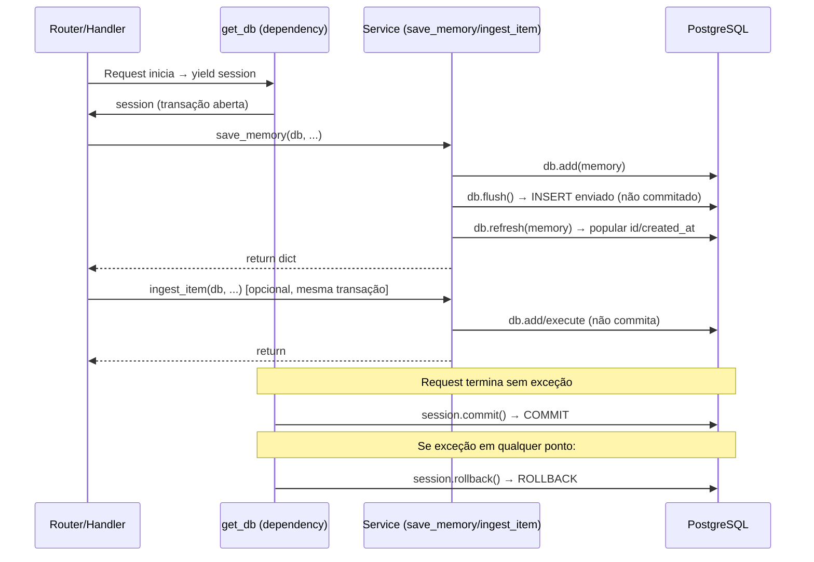

# Documento de Design — Lanez Fase 4.5: Saneamento Técnico

## Visão Geral

Este documento descreve as correções técnicas da Fase 4.5. São 5 issues independentes que corrigem dívidas técnicas acumuladas: tipo de coluna incorreto nas migrations (C1), property test flaky (A1), embeddings órfãos em re-ingestão (A2), services que commitam diretamente (M1), e migrations sem server_default (M2).

Nenhum arquivo novo é criado. 9 arquivos existentes são modificados. A suíte deve passar com ≥123 testes (121 atuais + 2 novos mínimos).

## Issue M2 — server_default nas migrations

### Estado Atual (errado)

```python
# alembic/versions/001_initial_tables.py (linhas 26, 41, 63)
# alembic/versions/002_add_embeddings.py (linha 28)
# alembic/versions/003_add_memories.py (linha 25)
sa.Column("id", sa.Uuid(), nullable=False, default=sa.text("gen_random_uuid()")),
```

### Estado Alvo (correto)

```python
sa.Column("id", sa.Uuid(), nullable=False, server_default=sa.text("gen_random_uuid()")),
```

### Justificativa Técnica

O parâmetro `default=` é Python-side only — usado pelo ORM quando o cliente não passa valor. No DDL emitido por Alembic, **não gera cláusula `DEFAULT`**. Inserts via SQL puro (psql, dumps) falham com `null value in column "id" violates not-null constraint`. O `server_default=` gera `DEFAULT gen_random_uuid()` no DDL.

### Impacto

- Nenhum impacto em testes (mocks não executam DDL real)
- Modelos SQLAlchemy mantêm `default=uuid.uuid4` como dupla camada
- Nenhum outro componente afetado

## Issue C1 — Vector(384) nas migrations

### Estado Atual (errado)

```python
# alembic/versions/002_add_embeddings.py
sa.Column("vector", sa.Text(), nullable=False),

# alembic/versions/003_add_memories.py
sa.Column("vector", sa.Text(), nullable=False),
```

### Estado Alvo (correto)

```python
# Topo do arquivo:
from pgvector.sqlalchemy import Vector

# Na definição da coluna:
sa.Column("vector", Vector(384), nullable=False),
```

### Justificativa Técnica

Em Postgres real, `sa.Text()` cria coluna tipo `text`. O `CREATE INDEX USING hnsw (vector vector_cosine_ops)` falha com `data type text has no default operator class for access method "hnsw"`. O índice HNSW requer tipo `vector(N)` do pgvector. Os modelos SQLAlchemy já usam `Vector(384)` — apenas as migrations estavam inconsistentes.

### Impacto

- Nenhum impacto em testes (migrations não são executadas nos testes unitários)
- O raw SQL do `CREATE INDEX` permanece inalterado
- Modelos em `app/models/` não são tocados

## Issue A1 — Property test flaky

### Estado Atual (problemático)

```python
# tests/test_property_recall_threshold.py
assert all(score > 0.5 for score in scores), (
    f"Encontrado relevance_score <= 0.5: {scores}. Distâncias filtradas: {filtered}"
)
```

### Estado Alvo (correto)

```python
assert all(score >= 0.5 for score in scores), (
    f"Encontrado relevance_score < 0.5: {scores}. Distâncias filtradas: {filtered}"
)
```

### Justificativa Técnica

Quando `distance = 0.49999...`, `1 - distance = 0.50001...`, e `round(0.50001, 4)` pode retornar `0.5` exatamente (Banker's_Rounding). O filtro real admite `distance < 0.5` (exclusive), mas o arredondamento pode produzir `score == 0.5`. A propriedade correta é `score >= 0.5`, não `score > 0.5`.

### Impacto

- O serviço `recall_memory` não é modificado
- A propriedade formal passa de `∀ r → score > 0.5` para `∀ r → score >= 0.5`
- Nenhum outro teste afetado

## Issue M1 — Composição Transacional

### Estado Atual (errado)

```python
# app/database.py
async def get_db() -> AsyncGenerator[AsyncSession, None]:
    async with AsyncSessionLocal() as session:
        yield session

# app/services/memory.py::save_memory (linha 59)
await db.commit()
await db.refresh(memory)

# app/services/memory.py::recall_memory (linha 120)
await db.commit()

# app/services/embeddings.py::ingest_item (linha 178)
await db.commit()
```

### Estado Alvo (correto)

```python
# app/database.py
async def get_db() -> AsyncGenerator[AsyncSession, None]:
    """FastAPI dependency que fornece uma sessão assíncrona do banco.

    Commit é feito automaticamente ao final do request se nenhuma
    exceção foi levantada. Rollback automático em caso de exceção.
    """
    async with AsyncSessionLocal() as session:
        try:
            yield session
            await session.commit()
        except Exception:
            await session.rollback()
            raise

# app/services/memory.py::save_memory
await db.flush()
await db.refresh(memory)

# app/services/memory.py::recall_memory
# (linha do commit removida — sem substituto)

# app/services/embeddings.py::ingest_item
# (linha do commit removida — sem substituto)
```

### Justificativa Técnica

Services que chamam `commit()` impedem composição transacional. Se um endpoint quiser fazer `save_memory(...)` duas vezes atomicamente e a segunda falhar, a primeira já foi commitada. O padrão correto é: services fazem `flush()` (quando precisam de refresh) ou simplesmente não commitam, e o `get_db` dependency faz commit/rollback no boundary do request.

### Diagrama — Fluxo Transacional Após M1



### Impacto

- `save_memory`: troca `commit()` por `flush()` — `refresh()` continua funcionando pois flush envia o INSERT
- `recall_memory`: remove `commit()` — o UPDATE de `last_accessed_at` será commitado pelo `get_db`
- `ingest_item`: remove `commit()` — o INSERT/UPDATE será commitado pelo `get_db`
- Testes existentes: `test_recall_memory_below_threshold` já verifica `db.commit.assert_not_awaited()` — continua válido
- Novo teste: `test_save_memory_does_not_commit` valida que flush é chamado e commit não

## Issue A2 — Embeddings Órfãos

### Estado Atual (errado)

```python
# app/services/embeddings.py::ingest_graph_data
async def ingest_graph_data(db, user_id, service, resource_id, data):
    text = extract_text(service, data)
    if not text:
        return
    chunks = chunk_text(text)
    if len(chunks) == 1:
        await ingest_item(db, user_id, service, resource_id, chunks[0])
    else:
        for i, chunk in enumerate(chunks):
            await ingest_item(db, user_id, service, f"{resource_id}__chunk_{i}", chunk)
```

### Problema — Tabela Antes/Depois

| Cenário | 1ª Ingestão (email longo) | 2ª Ingestão (email editado curto) | Órfãos |
|---------|---------------------------|-----------------------------------|--------|
| Sem fix | `abc__chunk_0`, `abc__chunk_1`, `abc__chunk_2` | `abc` (upsert) | `abc__chunk_0`, `abc__chunk_1`, `abc__chunk_2` permanecem |
| Com fix | `abc__chunk_0`, `abc__chunk_1`, `abc__chunk_2` | DELETE all → INSERT `abc` | Nenhum |

### Estado Alvo (correto)

```python
from sqlalchemy import delete, or_
from app.models.embedding import Embedding

async def ingest_graph_data(db, user_id, service, resource_id, data):
    text = extract_text(service, data)
    if not text:
        return

    # Remover entradas antigas do mesmo resource_id (cobrindo 1↔N chunks)
    await db.execute(
        delete(Embedding).where(
            Embedding.user_id == user_id,
            Embedding.service == service,
            or_(
                Embedding.resource_id == resource_id,
                Embedding.resource_id.like(f"{resource_id}__chunk_%"),
            ),
        )
    )

    chunks = chunk_text(text)
    if len(chunks) == 1:
        await ingest_item(db, user_id, service, resource_id, chunks[0])
    else:
        for i, chunk in enumerate(chunks):
            await ingest_item(db, user_id, service, f"{resource_id}__chunk_{i}", chunk)
```

### Justificativa Técnica

O `ingest_item` faz upsert por `(user_id, service, resource_id)`. Quando o número de chunks muda entre re-ingestões, os resource_ids antigos não são cobertos pelo upsert dos novos. O DELETE prévio garante que qualquer variante anterior (exata ou com sufixo `__chunk_N`) é removida antes da nova ingestão.

Após M1, `ingest_item` não faz mais commit, então o DELETE e os INSERTs subsequentes compõem naturalmente a mesma transação — se qualquer INSERT falhar, o DELETE também é revertido.

### Impacto

- Busca semântica não retorna mais conteúdo desatualizado
- Performance: um DELETE extra por chamada de `ingest_graph_data` (negligível — filtrado por user_id + service + resource_id)
- Nenhum outro componente afetado

## Propriedades Formais para Novos Testes

### Propriedade A2: Limpeza de Órfãos

**Invariante:** Após `ingest_graph_data(db, uid, svc, rid, data)` com texto não vazio, não existem registros em `embeddings` com `(user_id=uid, service=svc)` cujo `resource_id` seja `rid` ou `rid__chunk_N` que não correspondam aos chunks recém-ingeridos.

**Teste:** `test_ingest_graph_data_cleans_orphan_chunks_on_resize` — simula re-ingestão de recurso que muda de N para 1 chunk e verifica que o DELETE foi emitido com filtro correto.

### Propriedade M1: Services Não Commitam

**Invariante:** `save_memory(db, ...)` chama `db.flush()` exatamente uma vez e `db.commit()` zero vezes.

**Teste:** `test_save_memory_does_not_commit` — mocka db, chama save_memory, verifica `db.flush.assert_awaited_once()` e `db.commit.assert_not_awaited()`.

## Estratégia de Testes

### Testes Novos (mínimo 2)

1. `tests/test_edge_cases_embeddings.py::test_ingest_graph_data_cleans_orphan_chunks_on_resize` — Valida Issue A2
2. `tests/test_edge_cases_memory.py::test_save_memory_does_not_commit` — Valida Issue M1

### Testes Existentes Ajustados

- `tests/test_property_recall_threshold.py` — assert `>= 0.5` (Issue A1)
- `tests/test_edge_cases_memory.py::test_recall_memory_updates_last_accessed` — adicionar `db.commit.assert_not_awaited()` para reforçar que o serviço não comita mais
- `tests/test_edge_cases_embeddings.py::test_ingest_item_same_text_returns_false_on_second_call` — remover `db_first.commit.assert_awaited_once()` (ingest_item não comita mais)
- `tests/test_edge_cases_embeddings.py::test_ingest_item_empty_string_returns_false` e `test_ingest_item_whitespace_only_returns_false` — remover `db.commit.assert_not_called()` ou manter (continua válido pois não comita)

### Validação Final

- `pytest -q` → ≥123 testes verdes
- `pytest tests/test_property_recall_threshold.py --hypothesis-seed=N` (N=0..20) → todos passam
