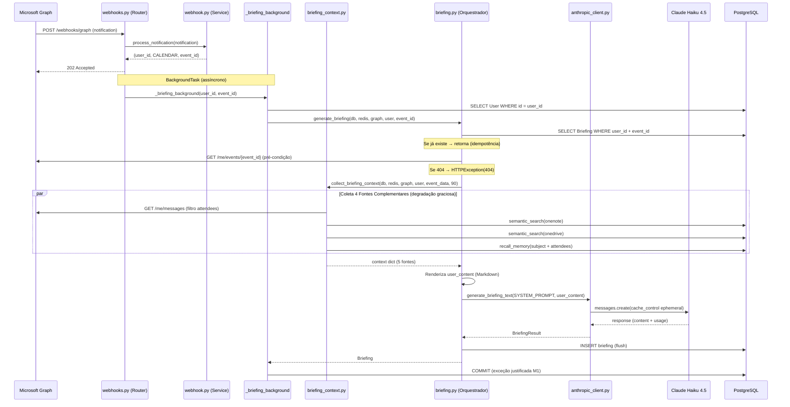
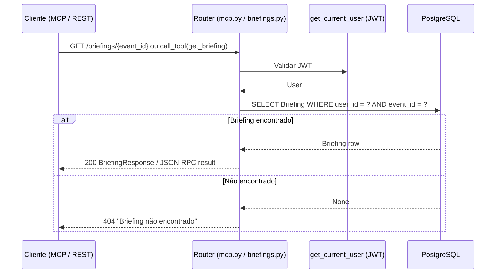

# Documento de Design — Lanez Fase 5: Briefing Automático de Reunião

## Visão Geral

Este documento descreve a arquitetura e o design técnico da Fase 5 do Lanez. O objetivo é implementar geração automática de briefings para reuniões de trabalho usando Claude Haiku 4.5 com prompt caching. A Fase 5 adiciona 6 arquivos novos (`app/schemas/briefing.py`, `app/models/briefing.py`, `app/services/anthropic_client.py`, `app/services/briefing_context.py`, `app/services/briefing.py`, `app/routers/briefings.py`), uma nova migração Alembic (`004_add_briefings.py`), e modifica 5 arquivos existentes (`app/config.py`, `app/models/__init__.py`, `app/services/webhook.py`, `app/routers/webhooks.py`, `app/routers/mcp.py`).

Decisões técnicas chave: Claude Haiku 4.5 (`claude-haiku-4-5-20251001`) como modelo único, prompt caching ephemeral no system prompt fixo (~2k tokens), coleta multi-fonte com degradação graciosa, idempotência por `UniqueConstraint("user_id", "event_id")`, `BackgroundTasks` para geração assíncrona (webhook exige resposta 202 em <30s), e exposição dual REST + MCP tool.

## Arquitetura

```
┌──────────────────────────────────────────────────────────────────────┐
│                          FastAPI App                                   │
│                                                                        │
│  ┌────────────────┐  ┌──────────────────────┐  ┌──────────────────┐  │
│  │    Routers     │  │      Services        │  │     Models       │  │
│  │  auth.py       │→│  graph.py            │→│  user.py         │  │
│  │  webhooks.py ★ │→│  cache.py            │→│  cache.py        │  │
│  │  graph.py      │→│  webhook.py ★        │→│  webhook.py      │  │
│  │  mcp.py ★      │→│  searxng.py          │  │  embedding.py    │  │
│  │  briefings.py★ │→│  embeddings.py       │  │  memory.py       │  │
│  └────────────────┘  │  memory.py           │  │  briefing.py ★   │  │
│        │             │  anthropic_client.py★ │  └──────────────────┘  │
│        ▼             │  briefing_context.py★ │         │              │
│  ┌──────────┐        │  briefing.py ★        │         ▼              │
│  │  Schemas │        └──────────────────────┘  ┌──────────────────┐  │
│  │briefing★ │               │                  │ PostgreSQL       │  │
│  └──────────┘        ┌──────────────┐          │ + pgvector       │  │
│                      │  Anthropic   │          └──────────────────┘  │
│                      │  Claude API  │                                 │
│                      └──────────────┘                                 │
└──────────────────────────────────────────────────────────────────────┘

★ = Novo ou modificado na Fase 5
```

## Fluxo Principal — Geração de Briefing via Webhook



## Fluxo de Leitura — Cliente MCP / REST



## Componentes e Interfaces

### 1. Configuração (`app/config.py`) — MODIFICAÇÃO

**Responsabilidade:** Adicionar campos necessários para integração Anthropic.

**Interface (novos campos):**

```python
class Settings(BaseSettings):
    # ... campos existentes ...

    # Anthropic API — obrigatório para Fase 5
    ANTHROPIC_API_KEY: str

    # Briefing — janela histórica de coleta de contexto (em dias)
    BRIEFING_HISTORY_WINDOW_DAYS: int = 90
```

**Decisões:**
- `ANTHROPIC_API_KEY` sem default — fail-fast na inicialização se ausente
- `BRIEFING_HISTORY_WINDOW_DAYS = 90` — configurável via env, sem necessidade de restart

### 2. Schema Pydantic (`app/schemas/briefing.py`) — NOVO

**Responsabilidade:** Schema de resposta para endpoint REST e serialização.

**Interface:**

```python
class BriefingResponse(BaseModel):
    id: UUID
    event_id: str
    event_subject: str
    event_start: datetime
    event_end: datetime
    attendees: list[str]
    content: str
    generated_at: datetime
    model_used: str
    input_tokens: int
    cache_read_tokens: int
    cache_write_tokens: int
    output_tokens: int
```

**Decisões:**
- Inclui telemetria de tokens para monitoramento de custos
- `content` é o Markdown completo gerado pelo Haiku

### 3. Modelo Briefing (`app/models/briefing.py`) — NOVO

**Responsabilidade:** Modelo SQLAlchemy para persistência de briefings com constraint de unicidade.

**Interface:**

```python
class Briefing(Base):
    __tablename__ = "briefings"

    id: Mapped[uuid.UUID]              # PK, default uuid4
    user_id: Mapped[uuid.UUID]         # FK users.id ON DELETE CASCADE
    event_id: Mapped[str]              # String(255), not null
    event_subject: Mapped[str]         # String(500), not null
    event_start: Mapped[datetime]      # DateTime(tz), not null
    event_end: Mapped[datetime]        # DateTime(tz), not null
    attendees: Mapped[list[str]]       # ARRAY(String), not null, default list
    content: Mapped[str]               # Text, not null
    model_used: Mapped[str]            # String(64), not null
    input_tokens: Mapped[int]          # Integer, not null, default 0
    cache_read_tokens: Mapped[int]     # Integer, not null, default 0
    cache_write_tokens: Mapped[int]    # Integer, not null, default 0
    output_tokens: Mapped[int]         # Integer, not null, default 0
    generated_at: Mapped[datetime]     # DateTime(tz), not null

    __table_args__ = (
        UniqueConstraint("user_id", "event_id", name="uq_briefing_user_event"),
        Index("ix_briefings_user_event_start", "user_id", "event_start"),
    )
```

**Decisões:**
- `UniqueConstraint` garante idempotência a nível de banco — mesmo que a verificação em Python falhe por race condition, o banco rejeita duplicata
- `ARRAY(String)` para attendees — consistente com padrão de tags da Fase 4
- Telemetria de tokens como colunas separadas — permite análise de custos por briefing

### 4. Migration Alembic (`alembic/versions/004_add_briefings.py`) — NOVO

**Responsabilidade:** Criar tabela briefings com constraints e índices.

**Operações upgrade:**
1. `CREATE TABLE briefings` com todas as colunas, FK, e `server_default` em colunas com default
2. `CREATE UNIQUE INDEX uq_briefing_user_event` em (user_id, event_id)
3. `CREATE INDEX ix_briefings_user_event_start` em (user_id, event_start)

**Operações downgrade:**
1. Drop index `ix_briefings_user_event_start`
2. Drop table `briefings` (constraint unique é removida junto)

**Decisões:**
- `server_default` (não `default`) — lição da Fase 4.5
- `gen_random_uuid()` para id — consistente com migrations anteriores
- `ARRAY[]::varchar[]` para attendees — consistente com tags em memories

### 5. Cliente Anthropic (`app/services/anthropic_client.py`) — NOVO

**Responsabilidade:** Encapsular chamada ao Claude Haiku 4.5 com prompt caching e telemetria.

**Interface:**

```python
class BriefingResult:
    content: str
    model: str
    input_tokens: int
    cache_read_tokens: int
    cache_write_tokens: int
    output_tokens: int

def get_anthropic_client() -> AsyncAnthropic:
    """Retorna cliente Anthropic singleton."""

async def generate_briefing_text(
    system_prompt: str,
    user_content: str,
) -> BriefingResult:
    """Chama Claude Haiku 4.5 com cache_control ephemeral no system prompt."""
```

**Decisões:**
- Singleton para `AsyncAnthropic` — evita criar conexão a cada chamada
- `cache_control: {"type": "ephemeral"}` no system prompt — cache TTL 5min da Anthropic, economiza ~90% em input tokens cacheados a partir do 2º briefing na janela
- `max_tokens=1500` — suficiente para briefing estruturado, limita custo de output
- Captura de `cache_read_input_tokens` e `cache_creation_input_tokens` com default 0 — campos podem estar ausentes na resposta se não houve cache hit/write
- Cliente específico para briefings — não criar wrapper genérico

**Estrutura da chamada:**

```python
response = await client.messages.create(
    model="claude-haiku-4-5-20251001",
    max_tokens=1500,
    system=[{
        "type": "text",
        "text": system_prompt,
        "cache_control": {"type": "ephemeral"},
    }],
    messages=[{"role": "user", "content": user_content}],
)
```

### 6. Service de Coleta de Contexto (`app/services/briefing_context.py`) — NOVO

**Responsabilidade:** Coletar as 4 fontes complementares de contexto (emails, OneNote, OneDrive, memórias) para compor o user prompt do briefing. Recebe o evento já resolvido — a busca do evento é pré-condição do orquestrador.

**Interface:**

```python
async def collect_briefing_context(
    db: AsyncSession,
    redis: aioredis.Redis,
    graph: GraphService,
    user: User,
    event_data: dict,
    history_window_days: int,
) -> dict:
    """Recebe evento já resolvido. Retorna dict com: event, emails_with_attendees, onenote_pages, onedrive_files, memories"""
```

**Detalhes da coleta:**

| Fonte | API/Serviço | Parâmetros | Limite | Degrada? |
|-------|-------------|------------|--------|----------|
| Evento | Passthrough (recebido do orquestrador) | — | 1 | N/A (pré-condição) |
| Emails | `graph.fetch_with_params(user, "/me/messages", ...)` | `$top=10, $orderby=receivedDateTime desc, $filter=receivedDateTime ge {N dias}` + filtro Python por attendees | 10 | Sim |
| OneNote | `semantic_search(db, user.id, query=subject, limit=5, services=["onenote"])` | — | 5 | Sim |
| OneDrive | `semantic_search(db, user.id, query=subject, limit=5, services=["onedrive"])` | — | 5 | Sim |
| Memórias | `recall_memory(db, user.id, query=f"{subject} {attendees}", limit=5)` | — | 5 | Sim |

**Decisões:**
- Evento é pré-condição obrigatória — buscado pelo orquestrador antes de chamar esta função. Se o evento não existe, o orquestrador levanta 404 sem chegar aqui
- As 4 fontes complementares são independentes — try/except individual com `logger.warning`
- Filtro de emails por attendees em Python (não no `$filter` do Graph) — Graph API não suporta filtro por from/to em combinação com OR
- Reutiliza `semantic_search` e `recall_memory` existentes — sem duplicação

### 7. Service Orquestrador (`app/services/briefing.py`) — NOVO

**Responsabilidade:** Orquestrar coleta + LLM + persistência com idempotência.

**Interface:**

```python
SYSTEM_PROMPT: str  # Prompt fixo em pt-BR (~2k tokens)

async def generate_briefing(
    db: AsyncSession,
    redis: aioredis.Redis,
    graph: GraphService,
    user: User,
    event_id: str,
) -> Briefing:
    """Orquestra coleta, chamada Haiku e persistência. Idempotente."""
```

**Fluxo interno:**
1. Verifica existência de Briefing para (user_id, event_id) — se existe, retorna (idempotência)
2. Busca evento via Graph API (`/me/events/{event_id}`) — pré-condição obrigatória. Se 404 → `HTTPException(404)`
3. Passa evento resolvido a `collect_briefing_context` (coleta 4 fontes complementares com degradação graciosa)
4. Renderiza user_content + chama Anthropic + persiste

**Decisões:**
- Verificação de existência ANTES de buscar evento — evita chamadas desnecessárias à Graph API e Anthropic
- Evento como pré-condição obrigatória (não degrada) — sem evento não há briefing possível. As 4 fontes complementares degradam graciosamente
- `flush()` + `refresh()` sem `commit()` — regra M1 da Fase 4.5 (commit no boundary)
- `SYSTEM_PROMPT` como constante no módulo — fixo, cacheable pela Anthropic

**Formato do user_content renderizado:**

```markdown
# Reunião

**Assunto:** {event.subject}
**Quando:** {event.start} - {event.end}
**Local:** {event.location or "(não especificado)"}
**Resumo:** {event.body_preview or "(sem resumo)"}

# Participantes

- email1@example.com
- email2@example.com

# Contexto coletado

## Emails recentes com participantes (últimos 90 dias)

**[2024-01-15] Assunto do email**
Preview do corpo do email...

**[2024-01-10] Outro email**
Preview...

## Páginas OneNote relacionadas

- Título da página 1
- Título da página 2

## Arquivos OneDrive relacionados

- nome_arquivo_1.docx
- nome_arquivo_2.pdf

## Memórias relevantes

- Conteúdo da memória 1 (até 200 chars)
- Conteúdo da memória 2 (até 200 chars)

---

Gere o briefing seguindo as regras do system prompt.
```

### 8. Webhook Handler — Modificações

**Responsabilidade:** Extrair event_id de notificações CALENDAR e disparar geração de briefing em background.

**Mudança em `app/services/webhook.py::process_notification`:**

```python
# Retorno muda de tuple[UUID, ServiceType] | None
# para tuple[UUID, ServiceType, str | None] | None

event_id: str | None = None
if service_type == ServiceType.CALENDAR:
    parts = notification.resource.split("/Events/")
    if len(parts) == 2:
        event_id = parts[1]
return user_id, service_type, event_id
```

**Nova função em `app/routers/webhooks.py`:**

```python
async def _briefing_background(user_id: uuid.UUID, event_id: str) -> None:
    """Background task: gera briefing para evento de calendar.

    Cria sessão própria via AsyncSessionLocal() — fora do get_db dependency.
    Faz commit manual ao final — ÚNICA EXCEÇÃO justificada à regra M1 (Fase 4.5).
    """
```

**Decisões:**
- 3-tupla mantém compatibilidade — `_reingest_background` ignora o terceiro elemento
- `_briefing_background` cria sessão própria — padrão idêntico ao `_reingest_background`
- Commit manual justificado — sessão não passa pelo `get_db` que faz commit/rollback no boundary
- Log de exceção sem propagação — webhook já respondeu 202

### 9. Endpoint REST (`app/routers/briefings.py`) — NOVO

**Responsabilidade:** Expor briefings via REST para consumo pelo painel React (Fase 6).

**Interface:**

```python
router = APIRouter(prefix="/briefings", tags=["briefings"])

@router.get("/{event_id}", response_model=BriefingResponse)
async def get_briefing_by_event(
    event_id: str,
    user: User = Depends(get_current_user),
    db: AsyncSession = Depends(get_db),
) -> BriefingResponse:
    """200 com BriefingResponse ou 404."""
```

**Decisões:**
- Query simples por `(user_id, event_id)` — coberto pelo unique constraint
- Sem paginação — 1 briefing por evento
- Autenticação via JWT — consistente com demais routers

### 10. Tool MCP `get_briefing` — Modificação em `app/routers/mcp.py`

**Responsabilidade:** Expor 9ª ferramenta MCP para recuperação de briefings.

**Interface:**

```python
TOOL_GET_BRIEFING = MCPTool(
    name="get_briefing",
    description="Recupera o briefing automático gerado para um evento de reunião...",
    inputSchema={
        "type": "object",
        "properties": {
            "event_id": {"type": "string", "description": "ID do evento no Outlook"},
        },
        "required": ["event_id"],
    },
)

async def handle_get_briefing(arguments, user, db, redis, graph, searxng) -> dict:
    """Consulta Briefing por (user_id, event_id). 404 se não encontrado."""
```

**Decisões:**
- Handler faz query direta no banco — não chama `generate_briefing` (leitura pura)
- Retorna subset dos campos (sem telemetria de tokens) — informação relevante para o AI assistant
- Registrar em `TOOLS_REGISTRY`, `TOOLS_MAP`, `ALL_TOOLS` — total 9 ferramentas

## Propriedades Formais de Corretude

### Propriedade 1: Filtro de Attendees (test_property_briefing_context_attendee_filter)

**Tipo:** Invariante
**Requisito:** R4.3
**Descrição:** Para qualquer lista de emails como attendees e qualquer lista de emails em from/to, um email é mantido no resultado se e somente se pelo menos um attendee aparece em from ou to.
**Propriedade formal:** `∀ email ∈ emails_result → (email.from ∈ attendees) ∨ (∃ r ∈ email.toRecipients: r ∈ attendees)`
**Contraposição:** `∀ email ∉ emails_result → (email.from ∉ attendees) ∧ (∀ r ∈ email.toRecipients: r ∉ attendees)`
**Estratégia:** Gerar via Hypothesis listas aleatórias de attendees e emails com from/to aleatórios, aplicar a função de filtro, verificar que o invariante é satisfeito em ambas as direções.

## Estratégia de Testes

### Testes Obrigatórios (mínimo 12 novos)

**Unit / edge cases:**

| Teste | Arquivo | Verifica |
|-------|---------|----------|
| `test_briefing_context_collects_event` | `tests/test_edge_cases_briefing.py` | Graph chamado com $select correto |
| `test_briefing_context_filters_emails_by_attendees` | `tests/test_edge_cases_briefing.py` | Apenas emails com attendees em from/to mantidos |
| `test_briefing_context_handles_partial_failure` | `tests/test_edge_cases_briefing.py` | 1 fonte falha, 4 continuam |
| `test_briefing_idempotent` | `tests/test_edge_cases_briefing.py` | 2 chamadas = 1 row em briefings |
| `test_briefing_uses_flush_not_commit` | `tests/test_edge_cases_briefing.py` | flush chamado, commit não |
| `test_anthropic_client_uses_cache_control` | `tests/test_anthropic_client.py` | system[0].cache_control == {"type": "ephemeral"} |
| `test_anthropic_client_captures_cache_tokens` | `tests/test_anthropic_client.py` | cache_read_tokens == 100 quando response tem |

**Integração / handlers:**

| Teste | Arquivo | Verifica |
|-------|---------|----------|
| `test_webhook_extracts_event_id_for_calendar` | `tests/test_webhook_service.py` | resource "Users/abc/Events/xyz" → event_id="xyz" |
| `test_webhook_returns_none_event_id_for_non_calendar` | `tests/test_webhook_service.py` | mail/onenote → event_id=None |
| `test_briefings_endpoint_returns_briefing` | `tests/test_edge_cases_briefing.py` | GET 200 + BriefingResponse |
| `test_briefings_endpoint_404_when_missing` | `tests/test_edge_cases_briefing.py` | GET 404 |
| `test_mcp_get_briefing_tool_returns_9_tools` | `tests/test_edge_cases_mcp.py` | 9 ferramentas com get_briefing |
| `test_mcp_get_briefing_404_when_missing` | `tests/test_edge_cases_mcp.py` | call_tool 404 |

**Property-based:**

| Teste | Arquivo | Verifica |
|-------|---------|----------|
| `test_property_briefing_context_attendee_filter` | `tests/test_property_briefing_attendees.py` | Invariante de filtro (Propriedade 1) |

### Estratégia de Mocking

- **Anthropic API:** `unittest.mock.AsyncMock` para `AsyncAnthropic.messages.create` retornando objeto com `content[0].text`, `model`, `usage.input_tokens`, `usage.cache_read_input_tokens`, `usage.cache_creation_input_tokens`, `usage.output_tokens`
- **Graph API:** Mock de `GraphService.fetch_with_params` retornando dicts equivalentes às respostas reais
- **semantic_search / recall_memory:** Mock direto das funções importadas
- **JAMAIS chamar Anthropic API real em testes**
