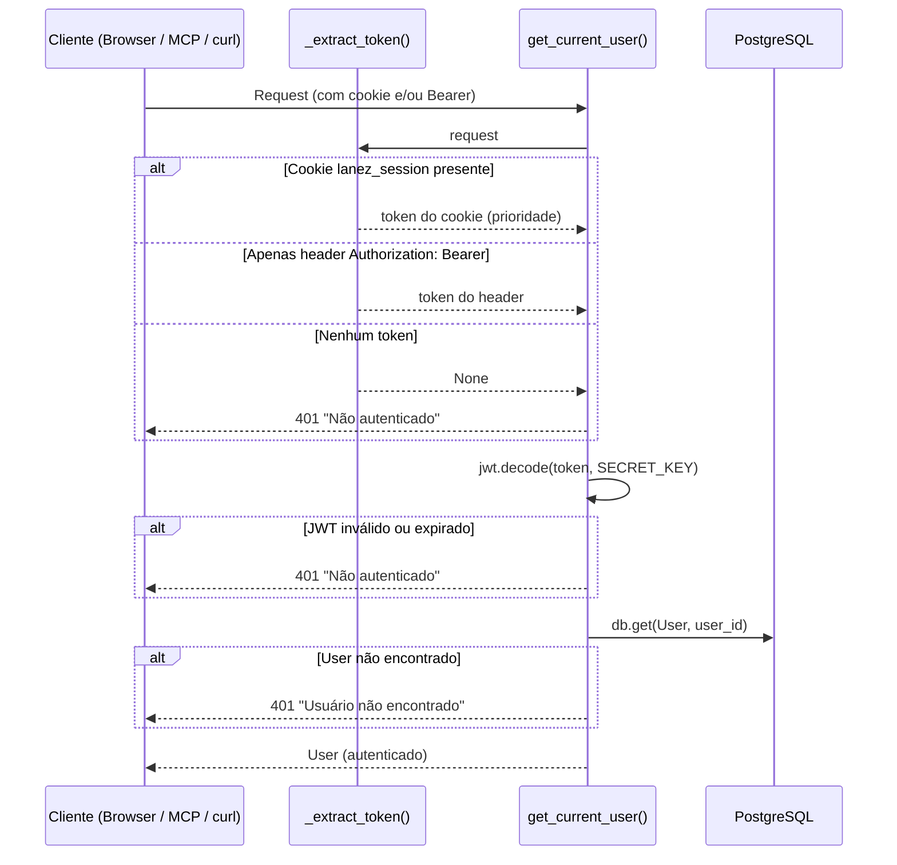
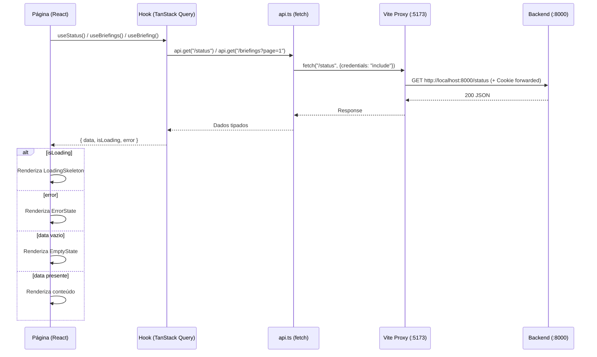

# Documento de Design — Lanez Fase 6a: Painel React (Somente Leitura)

## Visão Geral

Este documento descreve a arquitetura e o design técnico da Fase 6a do Lanez. O objetivo é implementar o primeiro frontend do projeto — um painel web em React que permite ao usuário autenticar via Microsoft 365 com sessão persistente via cookie HttpOnly, visualizar status das integrações no dashboard, navegar e ler briefings gerados, e consultar configurações atuais do sistema. A Fase 6a modifica 3 arquivos backend existentes (`app/dependencies.py`, `app/routers/auth.py`, `app/schemas/auth.py`), adiciona 4 arquivos backend novos (`app/routers/status.py`, `app/schemas/status.py`, e novos endpoints em `app/routers/briefings.py` e `app/schemas/briefing.py`), e cria toda a árvore `frontend/` com ~30 arquivos.

Decisões técnicas chave: autenticação dual Cookie HttpOnly + Bearer com prioridade para cookie, callback OAuth modo dual (redirect+cookie vs JSON legado), Vite + React 18 + TypeScript + Tailwind 3.4 + shadcn/ui + TanStack Query v5 + React Router v6, proxy Vite para backend em dev (mesma origem), tema light/dark/system via CSS variables do shadcn/ui, e smoke tests mínimos com Vitest + React Testing Library.

### Divergências de modelo detectadas (pré-flight)

Antes de redigir o design, os modelos reais foram inspecionados. Divergências encontradas em relação ao briefing original:

| Divergência | Modelo Real | Impacto no Design |
|---|---|---|
| `Embedding.service` | `String(20)`, NÃO Enum | Usar string diretamente no `group_by`, sem `.value` |
| `WebhookSubscription` | NÃO possui coluna `service` — possui `resource` (`String(255)`) | Endpoint `/status` deve expor `resource` diretamente ou derivar serviço da string resource |
| Redis state OAuth | STRING pura (`code_verifier`), não JSON | Migrar para JSON `{"code_verifier": ..., "return_url": ...}` |
| `oauth2_scheme` | Existe em `app/dependencies.py` | Remover junto com todos os callsites |

## Arquitetura

```
┌─────────────────────────────────────────────────────────────────────────────┐
│                              Mono-repo Lanez                                │
│                                                                             │
│  ┌─────────────────────────────────────┐  ┌──────────────────────────────┐  │
│  │         Frontend (Vite :5173)       │  │    Backend (FastAPI :8000)   │  │
│  │                                     │  │                              │  │
│  │  src/                               │  │  Routers (modificados)       │  │
│  │  ├── App.tsx (BrowserRouter+Auth)   │  │  ├── auth.py ★              │  │
│  │  ├── lib/api.ts (fetch+credentials) │  │  │   ├── /auth/microsoft    │  │
│  │  ├── auth/AuthContext.tsx           │  │  │   ├── /auth/callback ★   │  │
│  │  ├── theme/ThemeContext.tsx         │  │  │   ├── /auth/me ★         │  │
│  │  ├── hooks/                        │  │  │   ├── /auth/logout ★     │  │
│  │  │   ├── useStatus.ts             │  │  │   └── /auth/refresh       │  │
│  │  │   ├── useBriefings.ts          │  │  ├── briefings.py ★          │  │
│  │  │   └── useBriefing.ts           │  │  │   ├── GET /briefings ★    │  │
│  │  ├── components/                   │  │  │   └── GET /briefings/{id} │  │
│  │  │   ├── ui/ (shadcn)             │  │  └── status.py ★ (NOVO)      │  │
│  │  │   ├── AppShell.tsx             │  │      └── GET /status ★       │  │
│  │  │   ├── Sidebar.tsx              │  │                              │  │
│  │  │   ├── TopBar.tsx               │  │  Dependencies (modificado)    │  │
│  │  │   ├── StatusCard.tsx           │  │  └── dependencies.py ★       │  │
│  │  │   ├── TokenUsageChart.tsx      │  │      └── get_current_user    │  │
│  │  │   ├── BriefingCard.tsx         │  │          (cookie + Bearer)   │  │
│  │  │   ├── BriefingMarkdown.tsx     │  │                              │  │
│  │  │   ├── EmptyState.tsx           │  │  Schemas (modificados/novos)  │  │
│  │  │   ├── ErrorState.tsx           │  │  ├── auth.py ★               │  │
│  │  │   └── LoadingSkeleton.tsx      │  │  ├── briefing.py ★           │  │
│  │  └── pages/                        │  │  └── status.py ★ (NOVO)     │  │
│  │      ├── LoginPage.tsx            │  │                              │  │
│  │      ├── DashboardPage.tsx        │  │  Models (somente leitura)     │  │
│  │      ├── BriefingsListPage.tsx    │  │  ├── user.py                 │  │
│  │      ├── BriefingDetailPage.tsx   │  │  ├── briefing.py             │  │
│  │      └── SettingsPage.tsx         │  │  ├── embedding.py            │  │
│  │                                     │  │  ├── webhook.py             │  │
│  └──────────────┬──────────────────────┘  │  └── memory.py              │  │
│                 │ Vite Proxy               │                              │  │
│                 │ /auth, /briefings,       └──────────┬───────────────────┘  │
│                 │ /status, /mcp                       │                      │
│                 └────────────────────────────────────►│                      │
│                                                       ▼                      │
│                                              ┌──────────────────┐           │
│                                              │ PostgreSQL       │           │
│                                              │ + pgvector       │           │
│                                              └──────────────────┘           │
│                                              ┌──────────────────┐           │
│                                              │ Redis            │           │
│                                              │ (OAuth state)    │           │
│                                              └──────────────────┘           │
└─────────────────────────────────────────────────────────────────────────────┘

★ = Novo ou modificado na Fase 6a
```

## Fluxo de Autenticação Dual (Cookie + Bearer)



## Fluxo OAuth Callback Dual

```mermaid
sequenceDiagram
    participant B as Browser (Painel)
    participant M as MCP / curl
    participant A as /auth/microsoft
    participant R as Redis
    participant E as Microsoft Entra ID
    participant CB as /auth/callback

    Note over B: Fluxo Painel (com return_url)
    B->>A: GET /auth/microsoft?return_url=http://localhost:5173/dashboard
    A->>A: _is_allowed_return_url(return_url) ✓
    A->>R: SET oauth:state:{state} = JSON{"code_verifier", "return_url"} TTL=600s
    A-->>B: 302 → Entra ID authorize

    B->>E: Autoriza
    E-->>CB: GET /auth/callback?code=...&state=...
    CB->>R: GET oauth:state:{state}
    R-->>CB: {"code_verifier": "...", "return_url": "http://localhost:5173/dashboard"}
    CB->>E: POST token (code + code_verifier)
    E-->>CB: access_token, refresh_token
    CB->>CB: _create_jwt(user_id)
    CB-->>B: 302 → return_url + Set-Cookie: lanez_session=<jwt>; HttpOnly; SameSite=Lax

    Note over M: Fluxo Legado (sem return_url)
    M->>A: GET /auth/microsoft
    A->>R: SET oauth:state:{state} = JSON{"code_verifier", "return_url": null} TTL=600s
    A-->>M: 302 → Entra ID authorize

    M->>E: Autoriza
    E-->>CB: GET /auth/callback?code=...&state=...
    CB->>R: GET oauth:state:{state}
    R-->>CB: {"code_verifier": "...", "return_url": null}
    CB->>E: POST token (code + code_verifier)
    E-->>CB: access_token, refresh_token
    CB->>CB: _create_jwt(user_id)
    CB-->>M: 200 JSON TokenResponse {access_token, user_id, email, ...}
```

## Fluxo de Dados do Frontend



## Componentes e Interfaces

### 1. Autenticação Dual (`app/dependencies.py`) — MODIFICAÇÃO

**Responsabilidade:** Substituir `get_current_user` para aceitar JWT via cookie HttpOnly OU header Bearer, com prioridade para cookie. Remover `oauth2_scheme`.

**Interface:**

```python
_COOKIE_NAME = "lanez_session"
_JWT_ALGORITHM = "HS256"


def _extract_token(request: Request) -> str | None:
    """Extrai JWT do cookie HttpOnly OU do header Authorization Bearer.
    Cookie tem prioridade. Retorna None se nenhum token encontrado."""


async def get_current_user(
    request: Request,
    db: AsyncSession = Depends(get_db),
) -> User:
    """Valida JWT (cookie ou Bearer) e retorna User.
    401 "Não autenticado" se token ausente/inválido/expirado.
    401 "Usuário não encontrado" se user_id não existe no banco."""
```

**Decisões:**
- Cookie tem prioridade — painel é o consumidor primário; Bearer é fallback para MCP/curl
- `_extract_token` é função pura (não async) — facilita testes unitários e property-based
- `oauth2_scheme = OAuth2PasswordBearer(...)` removido — não é mais necessário; `WWW-Authenticate: Bearer` no 401 mantém compatibilidade Swagger
- `Request` como parâmetro direto — substitui `Depends(oauth2_scheme)` para acesso a cookies

### 2. Callback OAuth Dual (`app/routers/auth.py`) — MODIFICAÇÃO

**Responsabilidade:** Adicionar suporte a `return_url` no fluxo OAuth, endpoints `/auth/me` e `/auth/logout`.

**Interfaces (funções novas/modificadas):**

```python
def _is_allowed_return_url(url: str) -> bool:
    """Valida que return_url começa com uma origem listada em CORS_ORIGINS."""


@router.get("/microsoft")
async def auth_microsoft(
    redis: Redis = Depends(get_redis),
    return_url: str | None = Query(default=None),
):
    """Inicia fluxo OAuth. Se return_url fornecido, valida contra allowlist
    e armazena no Redis como JSON junto com code_verifier."""


@router.get("/callback")
async def auth_callback(
    background_tasks: BackgroundTasks,
    code: str | None = Query(default=None),
    state: str | None = Query(default=None),
    error: str | None = Query(default=None),
    error_description: str | None = Query(default=None),
    redis: Redis = Depends(get_redis),
    db: AsyncSession = Depends(get_db),
):
    """Callback OAuth dual:
    - Com return_url no state → RedirectResponse 302 + Set-Cookie lanez_session
    - Sem return_url → TokenResponse JSON (legado)"""


@router.get("/me", response_model=UserMeResponse)
async def auth_me(
    current_user: User = Depends(get_current_user),
) -> UserMeResponse:
    """Retorna dados básicos do usuário autenticado."""


@router.post("/logout", status_code=204)
async def auth_logout() -> Response:
    """Limpa cookie lanez_session. Idempotente — sempre 204."""
```

**Decisões:**
- Redis migra de string pura para JSON `{"code_verifier": "...", "return_url": "..."}` — TTL 600s mantido
- `_is_allowed_return_url` valida prefixo contra `CORS_ORIGINS` — rejeita com 400 se fora da allowlist
- Cookie: `HttpOnly=True, SameSite=Lax, Secure=False, Path=/, Max-Age=604800` (7 dias)
- `secure=False` com `# TODO Fase 6c (deploy): secure=True quando atrás de HTTPS`
- `samesite="lax"` — `"strict"` quebraria o redirect de retorno do OAuth
- Logout idempotente — `delete_cookie` sem verificar se cookie existe

### 3. Schemas de Auth (`app/schemas/auth.py`) — MODIFICAÇÃO

**Responsabilidade:** Adicionar `UserMeResponse` sem substituir schemas existentes.

**Interface (novo schema):**

```python
class UserMeResponse(BaseModel):
    id: UUID
    email: str
    token_expires_at: datetime
    last_sync_at: datetime | None
    created_at: datetime
```

### 4. Listagem de Briefings (`app/routers/briefings.py`) — MODIFICAÇÃO

**Responsabilidade:** Adicionar endpoint de listagem paginada com busca textual.

**Interface (novo endpoint):**

```python
@router.get("", response_model=BriefingListResponse)
async def list_briefings(
    user: User = Depends(get_current_user),
    db: AsyncSession = Depends(get_db),
    page: int = Query(default=1, ge=1),
    page_size: int = Query(default=20, ge=1, le=100),
    q: str | None = Query(default=None, description="Busca em event_subject"),
) -> BriefingListResponse:
    """Lista briefings paginados por event_start desc.
    Filtro ILIKE em event_subject quando q fornecido.
    Statements separados para count e paginação."""
```

**Decisões:**
- Statements separados para `count` e `paged` — evita problemas com subquery + limit
- Filtro ILIKE `%q%` — case-insensitive, suficiente para busca simples
- Ordenação `event_start.desc()` — mais recentes primeiro
- `BriefingListItem` sem `content` nem tokens — payload reduzido para listagem

### 5. Schemas de Briefing (`app/schemas/briefing.py`) — MODIFICAÇÃO

**Responsabilidade:** Adicionar schemas de listagem sem substituir `BriefingResponse` existente.

**Interface (novos schemas):**

```python
class BriefingListItem(BaseModel):
    id: UUID
    event_id: str
    event_subject: str
    event_start: datetime
    event_end: datetime
    attendees: list[str]
    generated_at: datetime

    model_config = {"from_attributes": True}


class BriefingListResponse(BaseModel):
    items: list[BriefingListItem]
    total: int
    page: int
    page_size: int
```

### 6. Endpoint de Status (`app/routers/status.py`) — NOVO

**Responsabilidade:** Agregar métricas do dashboard num único endpoint.

**Interface:**

```python
router = APIRouter(prefix="/status", tags=["status"])


@router.get("", response_model=StatusResponse)
async def get_status(
    user: User = Depends(get_current_user),
    db: AsyncSession = Depends(get_db),
) -> StatusResponse:
    """Retorna métricas agregadas:
    - Token Microsoft (expiry, seconds remaining)
    - Webhooks (lista com resource + expires_at)
    - Embeddings por serviço (group_by Embedding.service — String, sem .value)
    - Memórias (count)
    - Briefings 30d (count + 5 recentes)
    - Tokens Claude 30d (sum com coalesce)
    - Config (briefing_history_window_days)"""
```

**Decisões críticas (divergências de modelo):**
- `WebhookSubscription` NÃO tem coluna `service` — usar `resource` (String(255)) diretamente: `{"resource": w.resource, "expires_at": w.expires_at}`
- `Embedding.service` é `String(20)`, NÃO Enum — usar `row[0]` diretamente no `ServiceCount`, sem `.value`
- `func.coalesce(..., 0)` em somas de tokens — evita NULL quando não há briefings no período
- `token_expires_in_seconds` calculado como `int((user.token_expires_at - now).total_seconds())` — pode ser negativo se token expirado

**Registro:** `app.include_router(status.router)` em `app/main.py`

### 7. Schemas de Status (`app/schemas/status.py`) — NOVO

**Responsabilidade:** Schemas Pydantic para o endpoint de status.

**Interface:**

```python
class ServiceCount(BaseModel):
    service: str
    count: int


class WebhookInfo(BaseModel):
    resource: str
    expires_at: datetime


class RecentBriefing(BaseModel):
    event_id: str
    event_subject: str
    event_start: datetime


class TokenUsageBucket(BaseModel):
    input: int
    output: int
    cache_read: int
    cache_write: int


class StatusConfig(BaseModel):
    briefing_history_window_days: int


class StatusResponse(BaseModel):
    user_email: str
    token_expires_at: datetime
    token_expires_in_seconds: int
    last_sync_at: datetime | None
    webhook_subscriptions: list[WebhookInfo]
    embeddings_by_service: list[ServiceCount]
    memories_count: int
    briefings_count_30d: int
    recent_briefings: list[RecentBriefing]
    tokens_30d: TokenUsageBucket
    config: StatusConfig
```

**Decisão:** Schemas tipados (`WebhookInfo`, `RecentBriefing`) em vez de `dict[str, Any]` — melhor validação e documentação OpenAPI.

### 8. Cliente API Frontend (`frontend/src/lib/api.ts`)

**Responsabilidade:** Cliente HTTP fino usando `fetch` nativo com `credentials: "include"`.

**Interface:**

```typescript
export class ApiError extends Error {
  constructor(public status: number, public detail: string);
}

async function request<T>(path: string, init?: RequestInit): Promise<T>;

export const api = {
  get: <T>(path: string) => Promise<T>,
  post: <T>(path: string, body?: unknown) => Promise<T>,
};
```

**Decisões:**
- `credentials: "include"` — envia cookie `lanez_session` automaticamente
- Vite proxy torna tudo same-origin — sem CORS cross-origin em dev
- `ApiError` com `status` e `detail` — permite tratamento granular no AuthContext (401 → não autenticado)
- Response 204 retorna `undefined` — para logout

### 9. Contexto de Auth (`frontend/src/auth/AuthContext.tsx`)

**Responsabilidade:** Gerenciar estado de autenticação do painel.

**Interface:**

```typescript
interface User {
  id: string;
  email: string;
  token_expires_at: string;
  last_sync_at: string | null;
  created_at: string;
}

interface AuthContextValue {
  user: User | null;
  loading: boolean;
  login: () => void;
  logout: () => Promise<void>;
}

export function AuthProvider({ children }: { children: ReactNode }): JSX.Element;
export function useAuth(): AuthContextValue;
```

**Decisões:**
- `GET /auth/me` no mount — verifica sessão ativa; 401 → `user = null`
- `login()` redireciona via `window.location.href` para `/auth/microsoft?return_url=<origin>/dashboard`
- `logout()` chama `POST /auth/logout` e limpa estado local

### 10. Rota Protegida (`frontend/src/auth/ProtectedRoute.tsx`)

**Interface:**

```typescript
export function ProtectedRoute(): JSX.Element;
// Se loading → Skeleton; se !user → Navigate to /login; se user → Outlet
```

### 11. Contexto de Tema (`frontend/src/theme/ThemeContext.tsx`)

**Interface:**

```typescript
type Theme = "light" | "dark" | "system";

interface ThemeContextValue {
  theme: Theme;                       // preferência salva: light | dark | system
  setTheme: (theme: Theme) => void;
  resolvedTheme: "light" | "dark";    // tema efetivo após resolver system via matchMedia
}

export function ThemeProvider({ children }: { children: ReactNode }): JSX.Element;
export function useTheme(): ThemeContextValue;
```

**Decisões:**
- Persistência em `localStorage` com chave `lanez_theme`
- Aplica classe `dark` no `<html>` — padrão shadcn/ui
- Modo `system` usa `window.matchMedia("(prefers-color-scheme: dark)")`
- `resolvedTheme` exposto para consumidores que precisam decidir paleta de cores literais (Recharts), evitando duplicar a lógica de matchMedia em cada componente

### 12. Toggle de Tema (`frontend/src/theme/ThemeToggle.tsx`)

**Interface:**

```typescript
export function ThemeToggle(): JSX.Element;
// DropdownMenu do shadcn/ui com 3 opções: Sol (light), Lua (dark), Monitor (system)
// Ícones: lucide-react Sun, Moon, Monitor
```

### 13. Hooks TanStack Query (`frontend/src/hooks/`)

**Interfaces:**

```typescript
// useStatus.ts
export function useStatus(): UseQueryResult<StatusResponse>;
// GET /status, staleTime: 30s

// useBriefings.ts
export function useBriefings(params: {
  page: number;
  pageSize: number;
  q?: string;
}): UseQueryResult<BriefingListResponse>;
// GET /briefings?page=&page_size=&q=, keepPreviousData: true

// useBriefing.ts
export function useBriefing(eventId: string): UseQueryResult<BriefingResponse>;
// GET /briefings/{eventId}
```

### 14. Componentes de Layout (`frontend/src/components/`)

**AppShell** (`AppShell.tsx`):
```typescript
export function AppShell(): JSX.Element;
// Layout: Sidebar (w-60 / 240px) + div(flex-1) contendo TopBar + main(Outlet)
```

**Sidebar** (`Sidebar.tsx`):
```typescript
export function Sidebar(): JSX.Element;
// Logo "Lanez", NavLinks: Dashboard (/dashboard), Briefings (/briefings),
// Configurações (/settings). Botão Logout no rodapé.
// Ícones: lucide-react LayoutDashboard, FileText, Settings, LogOut
```

**TopBar** (`TopBar.tsx`):
```typescript
export function TopBar(): JSX.Element;
// Email do usuário (via useAuth) + ThemeToggle à direita
```

### 15. Componentes de Dados (`frontend/src/components/`)

**StatusCard** (`StatusCard.tsx`):
```typescript
interface StatusCardProps {
  title: string;
  value: string | number;
  description?: string;
  icon?: ReactNode;
}
export function StatusCard(props: StatusCardProps): JSX.Element;
// Usa Card do shadcn/ui
```

**TokenUsageChart** (`TokenUsageChart.tsx`):
```typescript
interface TokenUsageChartProps {
  data: { input: number; output: number; cache_read: number; cache_write: number };
}
export function TokenUsageChart(props: TokenUsageChartProps): JSX.Element;
// Recharts BarChart com 4 barras. Cores via CSS variables com variantes dark mode.
```

**BriefingCard** (`BriefingCard.tsx`):
```typescript
interface BriefingCardProps {
  briefing: BriefingListItem;
}
export function BriefingCard(props: BriefingCardProps): JSX.Element;
// Card com event_subject, event_start (formatado via date-fns), attendees (Badge),
// link para /briefings/{event_id}
```

**BriefingMarkdown** (`BriefingMarkdown.tsx`):
```typescript
interface BriefingMarkdownProps {
  content: string;
}
export function BriefingMarkdown(props: BriefingMarkdownProps): JSX.Element;
// react-markdown + remark-gfm + className="prose dark:prose-invert" (Tailwind typography)
```

### 16. Componentes de Estado (`frontend/src/components/`)

**EmptyState** (`EmptyState.tsx`):
```typescript
interface EmptyStateProps {
  title: string;
  description?: string;
  icon?: ReactNode;
}
export function EmptyState(props: EmptyStateProps): JSX.Element;
```

**ErrorState** (`ErrorState.tsx`):
```typescript
interface ErrorStateProps {
  message?: string;
  onRetry?: () => void;
}
export function ErrorState(props: ErrorStateProps): JSX.Element;
// Alert do shadcn/ui com botão de retry opcional
```

**LoadingSkeleton** (`LoadingSkeleton.tsx`):
```typescript
interface LoadingSkeletonProps {
  count?: number;
  className?: string;
}
export function LoadingSkeleton(props: LoadingSkeletonProps): JSX.Element;
// Skeleton do shadcn/ui repetido count vezes
```

### 17. Páginas (`frontend/src/pages/`)

**LoginPage** (`LoginPage.tsx`):
```typescript
export function LoginPage(): JSX.Element;
// Card centralizado com logo "Lanez", descrição, botão "Entrar com Microsoft 365"
// Se já autenticado → Navigate to /dashboard
```

**DashboardPage** (`DashboardPage.tsx`):
```typescript
export function DashboardPage(): JSX.Element;
// Consome useStatus(). Grid de 7 cards:
// 1. Microsoft 365 (token expiry countdown)
// 2. Webhooks (count + lista resource)
// 3. Briefings 30d (count)
// 4. Memórias (count)
// 5. Embeddings por serviço (lista service: count)
// 6. Token usage chart (Recharts)
// 7. Briefings recentes (lista com links)
```

**BriefingsListPage** (`BriefingsListPage.tsx`):
```typescript
export function BriefingsListPage(): JSX.Element;
// Consome useBriefings(). Input de busca (debounce 300ms via setTimeout),
// lista de BriefingCard, paginação com botões Anterior/Próximo.
```

**BriefingDetailPage** (`BriefingDetailPage.tsx`):
```typescript
export function BriefingDetailPage(): JSX.Element;
// Consome useBriefing(eventId). Cabeçalho com metadados do evento,
// BriefingMarkdown com conteúdo, telemetria de tokens no rodapé.
```

**SettingsPage** (`SettingsPage.tsx`):
```typescript
export function SettingsPage(): JSX.Element;
// Consome useStatus(). Exibe configurações em modo somente leitura:
// - briefing_history_window_days
// - Token Microsoft (com botão refresh via POST /auth/refresh)
// Alert do shadcn/ui informando "Configurações somente leitura nesta versão"
```

## Estados de Loading / Empty / Error por Página

| Página | Loading | Empty | Error |
|---|---|---|---|
| DashboardPage | Grid de `Skeleton` (7 cards placeholder) | N/A (impossível para usuário logado — sempre há dados de token/config) | `ErrorState` com retry via `refetch()` |
| BriefingsListPage | 5× `Skeleton h-24` (cards placeholder) | `EmptyState` "Nenhum briefing encontrado" (ícone FileText) | `ErrorState` com retry |
| BriefingDetailPage | `Skeleton` (header + bloco de texto) | `EmptyState` "Briefing não encontrado" (quando 404) | `ErrorState` com retry |
| SettingsPage | `Skeleton` (cards de config) | N/A (sempre há config) | `ErrorState` com retry |

## Modelo de Dados

Nenhum modelo novo é criado na Fase 6a. Os endpoints de leitura consultam os modelos existentes:

| Modelo | Tabela | Campos consultados na 6a |
|---|---|---|
| `User` | `users` | `id`, `email`, `token_expires_at`, `last_sync_at`, `created_at` |
| `Briefing` | `briefings` | Todos os campos (listagem e detalhe) |
| `Embedding` | `embeddings` | `user_id`, `service` (String(20)) — group_by para contagem |
| `WebhookSubscription` | `webhook_subscriptions` | `user_id`, `resource` (String(255)), `expires_at` |
| `Memory` | `memories` | `user_id` — apenas contagem |

**Restrição NF1:** Nenhuma migration Alembic é criada nesta fase.

## Propriedades Formais de Corretude

*Uma propriedade é uma característica ou comportamento que deve ser verdadeiro em todas as execuções válidas de um sistema — essencialmente, uma declaração formal sobre o que o sistema deve fazer. Propriedades servem como ponte entre especificações legíveis por humanos e garantias de corretude verificáveis por máquina.*

### Propriedade 1: Extração dual de token — cookie tem prioridade

*Para qualquer* JWT válido `t`, se `t` está presente no cookie `lanez_session` da request, então `_extract_token(request)` retorna `t`, independente do conteúdo do header `Authorization`. Quando apenas o header `Authorization: Bearer t` está presente (sem cookie), `_extract_token` retorna `t`. Quando ambos estão presentes com tokens diferentes, o token do cookie é retornado.

**Valida: Requisitos R1.1, R1.4, R1.8**

### Propriedade 2: Validação de allowlist de return_url

*Para qualquer* string `url` e qualquer lista de origens `allowed`, `_is_allowed_return_url(url)` retorna `True` se e somente se `url` começa com pelo menos uma das origens em `allowed`. Para qualquer `url` que não começa com nenhuma origem da lista, a função retorna `False`.

**Valida: Requisito R2.2**

### Propriedade 3: Invariantes de paginação de briefings

*Para qualquer* conjunto de N briefings pertencentes a um usuário, e quaisquer valores válidos de `page` (≥1) e `page_size` (1–100), o endpoint `GET /briefings` retorna: (a) `total` igual a N, (b) `len(items)` igual a `min(page_size, max(0, N - (page-1) * page_size))`, (c) items ordenados por `event_start` descendente (cada item tem `event_start` ≤ ao anterior).

**Valida: Requisitos R4.2, R4.4, R4.8**

### Propriedade 4: Filtro ILIKE retorna apenas briefings correspondentes

*Para qualquer* conjunto de briefings e qualquer string de busca `q` não-vazia, todos os items retornados por `GET /briefings?q=<q>` possuem `event_subject` contendo `q` (case-insensitive), e nenhum briefing cujo `event_subject` não contém `q` aparece nos resultados. O campo `total` reflete a contagem filtrada.

**Valida: Requisito R4.3**

## Tratamento de Erros

### Backend

| Cenário | HTTP Status | Detail | Componente |
|---|---|---|---|
| Sem token (cookie nem Bearer) | 401 | "Não autenticado" | `get_current_user` |
| JWT inválido/expirado | 401 | "Não autenticado" | `get_current_user` |
| user_id não encontrado no banco | 401 | "Usuário não encontrado" | `get_current_user` |
| `return_url` fora da allowlist | 400 | "return_url não permitido" | `auth_microsoft` |
| State OAuth ausente/expirado | 400 | "state inválido ou expirado" | `auth_callback` |
| Briefing não encontrado | 404 | "Briefing não encontrado" | `get_briefing_by_event` |
| Parâmetros de paginação inválidos | 422 | Validação Pydantic automática | `list_briefings` |

### Frontend

| Cenário | Comportamento |
|---|---|
| `GET /auth/me` retorna 401 | `user = null` → redireciona para `/login` |
| Qualquer request retorna 401 | `ApiError` com `status=401` — componente pode redirecionar |
| Request falha (rede/5xx) | `ErrorState` com mensagem e botão retry |
| Response 204 (logout) | Retorna `undefined` — estado limpo |

## Estratégia de Testes

### Testes Backend (mínimo 10 novos)

**Property-based (Hypothesis):**

| Teste | Arquivo | Propriedade |
|---|---|---|
| `test_property_extract_token_cookie_priority` | `tests/test_property_auth_dual.py` | Feature: lanez-fase6a-painel, Property 1: Extração dual de token — cookie tem prioridade |
| `test_property_is_allowed_return_url` | `tests/test_property_auth_dual.py` | Feature: lanez-fase6a-painel, Property 2: Validação de allowlist de return_url |
| `test_property_briefings_pagination_invariants` | `tests/test_property_briefings_list.py` | Feature: lanez-fase6a-painel, Property 3: Invariantes de paginação de briefings |
| `test_property_briefings_filter_ilike` | `tests/test_property_briefings_list.py` | Feature: lanez-fase6a-painel, Property 4: Filtro ILIKE retorna apenas briefings correspondentes |

Cada property test deve rodar mínimo 100 iterações via `@settings(max_examples=100)`.

**Unit / edge cases:**

| Teste | Arquivo | Verifica |
|---|---|---|
| `test_get_current_user_accepts_cookie` | `tests/test_auth_dual.py` | Request com cookie `lanez_session=<jwt>` retorna user |
| `test_get_current_user_accepts_bearer` | `tests/test_auth_dual.py` | Comportamento Bearer existente preservado |
| `test_get_current_user_cookie_takes_priority` | `tests/test_auth_dual.py` | Quando ambos presentes, cookie é usado |
| `test_get_current_user_no_token_returns_401` | `tests/test_auth_dual.py` | Sem credenciais → 401 |
| `test_auth_callback_with_return_url_sets_cookie_and_redirects` | `tests/test_auth_dual.py` | Com return_url allowlisted → 302 + Set-Cookie HttpOnly |
| `test_auth_callback_without_return_url_returns_json` | `tests/test_auth_dual.py` | Sem return_url → TokenResponse JSON (legado) |
| `test_auth_microsoft_rejects_return_url_outside_allowlist` | `tests/test_auth_dual.py` | `return_url=https://evil.com` → 400 |
| `test_auth_me_returns_user_info` | `tests/test_auth_dual.py` | Autenticado via cookie → email, token_expires_at, etc |
| `test_auth_logout_clears_cookie` | `tests/test_auth_dual.py` | POST /auth/logout → 204 + Set-Cookie Max-Age=0 |
| `test_briefings_list_paginates_and_filters` | `tests/test_briefings_list.py` | Cria 25 briefings, verifica paginação e filtro por q |
| `test_status_aggregates_correctly` | `tests/test_status.py` | Popula DB com fixtures, verifica contagens corretas |
| `test_status_uses_resource_not_service` | `tests/test_status.py` | WebhookSubscription expõe resource (não service) |
| `test_status_embedding_service_no_dot_value` | `tests/test_status.py` | Embedding.service usado como string direta |

### Testes Frontend (mínimo 6 smoke tests)

| Teste | Arquivo | Verifica |
|---|---|---|
| `test_app_renders` | `src/__tests__/App.test.tsx` | App renderiza sem crashar |
| `test_protected_route_redirects_unauthenticated` | `src/__tests__/ProtectedRoute.test.tsx` | Redireciona para /login quando não autenticado |
| `test_protected_route_renders_authenticated` | `src/__tests__/ProtectedRoute.test.tsx` | Renderiza conteúdo quando autenticado |
| `test_briefings_list_renders` | `src/__tests__/BriefingsListPage.test.tsx` | Página renderiza com dados mockados |
| `test_login_page_renders` | `src/__tests__/LoginPage.test.tsx` | LoginPage renderiza botão de login |
| `test_theme_toggle_renders` | `src/__tests__/ThemeToggle.test.tsx` | ThemeToggle renderiza sem crashar |

**Configuração:** Vitest + React Testing Library + jsdom. Comando: `vitest run` (execução única).

### Estratégia de Mocking

**Backend:**
- `get_current_user` mockado via `app.dependency_overrides` nos testes de endpoint
- Redis mockado via `fakeredis` ou `unittest.mock.AsyncMock`
- httpx (Entra ID, Graph API) mockado via `respx` ou `unittest.mock.patch`
- Banco de dados via fixture `AsyncSession` com SQLite ou PostgreSQL de teste

**Frontend:**
- `fetch` mockado via `vi.fn()` ou `msw` (Mock Service Worker)
- `AuthContext` mockado via Provider wrapper nos testes
- `window.location` mockado para testes de login redirect

### Integridade da Suíte

A suíte completa (136 testes existentes + novos backend + novos frontend) deve passar com `pytest` (backend) e `vitest run` (frontend) sem flags `-k` ou `-x`.
