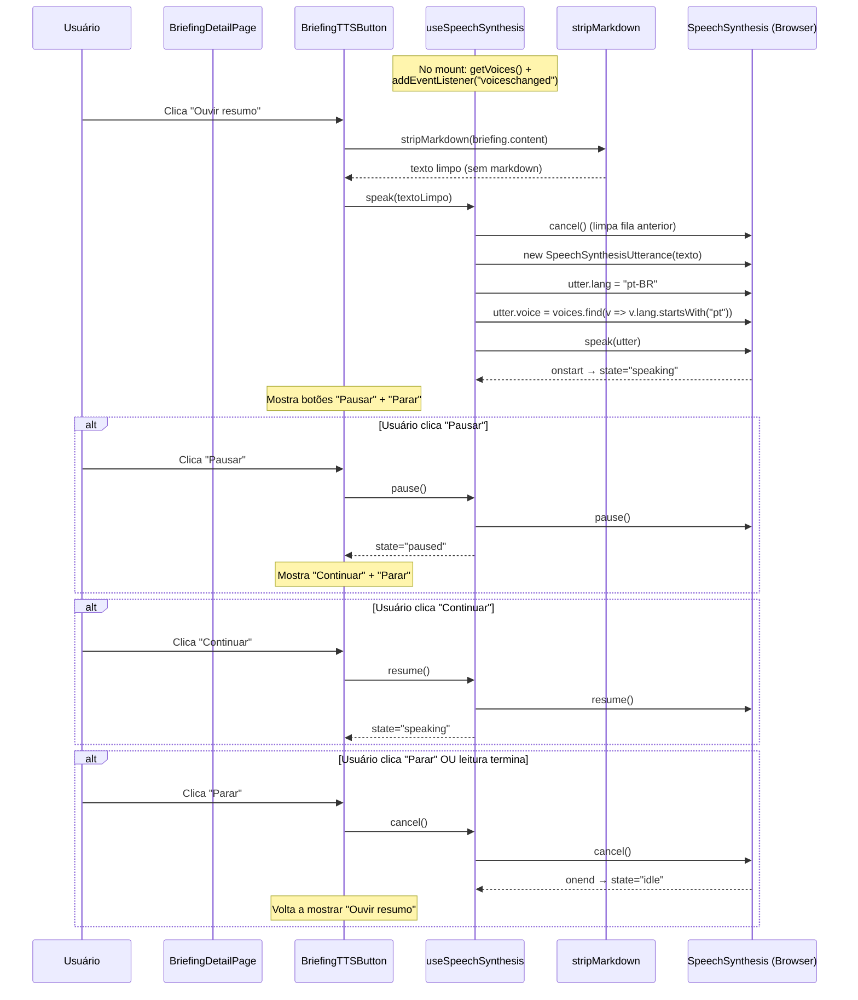

# Documento de Design — Lanez Fase 6b: Voz (STT via Groq Whisper + TTS via SpeechSynthesis)

## Visão Geral

Este documento descreve a arquitetura e o design técnico da Fase 6b do Lanez. O objetivo é adicionar dois recursos de voz ao painel React entregue na Fase 6a: (1) captura de voz por microfone na TopBar com transcrição via Groq Whisper e ações sobre o texto (salvar como memória ou buscar nos briefings), e (2) leitura por TTS de briefings na BriefingDetailPage usando SpeechSynthesis nativo do browser. O backend recebe 3 arquivos novos (`groq_voice.py`, `voice.py`, `memories.py`), 1 schema novo (`memory.py`), e 2 arquivos modificados (`config.py`, `main.py`). O frontend recebe 4 hooks, 5 componentes, 1 utilitário, extensão do cliente API, e 3 smoke tests novos.

Decisões técnicas chave: Groq Whisper (`whisper-large-v3-turbo`) para STT com `language="pt"`, SpeechSynthesis nativo para TTS com `lang="pt-BR"`, MediaRecorder nativo para captura de áudio (sem libs), Dialog do shadcn/ui para modal de voz, `save_memory` chamado como função standalone (não método de classe), `MemoryResponse` construído a partir de dict retornado, Content-Type validado com split de parâmetros para aceitar `audio/webm;codecs=opus` do Chrome.

### Divergências de modelo detectadas (pré-flight)

| Divergência | Briefing Assume | Modelo Real | Ajuste no Design |
|---|---|---|---|
| `save_memory` | `MemoryService().save_memory(...)` | `async def save_memory(db, user_id, content, tags=None) -> dict` — função standalone | Router importa `from app.services.memory import save_memory` e chama diretamente |
| Classe `MemoryService` | Existe | Não existe | Não instanciar classe; usar função de módulo |
| Retorno `save_memory` | Objeto ORM Memory | `dict` com `{"id": str, "content": str, "tags": list, "created_at": str(isoformat)}` | Construir `MemoryResponse` a partir do dict; `id` vem como string, converter para UUID |
| `MemoryResponse.from_attributes` | Funciona direto | Dict não é ORM — `from_attributes=True` não se aplica | Remover `from_attributes` ou construir manualmente |

## Arquitetura

```
┌─────────────────────────────────────────────────────────────────────────────┐
│                              Mono-repo Lanez                                │
│                                                                             │
│  ┌─────────────────────────────────────┐  ┌──────────────────────────────┐  │
│  │         Frontend (Vite :5173)       │  │    Backend (FastAPI :8000)   │  │
│  │                                     │  │                              │  │
│  │  src/                               │  │  Routers (novos ★)           │  │
│  │  ├── components/                    │  │  ├── voice.py ★              │  │
│  │  │   ├── voice/ ★                  │  │  │   └── POST /voice/        │  │
│  │  │   │   ├── MicButton.tsx ★       │  │  │       transcribe          │  │
│  │  │   │   ├── VoiceCaptureDialog ★  │  │  ├── memories.py ★           │  │
│  │  │   │   ├── RecordingIndicator ★  │  │  │   └── POST /memories     │  │
│  │  │   │   └── TranscriptionResult ★ │  │  ├── auth.py (inalterado)    │  │
│  │  │   ├── BriefingTTSButton.tsx ★   │  │  ├── briefings.py (inalter.) │  │
│  │  │   └── TopBar.tsx (MOD)          │  │  └── status.py (inalterado)  │  │
│  │  ├── hooks/ ★                      │  │                              │  │
│  │  │   ├── useVoiceRecorder.ts ★     │  │  Services (novo ★)           │  │
│  │  │   ├── useTranscribe.ts ★        │  │  ├── groq_voice.py ★         │  │
│  │  │   ├── useCreateMemory.ts ★      │  │  │   └── transcribe_audio   │  │
│  │  │   └── useSpeechSynthesis.ts ★   │  │  └── memory.py (inalterado) │  │
│  │  ├── lib/                          │  │      └── save_memory()       │  │
│  │  │   ├── api.ts (MOD)             │  │                              │  │
│  │  │   └── stripMarkdown.ts ★        │  │  Schemas (novo ★)            │  │
│  │  └── pages/                        │  │  └── memory.py ★             │  │
│  │      └── BriefingDetailPage (MOD)  │  │      ├── MemoryCreateRequest │  │
│  │                                     │  │      └── MemoryResponse      │  │
│  └──────────────┬──────────────────────┘  │                              │  │
│                 │ Vite Proxy               │  Config (MOD)                │  │
│                 │ /voice, /memories ★      │  └── config.py (4 settings) │  │
│                 │ + existentes             │                              │  │
│                 └────────────────────────►│  main.py (MOD — 2 routers)  │  │
│                                           └──────────┬───────────────────┘  │
│                                                      │                      │
│                                              ┌───────┴──────────┐           │
│                                              │ Groq API         │           │
│                                              │ (Whisper STT)    │           │
│                                              └──────────────────┘           │
│                                              ┌──────────────────┐           │
│                                              │ PostgreSQL       │           │
│                                              │ + pgvector       │           │
│                                              │ (memories table) │           │
│                                              └──────────────────┘           │
└─────────────────────────────────────────────────────────────────────────────┘

★ = Novo ou modificado na Fase 6b
```

## Fluxo de Captura de Voz (Mic → Transcrição → Ações)

```mermaid
sequenceDiagram
    participant U as Usuário
    participant MB as MicButton (TopBar)
    participant VCD as VoiceCaptureDialog
    participant UVR as useVoiceRecorder
    participant MR as MediaRecorder (Browser)
    participant UT as useTranscribe
    participant API as api.postMultipart
    participant VP as Vite Proxy
    participant VR as POST /voice/transcribe
    participant GV as groq_voice.transcribe_audio
    participant GQ as Groq API (Whisper)

    U->>MB: Clica no ícone Mic
    MB->>VCD: open=true

    U->>VCD: Clica "Iniciar gravação"
    VCD->>UVR: start()
    UVR->>MR: getUserMedia({audio: true})
    MR-->>UVR: MediaStream
    UVR->>MR: new MediaRecorder(stream).start()
    UVR-->>VCD: state="recording"

    Note over VCD: RecordingIndicator mostra<br/>pulse + timer MM:SS / 00:30

    alt Usuário clica "Parar" OU auto-stop em 30s
        U->>VCD: Clica "Parar"
        VCD->>UVR: stop()
        UVR->>MR: recorder.stop()
        MR-->>UVR: ondataavailable → chunks
        MR-->>UVR: onstop → Blob
        UVR-->>VCD: Blob (audio/webm)
    end

    VCD->>UT: mutate(blob)
    UT->>API: postMultipart("/voice/transcribe", FormData)
    API->>VP: POST /voice/transcribe (multipart)
    VP->>VR: Forward
    VR->>VR: Valida Content-Type (split ";"), tamanho ≤5MB
    VR->>GV: transcribe_audio(bytes, filename, content_type)
    GV->>GQ: POST multipart (file + model + language=pt)
    GQ-->>GV: {"text": "texto transcrito"}
    GV-->>VR: "texto transcrito"
    VR-->>VP: {transcription, duration_ms}
    VP-->>API: Response
    API-->>UT: VoiceTranscriptionResponse
    UT-->>VCD: transcription="texto transcrito"

    Note over VCD: TranscriptionResult mostra<br/>Textarea editável + 2 botões

    alt "Salvar como memória"
        U->>VCD: Clica "Salvar como memória"
        VCD->>API: POST /memories {content, tags:["voz"]}
        API->>VP: Forward
        VP-->>API: 201 {id, content, tags, created_at}
        VCD->>VCD: toast.success("Memória salva")
        VCD->>VCD: handleClose()
    else "Buscar nos briefings"
        U->>VCD: Clica "Buscar nos briefings"
        VCD->>VCD: navigate("/briefings?q=<texto>")
        VCD->>VCD: handleClose()
    end
```

## Fluxo de TTS (BriefingDetailPage)



## Contratos de API

### POST /voice/transcribe

**Request:** `multipart/form-data`
- Campo `audio`: `UploadFile` (audio/webm, audio/ogg, audio/mp4, audio/mpeg, audio/wav, audio/x-wav, audio/flac)
- Tamanho máximo: 5 MB
- Autenticação: Cookie HttpOnly OU Bearer

**Response (200):**
```json
{
  "transcription": "texto transcrito pelo Groq Whisper",
  "duration_ms": 1234
}
```

**Erros:**
| Status | Condição | Detail |
|---|---|---|
| 400 | Body vazio | "Áudio vazio" |
| 401 | Sem autenticação | "Não autenticado" |
| 413 | Áudio > 5 MB | "Áudio excede {max} bytes (recebido: {size})" |
| 415 | Content-Type inválido | "Content-Type não suportado: {ct}" |
| 502 | Falha Groq | "Falha ao transcrever áudio" |

### POST /memories

**Request:** `application/json`
```json
{
  "content": "texto da memória (1–10000 chars, não pode ser só whitespace)",
  "tags": ["voz", "opcional"]
}
```
- `content`: str, min_length=1, max_length=10_000, strip + reject whitespace-only
- `tags`: list[str], default=[], max_length=20
- Autenticação: Cookie HttpOnly OU Bearer

**Response (201):**
```json
{
  "id": "uuid-da-memoria",
  "content": "texto da memória",
  "tags": ["voz"],
  "created_at": "2024-01-15T10:30:00+00:00"
}
```

**Nota sobre retorno:** `save_memory()` retorna dict com `id` como string e `created_at` como string ISO. O router deve construir `MemoryResponse` a partir desse dict.

**Erros:**
| Status | Condição | Detail |
|---|---|---|
| 401 | Sem autenticação | "Não autenticado" |
| 422 | content vazio | Validação Pydantic |
| 422 | content só whitespace | "content não pode ser apenas whitespace" |
| 422 | tags > 20 itens | Validação Pydantic |

## Interfaces de Componentes

### Backend

#### `app/services/groq_voice.py` (NOVO)

```python
GROQ_TRANSCRIPTION_URL = "https://api.groq.com/openai/v1/audio/transcriptions"
_HTTP_TIMEOUT = 60.0

class GroqTranscriptionError(Exception):
    """Falha ao transcrever via Groq."""

async def transcribe_audio(
    audio_bytes: bytes,
    filename: str,
    content_type: str,
) -> str:
    """Transcreve áudio via Groq Whisper. Retorna texto. Levanta GroqTranscriptionError."""
```

#### `app/routers/voice.py` (NOVO)

```python
router = APIRouter(prefix="/voice", tags=["voice"])

class VoiceTranscriptionResponse(BaseModel):
    transcription: str
    duration_ms: int

_ALLOWED_CONTENT_TYPES = {
    "audio/webm", "audio/ogg", "audio/mp4",
    "audio/mpeg", "audio/wav", "audio/x-wav", "audio/flac",
}

@router.post("/transcribe", response_model=VoiceTranscriptionResponse)
async def transcribe(
    audio: UploadFile = File(...),
    user: User = Depends(get_current_user),
) -> VoiceTranscriptionResponse:
    """Recebe áudio multipart, valida, transcreve via Groq, retorna texto."""
```

#### `app/schemas/memory.py` (NOVO)

```python
class MemoryCreateRequest(BaseModel):
    content: str = Field(..., min_length=1, max_length=10_000)
    tags: list[str] = Field(default_factory=list, max_length=20)

    @field_validator("content")
    @classmethod
    def _strip_and_reject_whitespace(cls, v: str) -> str: ...

class MemoryResponse(BaseModel):
    id: UUID
    content: str
    tags: list[str]
    created_at: datetime
```

#### `app/routers/memories.py` (NOVO)

```python
router = APIRouter(prefix="/memories", tags=["memories"])

@router.post("", response_model=MemoryResponse, status_code=201)
async def create_memory(
    body: MemoryCreateRequest,
    user: User = Depends(get_current_user),
    db: AsyncSession = Depends(get_db),
) -> MemoryResponse:
    """Cria memória via save_memory() standalone. Constrói MemoryResponse do dict."""
```

**Decisão crítica:** O router chama `save_memory(db=db, user_id=user.id, content=body.content, tags=body.tags)` diretamente (função standalone), NÃO `MemoryService().save_memory(...)`. O retorno é dict, então `MemoryResponse` é construído manualmente.

### Frontend

#### `frontend/src/lib/api.ts` (MOD)

```typescript
// Adição:
async function requestMultipart<T>(path: string, formData: FormData): Promise<T>;

export const api = {
  get: <T>(path: string) => Promise<T>,
  post: <T>(path: string, body?: unknown) => Promise<T>,
  postMultipart: <T>(path: string, formData: FormData) => Promise<T>,  // NOVO
};
```

#### `frontend/src/lib/stripMarkdown.ts` (NOVO)

```typescript
export function stripMarkdown(md: string): string;
// Remove: headers, bold/italic, inline code, code fences, links,
// bullets, numbered lists, blockquotes (obrigatório), tabelas
```

#### `frontend/src/hooks/useVoiceRecorder.ts` (NOVO)

```typescript
type State = "idle" | "requesting-permission" | "recording" | "stopping" | "error";

interface UseVoiceRecorderResult {
  state: State;
  errorMessage: string | null;
  elapsedSeconds: number;
  start: () => Promise<void>;
  stop: () => Promise<Blob | null>;
  reset: () => void;
}

export function useVoiceRecorder(): UseVoiceRecorderResult;
```

#### `frontend/src/hooks/useTranscribe.ts` (NOVO)

```typescript
interface VoiceTranscriptionResponse {
  transcription: string;
  duration_ms: number;
}

export function useTranscribe(): UseMutationResult<VoiceTranscriptionResponse, ApiError, Blob>;
```

#### `frontend/src/hooks/useCreateMemory.ts` (NOVO)

```typescript
interface MemoryResponse { id: string; content: string; tags: string[]; created_at: string; }
interface CreateMemoryInput { content: string; tags?: string[]; }

export function useCreateMemory(): UseMutationResult<MemoryResponse, ApiError, CreateMemoryInput>;
```

#### `frontend/src/hooks/useSpeechSynthesis.ts` (NOVO)

```typescript
type State = "idle" | "speaking" | "paused";

interface UseSpeechSynthesisResult {
  state: State;
  speak: (text: string) => void;
  pause: () => void;
  resume: () => void;
  cancel: () => void;
  supported: boolean;
}

export function useSpeechSynthesis(): UseSpeechSynthesisResult;
```

#### `frontend/src/components/voice/MicButton.tsx` (NOVO)

```typescript
export function MicButton(): JSX.Element;
// Button ghost+icon com Mic, abre VoiceCaptureDialog
```

#### `frontend/src/components/voice/VoiceCaptureDialog.tsx` (NOVO)

```typescript
interface VoiceCaptureDialogProps {
  open: boolean;
  onOpenChange: (open: boolean) => void;
}

export function VoiceCaptureDialog(props: VoiceCaptureDialogProps): JSX.Element;
// Dialog shadcn com 4 estados: idle, recording, uploading, result
// + estado error com Alert destructive
```

#### `frontend/src/components/voice/RecordingIndicator.tsx` (NOVO)

```typescript
interface RecordingIndicatorProps {
  elapsedSeconds: number;
  maxSeconds?: number;  // default 30
}

export function RecordingIndicator(props: RecordingIndicatorProps): JSX.Element;
// Pulse vermelho (bg-red-500 animate-pulse) + timer MM:SS / MM:SS
// padStart(2, "0") em AMBOS os lados
```

#### `frontend/src/components/voice/TranscriptionResult.tsx` (NOVO)

```typescript
interface TranscriptionResultProps {
  initialText: string;
  onClose: () => void;
}

export function TranscriptionResult(props: TranscriptionResultProps): JSX.Element;
// Textarea editável + "Salvar como memória" + "Buscar nos briefings"
```

#### `frontend/src/components/BriefingTTSButton.tsx` (NOVO)

```typescript
interface BriefingTTSButtonProps {
  content: string;
}

export function BriefingTTSButton(props: BriefingTTSButtonProps): JSX.Element | null;
// null se !supported; 3 estados: idle (Ouvir), speaking (Pausar+Parar), paused (Continuar+Parar)
```

## Estados do VoiceCaptureDialog

| Estado | Condição | UI |
|---|---|---|
| **idle** | `recorder.state === "idle"` e `!transcribe.isPending` e `transcription === null` | Botão "Iniciar gravação" com ícone Mic |
| **recording** | `recorder.state === "recording"` ou `"stopping"` | RecordingIndicator (pulse + timer) + botão "Parar" (destructive) |
| **uploading** | `transcribe.isPending` | Texto "Transcrevendo..." (muted-foreground) |
| **result** | `transcription !== null` | TranscriptionResult com Textarea + 2 botões |
| **error** | `recorder.state === "error"` | Alert destructive com `recorder.errorMessage` (sobrepõe outros estados) |

## Propriedades Formais de Corretude

### Propriedade 1: Validação de Content-Type com split de parâmetros

*Para qualquer* string `ct` representando um Content-Type HTTP (possivelmente com parâmetros como `audio/webm;codecs=opus`), a validação `raw_ct = ct.split(";")[0].strip()` seguida de `raw_ct in _ALLOWED_CONTENT_TYPES` aceita o áudio se e somente se o tipo base (antes do `;`) está na lista permitida. Strings sem `;` são tratadas como tipo base completo.

**Valida: Requisitos R2.3, R2.4, R2.5**

### Propriedade 2: Rejeição de whitespace-only no MemoryCreateRequest

*Para qualquer* string `s` composta exclusivamente de caracteres whitespace (espaços, tabs, newlines), o `field_validator("content")` de `MemoryCreateRequest` levanta `ValueError`. *Para qualquer* string `s` que contém pelo menos um caractere não-whitespace, o validator retorna `s.strip()` sem erro (desde que `len(s.strip()) >= 1`).

**Valida: Requisitos R3.3, R3.4**

### Propriedade 3: stripMarkdown preserva texto puro

*Para qualquer* string `s` que não contém sintaxe Markdown (sem `#`, `*`, `` ` ``, `[`, `>`, `|`, `-` no início de linha), `stripMarkdown(s).trim() === s.trim()`. A função é idempotente para texto puro — aplicar duas vezes produz o mesmo resultado que aplicar uma vez.

**Valida: Requisitos R5.5, R5.6, R8.4**

### Propriedade 4: RecordingIndicator formata timer com padding correto

*Para qualquer* inteiro `n` onde `0 ≤ n ≤ 30`, o timer exibido pelo RecordingIndicator tem formato `MM:SS / 00:30` onde MM e SS têm exatamente 2 dígitos cada (com zero-padding via `padStart(2, "0")`). Para `n = 5`, exibe `00:05 / 00:30`. Para `n = 30`, exibe `00:30 / 00:30`.

**Valida: Requisito R7.3**

## Tratamento de Erros

### Backend

| Cenário | HTTP Status | Detail | Componente |
|---|---|---|---|
| Sem token (cookie nem Bearer) | 401 | "Não autenticado" | `get_current_user` |
| Content-Type não suportado | 415 | "Content-Type não suportado: {ct}" | `POST /voice/transcribe` |
| Áudio > 5 MB | 413 | "Áudio excede {max} bytes (recebido: {size})" | `POST /voice/transcribe` |
| Áudio vazio | 400 | "Áudio vazio" | `POST /voice/transcribe` |
| Falha Groq (rede, auth, payload) | 502 | "Falha ao transcrever áudio" | `POST /voice/transcribe` |
| GROQ_API_KEY vazio | 502 | "Falha ao transcrever áudio" (wraps GroqTranscriptionError) | `POST /voice/transcribe` |
| content vazio ou whitespace-only | 422 | Validação Pydantic | `POST /memories` |
| tags > 20 itens | 422 | Validação Pydantic | `POST /memories` |

### Frontend

| Cenário | Comportamento |
|---|---|
| Permissão de mic negada | Alert destructive com mensagem pt-BR no VoiceCaptureDialog |
| Mic não disponível | Alert com "Não foi possível acessar o microfone." |
| Transcrição falha (502, rede) | toast.error via Sonner com detail do erro |
| Salvar memória falha | toast.error via Sonner com detail do erro |
| SpeechSynthesis não disponível | BriefingTTSButton renderiza null |
| Gravação atinge 30s | Auto-stop via useEffect; timer mostra 00:30 / 00:30 |

## Estratégia de Testes

### Testes Backend (14 novos)

| Arquivo | Teste | Tipo | Requisito |
|---|---|---|---|
| `tests/test_voice_transcribe.py` | `test_voice_transcribe_returns_text` | Unit (mock transcribe_audio) | R4.1 |
| `tests/test_voice_transcribe.py` | `test_voice_transcribe_rejects_unsupported_content_type` | Unit | R4.2 |
| `tests/test_voice_transcribe.py` | `test_voice_transcribe_rejects_oversized_audio` | Unit | R4.3 |
| `tests/test_voice_transcribe.py` | `test_voice_transcribe_rejects_empty_audio` | Unit | R4.4 |
| `tests/test_voice_transcribe.py` | `test_voice_transcribe_returns_502_on_groq_failure` | Unit (mock raises) | R4.5 |
| `tests/test_voice_transcribe.py` | `test_voice_transcribe_requires_auth` | Unit | R4.6 |
| `tests/test_groq_voice.py` | `test_groq_voice_raises_on_missing_api_key` | Unit (mock settings) | R4.7 |
| `tests/test_groq_voice.py` | `test_groq_voice_raises_on_non_200_status` | Unit (mock httpx) | R4.8 |
| `tests/test_groq_voice.py` | `test_groq_voice_raises_on_empty_text` | Unit (mock httpx) | R4.9 |
| `tests/test_memories_create.py` | `test_create_memory_201_with_id_and_created_at` | Unit (mock save_memory) | R4.10 |
| `tests/test_memories_create.py` | `test_create_memory_validates_min_length` | Unit | R4.11 |
| `tests/test_memories_create.py` | `test_create_memory_rejects_whitespace_only_content` | Unit | R4.12 |
| `tests/test_memories_create.py` | `test_create_memory_validates_max_tags` | Unit | R4.13 |
| `tests/test_memories_create.py` | `test_create_memory_requires_auth` | Unit | R4.14 |

**Padrão de mocking:** `app.dependency_overrides[get_current_user]` para mockar usuário autenticado, `unittest.mock.AsyncMock` para `save_memory` e `transcribe_audio`, `httpx` mockado via `unittest.mock.patch` nos testes de `groq_voice`.

### Testes Frontend (3 novos)

| Arquivo | Teste | Tipo | Requisito |
|---|---|---|---|
| `frontend/src/__tests__/MicButton.test.tsx` | Clicar abre dialog | Smoke | R9.2 |
| `frontend/src/__tests__/VoiceCaptureDialog.test.tsx` | Render mostra "Iniciar gravação"; error mostra Alert | Smoke | R9.3 |
| `frontend/src/__tests__/BriefingTTSButton.test.tsx` | `supported: false` → null; `speaking` → Pausar+Parar | Smoke | R9.4 |

**Mocks globais em `setup.ts`:** `MediaRecorder`, `navigator.mediaDevices.getUserMedia`, `window.speechSynthesis` (com `addEventListener`/`removeEventListener`), `SpeechSynthesisUtterance`.

### Meta de testes

- Backend: 164 baseline + 14 novos = **178 verdes**
- Frontend: 6 baseline + 3 novos = **mínimo 9 verdes**
