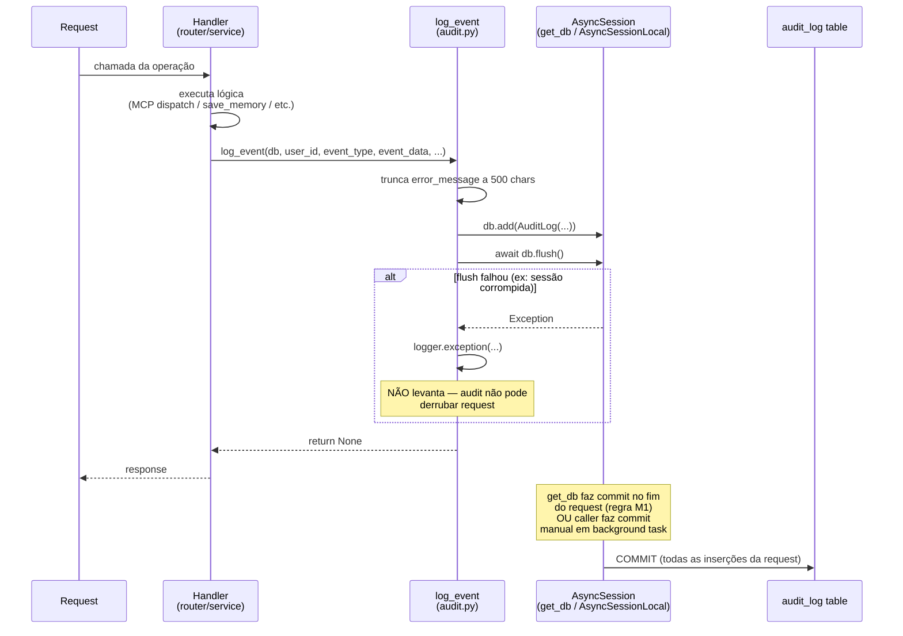
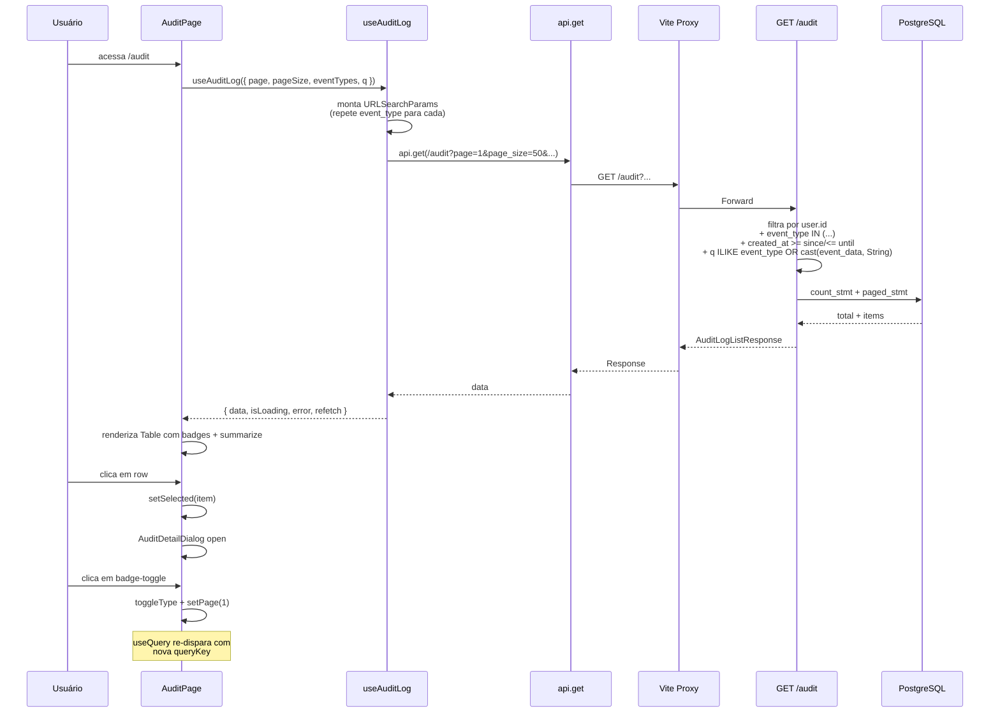

# Documento de Design — Lanez Fase 7: Audit Log (`/audit`)

## Visão Geral

Este documento descreve a arquitetura e o design técnico da Fase 7 do Lanez. O objetivo é introduzir uma trilha persistente de eventos significativos do sistema (auth, MCP tool calls, briefing generation, memory writes, voice transcriptions, webhooks recebidos) e expor essa trilha ao usuário no painel via página `/audit`. O backend ganha modelo + migration `005_add_audit_log.py`, service helper `app/services/audit.py` (com `AuditEventType` StrEnum e `log_event` que faz `flush` sem commit), 8 pontos de injeção nos routers/services existentes, endpoint `GET /audit` paginado com filtros, e nova setting `AUDIT_HISTORY_WINDOW_DAYS`. O frontend ganha hook `useAuditLog`, componentes `AuditEventBadge` + `AuditDetailDialog`, página `AuditPage` (modelo: BriefingsListPage), integração no `AppShell.navItems` e proxy Vite `/audit`.

Decisões técnicas chave: **inventário fechado** de 8 tipos de evento (StrEnum); injeção **explícita** via helper `log_event` em vez de middleware global (descartado por ruído de leituras); `event_data` JSONB livre com schema documentado por tipo e **sem versionamento** (frontend tolerante a campos ausentes); `mcp.call` registra **falhas** (`success=true/false`); demais eventos só path feliz; `log_event` faz `flush` (não commit) — regra M1 da Fase 4.5 mantida; `_summarize_arguments` zera PII (`{type, length}` por chave, nunca o valor cru); 8 cores de badge via Tailwind literais (única exceção justificada ao princípio "cores via tokens shadcn", análoga ao `bg-red-500` do `RecordingIndicator` da Fase 6b).

### Divergências de modelo detectadas (pré-flight)

| Divergência | Briefing assume | Modelo real | Ajuste no design |
|---|---|---|---|
| Loop `value[]` de notificações | Em `process_notification` | Em `app/routers/webhooks.py:receive_graph_notification` (linhas 115-128); `process_notification` recebe **uma** notification e retorna `(user_id, service_type, event_id) \| None` | Hook `webhook.received` injetado **no router** dentro do loop, após `if result is not None` |
| Commit do Briefing | Em "função background" | `_briefing_background` está em `app/routers/webhooks.py:69` chamando `generate_briefing(...)` em `app/services/briefing.py`; commit manual no router após retorno do serviço | Hook `briefing.generated` injetado em `app/services/briefing.py:generate_briefing` (após persistir Briefing); flush é coberto pelo `db.commit()` manual do router |
| `save_memory` standalone | Confirmado | `async def save_memory(db, user_id, content, tags=None) -> dict` ✓ | Adicionar kwarg `source: str = "rest"`; passar `"mcp"` no handler MCP, `"rest"` no router REST |
| `/auth/logout` stateless | Confirmado | Endpoint atual NÃO usa `Depends(get_current_user)` | Adicionar dependency; quebra teste pré-existente — atualizar no mesmo commit |
| Migrations | 4 (001-004) | ✓ | Nova migration: `005_add_audit_log` com `down_revision="004_briefings"` |
| 9 tools MCP | Confirmado | ✓ | Hook `mcp.call` cobre as 9 uniformemente via `call_tool` |
| `get_db` faz commit no boundary | Confirmado | ✓ | `log_event` apenas `flush`; commit fica para `get_db` ou caller de background task |

## Arquitetura

```
┌─────────────────────────────────────────────────────────────────────────────────────┐
│                                Mono-repo Lanez                                      │
│                                                                                     │
│  ┌─────────────────────────────────────┐   ┌──────────────────────────────────────┐ │
│  │      Frontend (Vite :5173)          │   │       Backend (FastAPI :8000)        │ │
│  │                                     │   │                                      │ │
│  │  src/                               │   │  Routers                             │ │
│  │  ├── components/                    │   │  ├── auth.py (MOD — 3 hooks +        │ │
│  │  │   ├── AuditEventBadge ★         │   │  │     dep em logout)                │ │
│  │  │   ├── AuditDetailDialog ★       │   │  ├── mcp.py (MOD — try/except +      │ │
│  │  │   └── AppShell (MOD — nav)      │   │  │     summarize_arguments)         │ │
│  │  ├── hooks/                         │   │  ├── memories.py (MOD — kwarg       │ │
│  │  │   └── useAuditLog ★             │   │  │     source)                       │ │
│  │  ├── pages/                         │   │  ├── voice.py (MOD — dep db +       │ │
│  │  │   └── AuditPage ★               │   │  │     hook)                         │ │
│  │  ├── App.tsx (MOD — rota)          │   │  ├── webhooks.py (MOD — hook no     │ │
│  │  └── components/ui/table ★ (shadcn)│   │  │     loop)                         │ │
│  │                                     │   │  ├── status.py (MOD — campo novo)   │ │
│  │       Vite proxy /audit ★ ────────┼───┼──► audit.py ★ (NOVO)                │ │
│  └─────────────────────────────────────┘   │  └── ...                             │ │
│                                            │                                      │ │
│                                            │  Services                            │ │
│                                            │  ├── audit.py ★ (NOVO)               │ │
│                                            │  │   ├── AuditEventType (StrEnum)    │ │
│                                            │  │   └── log_event(db, ...)          │ │
│                                            │  ├── memory.py (MOD — kwarg + hook) │ │
│                                            │  ├── briefing.py (MOD — hook)       │ │
│                                            │  └── ...                             │ │
│                                            │                                      │ │
│                                            │  Models                              │ │
│                                            │  ├── audit.py ★ (NOVO)               │ │
│                                            │  └── __init__.py (MOD — export)     │ │
│                                            │                                      │ │
│                                            │  Schemas                             │ │
│                                            │  ├── audit.py ★ (NOVO)               │ │
│                                            │  └── status.py (MOD — campo novo)   │ │
│                                            │                                      │ │
│                                            │  Alembic                             │ │
│                                            │  └── 005_add_audit_log.py ★ (NOVO)  │ │
│                                            │                                      │ │
│                                            │  Config                              │ │
│                                            │  └── config.py (MOD — 1 setting)    │ │
│                                            │                                      │ │
│                                            │  main.py (MOD — registrar audit)    │ │
│                                            └──────────────────┬───────────────────┘ │
│                                                               │                     │
│                                                       ┌───────┴──────────┐          │
│                                                       │ PostgreSQL       │          │
│                                                       │ + pgvector       │          │
│                                                       │ audit_log table  │          │
│                                                       └──────────────────┘          │
└─────────────────────────────────────────────────────────────────────────────────────┘

★ = Novo na Fase 7
MOD = Modificado na Fase 7
```

## Inventário fechado de 8 tipos de evento

| `event_type`              | Onde é injetado                                                                          | `event_data` (campos)                                                                                           | Registra falha? |
|---------------------------|------------------------------------------------------------------------------------------|------------------------------------------------------------------------------------------------------------------|-----------------|
| `auth.login`              | `app/routers/auth.py:auth_callback` após `db.commit()` do User                           | `{ "method": "oauth_callback", "had_return_url": bool, "email": str }`                                           | Não             |
| `auth.logout`             | `app/routers/auth.py:auth_logout` (após mudança para auth-required)                      | `{}`                                                                                                             | Não             |
| `auth.refresh`            | `app/routers/auth.py:auth_refresh` após `db.commit()` dos novos tokens                   | `{ "expires_in_seconds": int }`                                                                                  | Não             |
| `mcp.call`                | `app/routers/mcp.py:call_tool` (try/except envolvendo handler)                           | `{ "tool_name": str, "arguments_summary": dict, "success": bool, "error_message": str \| null }`                 | **Sim**         |
| `briefing.generated`      | `app/services/briefing.py:generate_briefing` após persistir Briefing                     | `{ "event_id": str, "model_used": str, "input_tokens": int, "output_tokens": int, "cache_read_tokens": int, "cache_write_tokens": int }` | Não             |
| `memory.created`          | `app/services/memory.py:save_memory` antes do return                                     | `{ "tags": list[str], "content_length": int, "source": "rest" \| "mcp" }`                                        | Não             |
| `voice.transcribed`       | `app/routers/voice.py:transcribe` após sucesso da Groq                                   | `{ "audio_bytes": int, "transcription_length": int, "duration_ms": int }`                                        | Não             |
| `webhook.received`        | `app/routers/webhooks.py:receive_graph_notification` dentro do loop, após `if result is not None` | `{ "resource": str, "change_type": str, "subscription_id": str }`                                       | Não             |

**Notas:**

- `mcp.call` é o **único** evento que registra falhas. A justificativa é dupla: (1) tools MCP cobrem a maior parte do uso de AI no sistema; (2) falhas em ferramentas MCP são informações úteis para auditoria (rate limits do Graph, tools com bugs).
- Outros eventos só registram path feliz porque suas falhas (Anthropic 429, Groq 502) já produzem HTTP responses que o cliente vê e não fazem parte da trilha de "ações executadas".
- `webhook.received` é registrado **uma vez por entrada do array `value[]`**, não uma vez por request HTTP de webhook (uma notificação Graph pode trazer múltiplas).

## Fluxo de injeção via `log_event`



## Fluxo de consulta `/audit`



## Contratos de API

### GET /audit

**Request:** Query params

| Param        | Tipo                  | Default | Restrições                |
|--------------|-----------------------|---------|---------------------------|
| `page`       | int                   | 1       | ge=1                      |
| `page_size`  | int                   | 50      | ge=1, le=200              |
| `event_type` | list[str] (repeatable)| —       | Valores em AuditEventType |
| `since`      | datetime              | —       | ISO 8601                  |
| `until`      | datetime              | —       | ISO 8601                  |
| `q`          | str                   | —       | ILIKE em event_type e cast(event_data, String) |

**Auth:** Cookie HttpOnly OU Bearer (401 se ausente).

**Response (200):**

```json
{
  "items": [
    {
      "id": "uuid-do-evento",
      "event_type": "mcp.call",
      "event_data": {
        "tool_name": "search_emails",
        "arguments_summary": {
          "query": { "type": "string", "length": 24 },
          "limit": { "type": "int", "value": 10 }
        },
        "success": true,
        "error_message": null
      },
      "success": true,
      "error_message": null,
      "latency_ms": 342,
      "created_at": "2026-04-30T18:45:12.345+00:00"
    }
  ],
  "total": 1234,
  "page": 1,
  "page_size": 50
}
```

**Erros:**

| Status | Condição          | Detail               |
|--------|-------------------|----------------------|
| 401    | Sem auth          | "Não autenticado"    |
| 422    | Validação params  | Validação Pydantic   |

### POST /auth/logout (mudança)

**Antes (Fase 6a):** stateless, sempre 204.

**Agora (Fase 7):**

| Status | Condição                          |
|--------|-----------------------------------|
| 204    | Auth válida; cookie limpo         |
| 401    | Sem cookie HttpOnly nem Bearer    |

## Interfaces de Componentes

### Backend

#### `app/models/audit.py` (NOVO)

```python
class AuditLog(Base):
    __tablename__ = "audit_log"

    id: Mapped[uuid.UUID]               # UUID PK, default=uuid4
    user_id: Mapped[uuid.UUID]          # FK users.id ondelete=CASCADE
    event_type: Mapped[str]             # String(64)
    event_data: Mapped[dict]            # JSONB, default=dict
    success: Mapped[bool]               # default=True
    error_message: Mapped[str | None]   # String(500), nullable
    latency_ms: Mapped[int | None]      # Integer, nullable
    created_at: Mapped[datetime]        # DateTime(timezone=True)

    __table_args__ = (
        Index("ix_audit_log_user_created", "user_id", "created_at"),
        Index("ix_audit_log_user_type_created", "user_id", "event_type", "created_at"),
    )
```

#### `app/services/audit.py` (NOVO)

```python
class AuditEventType(StrEnum):
    AUTH_LOGIN = "auth.login"
    AUTH_LOGOUT = "auth.logout"
    AUTH_REFRESH = "auth.refresh"
    MCP_CALL = "mcp.call"
    BRIEFING_GENERATED = "briefing.generated"
    MEMORY_CREATED = "memory.created"
    VOICE_TRANSCRIBED = "voice.transcribed"
    WEBHOOK_RECEIVED = "webhook.received"

async def log_event(
    db: AsyncSession,
    *,
    user_id: UUID,
    event_type: AuditEventType,
    event_data: dict[str, Any] | None = None,
    success: bool = True,
    error_message: str | None = None,
    latency_ms: int | None = None,
) -> None:
    """Registra evento. NÃO faz commit (regra M1). Não levanta em falha de flush."""
```

#### `app/routers/audit.py` (NOVO)

```python
router = APIRouter(prefix="/audit", tags=["audit"])

@router.get("", response_model=AuditLogListResponse)
async def list_audit_log(
    user: User = Depends(get_current_user),
    db: AsyncSession = Depends(get_db),
    page: int = Query(default=1, ge=1),
    page_size: int = Query(default=50, ge=1, le=200),
    event_type: list[str] | None = Query(default=None),
    since: datetime | None = Query(default=None),
    until: datetime | None = Query(default=None),
    q: str | None = Query(default=None),
) -> AuditLogListResponse: ...
```

#### `app/schemas/audit.py` (NOVO)

```python
class AuditLogItem(BaseModel):
    model_config = ConfigDict(from_attributes=True)
    id: UUID
    event_type: str
    event_data: dict[str, Any]
    success: bool
    error_message: str | None
    latency_ms: int | None
    created_at: datetime

class AuditLogListResponse(BaseModel):
    items: list[AuditLogItem]
    total: int
    page: int
    page_size: int
```

#### `app/routers/mcp.py` (MOD — função interna)

```python
def _summarize_arguments(arguments: dict) -> dict:
    """Resumo seguro: chaves + tamanhos, sem PII.

    string  → {"type": "string", "length": int}
    array   → {"type": "array", "length": int}
    int/float/bool → {"type": "<typename>", "value": <value>}
    None    → {"type": "null"}
    other   → {"type": "<typename>"}
    """
```

### Frontend

#### `frontend/src/hooks/useAuditLog.ts` (NOVO)

```typescript
export interface AuditLogItem {
  id: string;
  event_type: string;
  event_data: Record<string, unknown>;
  success: boolean;
  error_message: string | null;
  latency_ms: number | null;
  created_at: string;
}

export interface AuditLogListResponse {
  items: AuditLogItem[];
  total: number;
  page: number;
  page_size: number;
}

export interface AuditFilters {
  page: number;
  pageSize: number;
  eventTypes?: string[];
  since?: string;
  until?: string;
  q?: string;
}

export function useAuditLog(filters: AuditFilters): UseQueryResult<AuditLogListResponse>;
```

#### `frontend/src/components/AuditEventBadge.tsx` (NOVO)

```typescript
interface AuditEventBadgeProps {
  eventType: string;
  className?: string;
}

export function AuditEventBadge(props: AuditEventBadgeProps): JSX.Element;
// 8 cores conhecidas + fallback bg-muted
// Tailwind literais (única exceção da fase à regra de cores via tokens shadcn)
```

#### `frontend/src/components/AuditDetailDialog.tsx` (NOVO)

```typescript
interface AuditDetailDialogProps {
  item: AuditLogItem | null;
  onOpenChange: (open: boolean) => void;
}

export function AuditDetailDialog(props: AuditDetailDialogProps): JSX.Element;
// Dialog shadcn max-w-2xl
// Mostra: badge, marker "falhou" se !success, timestamp pt-BR, latência,
//         bloco erro com border destrutiva, <pre> com event_data formatado
```

#### `frontend/src/pages/AuditPage.tsx` (NOVO)

```typescript
export function AuditPage(): JSX.Element;
// Layout: título, input search (debounce 300ms), 8 badges-toggle,
//         Table shadcn com 5 colunas, paginação Anterior/Próximo
// Click em row abre AuditDetailDialog
```

## Estados visuais da `AuditPage`

| Estado     | Condição                    | UI                                                                     |
|------------|-----------------------------|------------------------------------------------------------------------|
| **loading**| `isLoading`                 | LoadingSkeleton (count=5, h-12)                                         |
| **error**  | `error !== null`            | ErrorState com `onRetry={() => void refetch()}`                        |
| **empty**  | `data.items.length === 0`   | EmptyState com ícone `History`, título "Nenhum evento encontrado"      |
| **list**   | `data.items.length > 0`     | Table com 5 colunas + paginação Anterior/Próximo                       |

Filtros (badges-toggle) sempre visíveis acima da Table — mesmo nos estados loading/empty/error.

## Propriedades formais de corretude

### Propriedade 1: `log_event` não derruba request

*Para qualquer* exceção `e` levantada por `db.flush()` dentro de `log_event`, `log_event` retorna `None` sem propagar `e`. O caller (router/service) continua a execução normalmente. A request original ainda pode ser commitada ou rollbackada conforme seu próprio fluxo, sem interferência do audit.

**Valida:** R2.7, NF3.1

### Propriedade 2: `_summarize_arguments` zera PII de strings

*Para qualquer* dict `arguments` contendo chaves cujos valores são `str`, o dict resultante de `_summarize_arguments(arguments)` contém apenas `{"type": "string", "length": int}` para essas chaves — nunca o valor original. Em particular, queries de email, conteúdo de memória, tags com PII implícita, e outros valores de string permanecem ausentes do `event_data` persistido.

**Valida:** R6.6, R6.7, NF2.1

### Propriedade 3: `mcp.call` registra **todas** as execuções

*Para toda* chamada a `POST /mcp/call` que passa pelas validações de protocolo (método correto, tool existe, params obrigatórios presentes), exatamente um evento `mcp.call` é persistido no `audit_log`, independentemente de o handler ter sucesso ou levantar exceção. Ou seja, o número de eventos `mcp.call` é igual ao número de despachos efetivos para `TOOLS_REGISTRY[tool_name]`.

**Valida:** R6.1, R6.2, R6.5

### Propriedade 4: `webhook.received` exige `user_id` válido

*Para toda* notificação no array `value[]` de um POST `/webhooks/graph`, um evento `webhook.received` é persistido se e somente se `process_notification(...)` retornou tupla `(user_id, service_type, event_id)` (não `None`). A FK `audit_log.user_id → users.id` está sempre satisfeita.

**Valida:** R10.2, R10.3

### Propriedade 5: Filtro `event_type` no GET /audit é OR

*Para qualquer* lista `[t1, t2, ..., tN]` passada como `event_type` no query string (parametro repetido), o conjunto de eventos retornados é exatamente `{e ∈ audit_log : e.user_id == user.id ∧ e.event_type ∈ {t1, ..., tN}}` (mais demais filtros se houver). A semântica é OR entre tipos.

**Valida:** R11.4, R13.6

### Propriedade 6: `AuditEventBadge` cobre os 8 tipos conhecidos

*Para qualquer* `eventType` ∈ `{auth.login, auth.logout, auth.refresh, mcp.call, briefing.generated, memory.created, voice.transcribed, webhook.received}`, `AuditEventBadge` aplica uma classe CSS distinta (não-fallback). Para qualquer outro valor, aplica o fallback `bg-muted text-muted-foreground`.

**Valida:** R15.1, R15.2, R15.3, R17.1

## Tratamento de Erros

### Backend

| Cenário                                    | HTTP Status | Detail                       | Componente                         |
|--------------------------------------------|-------------|-------------------------------|------------------------------------|
| Sem auth em GET /audit                     | 401         | "Não autenticado"             | `get_current_user`                 |
| Sem auth em POST /auth/logout              | 401         | "Não autenticado"             | `_get_current_user` (novo)         |
| Validação de params no GET /audit          | 422         | Validação Pydantic            | FastAPI                            |
| Falha de flush no `log_event`              | (silente)   | logger.exception              | `app/services/audit.py`            |
| Handler MCP levanta `HTTPException`        | (jsonrpc)   | `jsonrpc_domain_error`        | `mcp.call_tool` (registra success=false) |
| Handler MCP levanta exceção genérica       | (jsonrpc)   | `jsonrpc_domain_error`        | `mcp.call_tool` (registra success=false) |
| `process_notification` retorna `None`      | (silente)   | sem log de auditoria          | `webhooks.receive_graph_notification` |

### Frontend

| Cenário                                    | Comportamento                                            |
|--------------------------------------------|----------------------------------------------------------|
| `useAuditLog` em loading                   | LoadingSkeleton count=5                                  |
| `useAuditLog` com error                    | ErrorState com botão Retry                               |
| `data.items.length === 0`                  | EmptyState com ícone History                             |
| `event_data` com campos ausentes           | `summarizeEventData` usa fallback `"?"` por campo        |
| Tipo desconhecido em `AuditEventBadge`     | Aplica fallback `bg-muted text-muted-foreground`         |
| Click em row                               | `AuditDetailDialog` abre com item selecionado            |

## Estratégia de Testes

### Testes Backend (18 novos)

| Arquivo                               | Teste                                                       | Tipo                            | Requisito |
|---------------------------------------|-------------------------------------------------------------|----------------------------------|-----------|
| `tests/test_audit_service.py`         | `test_log_event_creates_audit_log_entry`                    | Unit (DB real)                  | R13.1     |
| `tests/test_audit_service.py`         | `test_log_event_truncates_long_error_message`               | Unit (DB real)                  | R13.2     |
| `tests/test_audit_service.py`         | `test_log_event_does_not_raise_on_flush_failure`            | Unit (mock flush)               | R13.3     |
| `tests/test_audit_endpoint.py`        | `test_audit_list_returns_paginated_items`                   | Integration                     | R13.4     |
| `tests/test_audit_endpoint.py`        | `test_audit_list_filters_by_event_type`                     | Integration                     | R13.5     |
| `tests/test_audit_endpoint.py`        | `test_audit_list_filters_by_event_type_multiple`            | Integration                     | R13.6     |
| `tests/test_audit_endpoint.py`        | `test_audit_list_filters_by_since_until`                    | Integration                     | R13.7     |
| `tests/test_audit_endpoint.py`        | `test_audit_list_q_searches_event_data`                     | Integration                     | R13.8     |
| `tests/test_audit_endpoint.py`        | `test_audit_list_orders_desc_by_created_at`                 | Integration                     | R13.9     |
| `tests/test_audit_endpoint.py`        | `test_audit_list_requires_auth`                             | Unit                            | R13.10    |
| `tests/test_audit_endpoint.py`        | `test_audit_list_isolates_per_user`                         | Integration                     | R13.11    |
| `tests/test_audit_hooks.py`           | `test_audit_logged_on_mcp_call_success`                     | Integration (mock handler)      | R13.12    |
| `tests/test_audit_hooks.py`           | `test_audit_logged_on_mcp_call_failure`                     | Integration (mock raises)       | R13.13    |
| `tests/test_audit_hooks.py`           | `test_audit_logged_on_memory_create_rest`                   | Integration                     | R13.14    |
| `tests/test_audit_hooks.py`           | `test_audit_logged_on_memory_create_mcp`                    | Integration                     | R13.15    |
| `tests/test_audit_hooks.py`           | `test_audit_logged_on_voice_transcribe_success`             | Integration (mock Groq)         | R13.16    |
| `tests/test_audit_hooks.py`           | `test_audit_logged_on_auth_logout`                          | Integration                     | R13.17    |
| `tests/test_audit_hooks.py`           | `test_auth_logout_now_requires_auth`                        | Regression                      | R13.18    |

**Atualizações em testes pré-existentes:**

- `tests/test_auth_logout_dual.py` (ou nome equivalente da Fase 6a): teste que bate `/auth/logout` sem auth e espera 204 deve ser **atualizado** para enviar cookie/Bearer válido no mesmo commit feat (gap da Fase 5)

**Padrão de mocking:** `app.dependency_overrides[get_current_user]` e `[get_db]` para autenticação e isolamento de banco; `unittest.mock.patch` para mockar handlers MCP, Groq, Anthropic; reuso de fixtures de banco em `tests/conftest.py` — nova tabela `audit_log` aparece automaticamente via `Base.metadata.create_all` se modelo for importado em `app/models/__init__.py`.

### Testes Frontend (2 novos)

| Arquivo                                              | Teste                                                                            | Tipo  | Requisito |
|------------------------------------------------------|----------------------------------------------------------------------------------|-------|-----------|
| `frontend/src/__tests__/AuditEventBadge.test.tsx`    | tipos conhecidos aplicam classes específicas; tipo desconhecido cai em fallback  | Smoke | R17.1     |
| `frontend/src/__tests__/AuditPage.test.tsx`          | loading mostra skeleton; items mostram tabela; click abre dialog                 | Smoke | R17.2     |

**Mocks:** `useAuditLog` mockado nos testes de página para evitar hit no backend real. Reuso dos mocks globais existentes em `setup.ts` (MediaRecorder, speechSynthesis) — sem alterações.

### Meta de testes

- Backend: 180 baseline + 18 novos = **198 verdes** (com teste de logout pré-existente atualizado)
- Frontend: 11 baseline + 2 novos = **mínimo 13 verdes**
