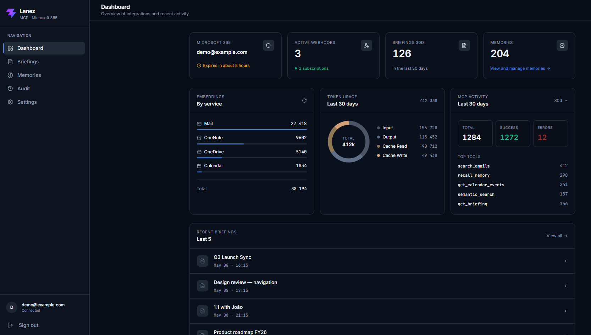
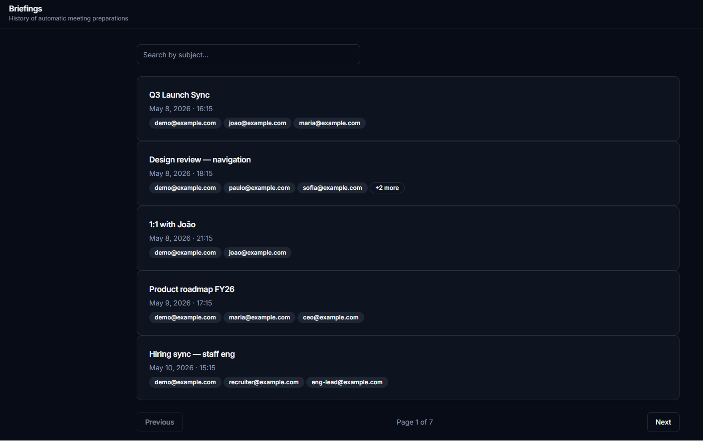
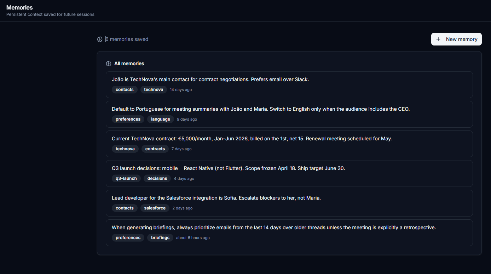
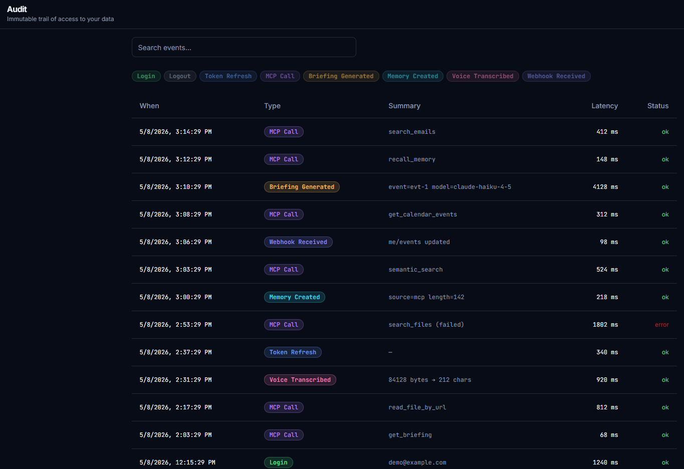
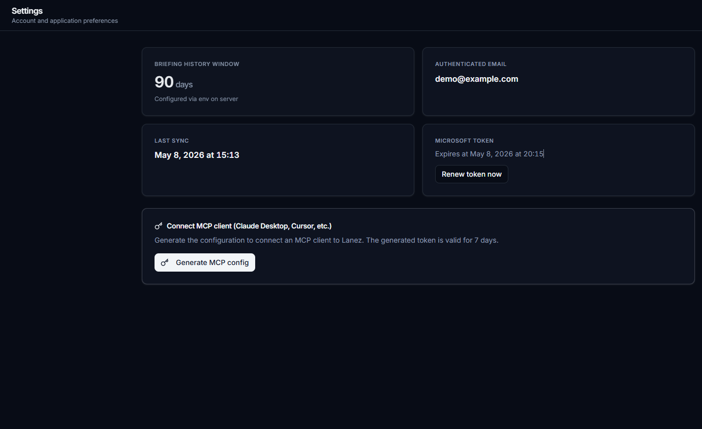

# Lanez

[](https://github.com/LucasMilanez/Lanez/actions/workflows/ci.yml)
[](LICENSE)
[](https://www.python.org/downloads/)
[](https://modelcontextprotocol.io/)

> Self-hosted MCP server that connects AI assistants to your Microsoft 365 data — calendar, emails, OneNote, OneDrive — with semantic search, persistent memory, and automatic meeting briefings.

**An open-source alternative for users who prefer self-hosting their AI–Microsoft 365 bridge inside their own MCP client (Claude Desktop, Cursor, etc.) instead of relying on a vendor-managed assistant.**

Live demo: [lanez.vercel.app](https://lanez.vercel.app) · Issues: [GitHub](https://github.com/LucasMilanez/Lanez/issues) · Security: [SECURITY.md](SECURITY.md)

---

## Features

- **10 MCP Tools** — Calendar events, email search, OneNote pages (with content reading), OneDrive/SharePoint files (with `.txt`/`.md`/`.csv`/`.docx` content), direct URL file reading, web search, semantic search, memory save/recall, meeting briefings
- **MCP Protocol 2025-06-18** — JSON-RPC 2.0 over HTTP, compatible with any MCP client
- **Semantic Search** — Cross-service search using sentence embeddings (pgvector)
- **Persistent Memory** — Save and recall context across sessions
- **Auto Briefings** — Pre-meeting briefings generated from emails, notes, and files related to attendees
- **Real-time Sync** — Microsoft Graph webhooks for instant calendar updates
- **Web Panel** — React dashboard for configuration, briefing history, and audit logs
- **Voice Input** — Speech-to-text via Groq Whisper API
- **Audit Trail** — Immutable log of all tool executions with latency tracking

## Screenshots


*Dashboard — Microsoft 365 integration status, embedding counts, Anthropic token usage, MCP activity and recent briefings.*

<table>
<tr>
<td width="50%">
<a href="docs/screenshots/briefings.png"></a>
<p align="center"><em>Briefings — paginated history of auto-generated meeting preparations.</em></p>
</td>
<td width="50%">
<a href="docs/screenshots/memories.png"></a>
<p align="center"><em>Memories — persistent user preferences, decisions and context snippets.</em></p>
</td>
</tr>
<tr>
<td width="50%">
<a href="docs/screenshots/audit.png"></a>
<p align="center"><em>Audit — immutable trail of every MCP call, auth event and webhook delivery.</em></p>
</td>
<td width="50%">
<a href="docs/screenshots/settings.png"></a>
<p align="center"><em>Settings — Microsoft token status and MCP client configuration.</em></p>
</td>
</tr>
</table>

## Architecture

```
┌─────────────────────────────────────────────────────────┐
│  MCP Clients (Claude Desktop, Cursor, etc.)             │
└────────────────────────┬────────────────────────────────┘
                         │ POST /mcp (JSON-RPC 2.0)
                         ▼
┌─────────────────────────────────────────────────────────┐
│  FastAPI Backend                                        │
│  ┌───────────┐  ┌──────────┐  ┌───────────────────┐    │
│  │ MCP Router│  │ Auth     │  │ Graph Service     │    │
│  │ (dispatch)│  │ (OAuth)  │  │ (Microsoft 365)   │    │
│  └───────────┘  └──────────┘  └───────────────────┘    │
│  ┌───────────┐  ┌──────────┐  ┌───────────────────┐    │
│  │ Embeddings│  │ Memory   │  │ Briefing Service  │    │
│  │ (MiniLM)  │  │ Service  │  │ (Anthropic API)   │    │
│  └───────────┘  └──────────┘  └───────────────────┘    │
└────────────────────────┬────────────────────────────────┘
                         │
          ┌──────────────┼──────────────┐
          ▼              ▼              ▼
   ┌────────────┐ ┌───────────┐ ┌────────────┐
   │ PostgreSQL │ │   Redis   │ │  SearXNG   │
   │ + pgvector │ │  (cache)  │ │ (web search│
   └────────────┘ └───────────┘ └────────────┘
```

## Tech Stack

| Layer | Technology |
|-------|-----------|
| Backend | FastAPI (Python 3.12, fully async) |
| Database | PostgreSQL 16 + pgvector |
| Cache | Redis 7 |
| Embeddings | Sentence Transformers all-MiniLM-L6-v2 (384-dim, CPU) |
| AI | Anthropic API (briefing generation) |
| Voice | Groq Whisper (STT) + Browser SpeechSynthesis (TTS) |
| Web Search | SearXNG (self-hosted) |
| Auth | OAuth 2.0 + PKCE (Microsoft Entra ID) |
| Real-time | Microsoft Graph Webhooks |
| Frontend | React 19 + Vite + TailwindCSS + TanStack Query |
| Infra | Docker Compose (local) / Fly.io + Vercel + Neon + Upstash (prod) |

## Getting Started

### Prerequisites

- Docker & Docker Compose
- Microsoft 365 account (for Graph API access)
- Microsoft Entra ID app registration ([guide](https://learn.microsoft.com/en-us/entra/identity-platform/quickstart-register-app))

### Local Development

```bash
# Clone and configure
cp .env.example .env
# Fill in your Microsoft OAuth credentials and secrets in .env

# Start all services
docker compose up -d --build

# Backend: http://localhost:8000
# Frontend: http://localhost:5173
# API docs: http://localhost:8000/docs
```

### Environment Variables

See [`.env.example`](.env.example) for all required variables. Key ones:

| Variable | Description |
|----------|-------------|
| `SECRET_KEY` | JWT signing key (generate with `python -c "import secrets; print(secrets.token_hex(32))"`) |
| `MICROSOFT_CLIENT_ID` | Azure app registration client ID |
| `MICROSOFT_CLIENT_SECRET` | Azure app registration secret |
| `ANTHROPIC_API_KEY` | For briefing generation |
| `DATABASE_URL` | PostgreSQL connection string |
| `REDIS_URL` | Redis connection string |
| `ALLOWED_EMAILS` | Comma-separated list of emails allowed to log in (defense-in-depth). Leave empty only in dev. |

## Security

Lanez is a **self-hosted single-user server**. It is not designed for
multi-tenant SaaS deployments. Before exposing it to the internet:

- **OAuth flow**: Authorization Code + PKCE (S256) via Microsoft Entra ID.
  Read-only scopes (`Calendars.Read`, `Files.Read`, `Mail.Read`,
  `Notes.Read`, `Sites.Read.All`, `User.Read`, `offline_access`).
- **Token storage**: Microsoft access and refresh tokens are encrypted at
  rest using **Fernet (AES-128-CBC + HMAC-SHA256)**. The Fernet key is
  derived from `SECRET_KEY` via **PBKDF2-HMAC-SHA256 with 480 000
  iterations** and `FERNET_SALT`.
- **Sessions**: Internal JWT (HS256, 7-day expiry) delivered via
  `httpOnly + samesite=lax + secure` cookie. Bearer token fallback for
  MCP clients.
- **Allowlist**: `ALLOWED_EMAILS` restricts which accounts can complete
  OAuth even if the Azure app is misconfigured as multi-tenant.
- **CSRF**: Frontend sends `X-Requested-With: XMLHttpRequest` on every
  mutation; the backend rejects cookie-authenticated mutations without
  it.
- **Rate limiting**: Per-user limits on endpoints that consume paid APIs
  (Anthropic, Groq) via `slowapi`.
- **Audit log**: Every MCP call, auth event, and webhook is recorded
  with latency and success flag.

### Key rotation caveat

`SECRET_KEY` and `FERNET_SALT` derive the encryption key for tokens
stored in the database. **Rotating either invalidates all existing
tokens** — every user must re-authenticate via the OAuth flow. Generate
strong values on first deploy and keep them stable. A zero-downtime
rotation procedure is not currently implemented.

### Reporting vulnerabilities

Open a private security advisory on GitHub or email the maintainer
directly. Do not open a public issue for undisclosed vulnerabilities.

## MCP Client Setup

Lanez implements the [Model Context Protocol](https://modelcontextprotocol.io/) (spec 2025-06-18). Any MCP-compatible client can connect.

### Quick Setup (Claude Desktop / Cursor / any MCP client)

1. Get a Bearer token by authenticating at `/auth/microsoft`
2. Add to your client's MCP config:

```json
{
  "mcpServers": {
    "lanez": {
      "command": "mcp-remote",
      "args": [
        "https://lanez-app.fly.dev/mcp",
        "--header",
        "Authorization: Bearer <Token>"
      ]
    }
  }
}
```

3. Restart your client — 10 tools should appear

See [docs/mcp-client-setup.md](docs/mcp-client-setup.md) for detailed instructions.

## API Endpoints

| Endpoint | Method | Description |
|----------|--------|-------------|
| `/mcp` | POST | MCP dispatcher (JSON-RPC 2.0) |
| `/mcp` | GET | List available tools |
| `/auth/microsoft` | GET | Start OAuth flow |
| `/auth/callback` | GET | OAuth callback |
| `/healthz` | GET | Liveness probe |
| `/readyz` | GET | Readiness probe (DB + Redis) |

## Deployment

Production deployment uses:
- **Fly.io** — Backend (Amsterdam region)
- **Vercel** — Frontend
- **Neon** — Managed PostgreSQL with pgvector
- **Upstash** — Managed Redis

See [docs/deploy.md](docs/deploy.md) for the full deployment guide.

## Testing

```bash
# Run all tests
pytest

# Run with coverage
pytest --cov=app --cov-report=html
```

The test suite covers unit, integration and Hypothesis property-based tests
on the backend, plus Vitest + Testing Library on the frontend. See
[CONTRIBUTING.md](CONTRIBUTING.md) for full commands.

## Project Structure

```
lanez/
├── app/                    # FastAPI backend
│   ├── main.py             # App entry point, lifespan, middleware
│   ├── config.py           # Settings (pydantic-settings)
│   ├── database.py         # SQLAlchemy async engine, Redis
│   ├── dependencies.py     # Auth dependencies
│   ├── models/             # SQLAlchemy ORM models
│   ├── routers/            # API endpoints (10 routers)
│   ├── schemas/            # Pydantic request/response schemas
│   └── services/           # Business logic (11 services)
├── frontend/               # React + Vite + TailwindCSS
├── alembic/                # Database migrations
├── tests/                  # Backend test suite
├── docs/                   # Documentation
├── docker-compose.yml      # Local dev stack (5 services)
├── Dockerfile              # Production image
└── fly.toml                # Fly.io deployment config
```

## License

[MIT](LICENSE)

Third-party model license: the default embedding model
[`sentence-transformers/all-MiniLM-L6-v2`](https://huggingface.co/sentence-transformers/all-MiniLM-L6-v2)
is distributed under Apache-2.0.

## Known limitations

- **Single-user by design.** Lanez stores one set of Microsoft credentials
  per row in `users`, but the panel, OAuth flow and rate limits are tuned
  for a personal deployment. Running it as multi-tenant SaaS would
  require additional tenant isolation, per-tenant quotas, and billing —
  out of scope.
- **MCP transport.** Only Streamable HTTP (`mcp-remote` + HTTP JSON-RPC)
  is tested end-to-end. Legacy SSE endpoints exist for compatibility
  but are not actively maintained. Pure `stdio` transport is not
  supported.
- **Web search in production.** The SearXNG container is not part of the
  default production stack on Fly.io. The `web_search` MCP tool returns
  an `unavailable` stub there; self-hosting SearXNG is straightforward
  but intentionally opt-in.
- **Key rotation.** Rotating `SECRET_KEY` or `FERNET_SALT` invalidates
  all stored Microsoft tokens. A zero-downtime rotation procedure is
  not currently implemented — every user must re-authenticate after a
  rotation.
- **Briefings are generated only for Outlook Calendar events.** Other
  calendar providers (Google, iCloud) are not covered.
